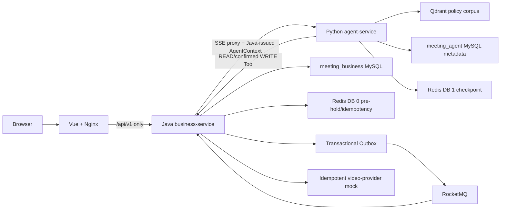
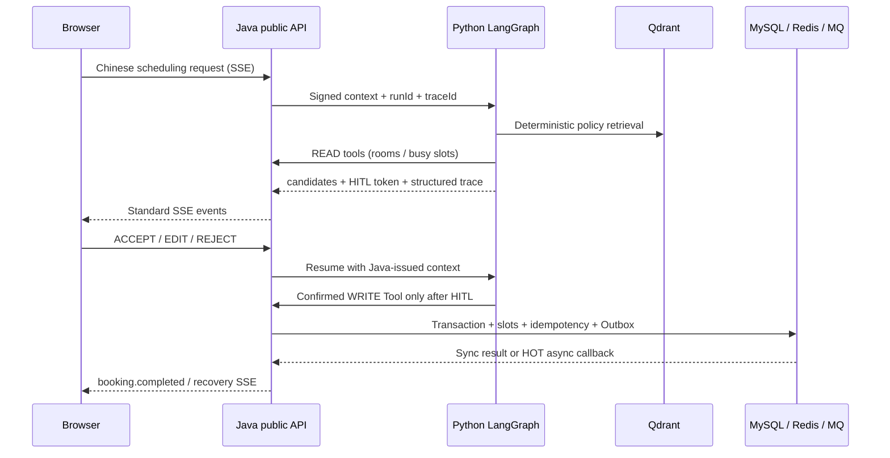

# 企业会议智能调度系统

一个用于技术展示的企业会议智能调度系统。Java 负责鉴权、会议事实源、并发预约、幂等、Outbox 和 RocketMQ；Python 负责固定的四个运行时 Agent、结构化理解、政策检索、OR-Tools、HITL 与恢复；Vue 将完整链路呈现给浏览器。Day 7 已完成交付证据、空卷部署验收和项目包装。

## 能力与架构边界

- 浏览器只访问 Java 的 `/api/v1/**`；前端绝不直连 Python。
- Java 是会议、房间和预约结果的唯一业务事实源；MySQL 唯一约束是并发最终裁决，Redis 仅作预占、缓存和 checkpoint。
- Python 只访问自己的 `meeting_agent` 元数据、Redis DB 1 checkpoint、Qdrant collection，以及 Java 白名单 Tool API；不会读写 Java 业务表。
- 运行时 Agent 固定为 **Supervisor + Requirement + Policy + Scheduling**。Retriever、OR-Tools、HITL 和 Tool 都是确定性节点，不伪装为 Agent。
- 默认 `AGENT_MODEL_PROVIDER=fixture`，所有 Smoke、评测和自动测试均不调用真实 DeepSeek；切换为 `deepseek` 时仅在本机 `.env` 填入真实 Key。





## 快速启动

前置条件：Docker Desktop（Compose v2+）和 PowerShell。首次使用会生成被 Git 忽略的本地 `.env`，不会覆盖已有的非空安全配置，也不会输出秘密。

```powershell
.\scripts\New-LocalEnv.ps1
docker compose config --quiet
docker compose up -d --build --wait
docker compose ps
```

打开 [http://localhost](http://localhost)。基础 `compose.yaml` 只发布前端端口；需要直接调试 Java、Python、MySQL 等端口时使用开发覆盖：

```powershell
docker compose -f compose.yaml -f compose.dev.yaml up -d --build --wait
```

演示账号：

| 角色 | 用户名 | 密码 |
|---|---|---|
| 员工 | `zhangsan` | `demo-password` |
| 管理员 | `admin` | `demo-password` |

这些仅是虚构演示数据；`.env` 中的数据库、JWT 和服务间密钥必须由 `New-LocalEnv.ps1` 随机生成，永不提交。

## 演示脚本

1. 以 `zhangsan` 登录，在聊天页输入：`下周三下午帮张三安排一个90分钟架构评审，要大屏`。
2. 观察 Java 代理的 SSE 时间线、结构化候选、政策引用和安全 Trace；选择 ACCEPT、EDIT 或 REJECT。EDIT 会重新求解，不能绕过确认写入。
3. 输入 `下周三下午帮张三安排一个90分钟架构评审，10人，要大屏`，可演示 HOT 房间的异步预约、冲突回调和恢复草案。
4. 在“我的会议”创建、修改、取消手动会议；以 `admin` 登录后可在“会议室”创建、编辑或启停会议室。员工只能读取 ACTIVE 房间。

自动 Smoke（均使用虚构数据，成功写入的 Smoke 会议会被取消）：

```powershell
# Day 4：Java SSE 代理、Read Tool、Qdrant 引用、Trace
python .\scripts\smoke-day4.py

# Day 5：HITL、EDIT/ACCEPT、HOT conflict recovery；基础 Compose 用 public trace
python .\scripts\smoke-day5.py --public-trace

# Day 6：浏览器所用 public API、手动会议、房间管理、SSE/Trace
python .\scripts\smoke-day6.py

# Day 7：全新项目/全新命名卷，完整 Golden Path 连续 3 次；不删除任何卷
.\scripts\Test-Day7EmptyVolume.ps1
```

`Test-Day7EmptyVolume.ps1` 使用独立的 Compose project、临时安全 `.env` 和空命名卷；成功后只停止临时容器/网络，**从不**使用 `down -v`。`-KeepProject` 可保留隔离环境进行人工检查。

## 质量门槛与验收材料

```powershell
Push-Location business-service
.\mvnw.cmd verify
Pop-Location

Push-Location agent-service
uv sync --frozen --group dev
uv run ruff check .
uv run mypy app
uv run pytest
Pop-Location

Push-Location frontend
npm ci
npm run type-check
npm run build
Pop-Location

# Java HTTP 并发压测：一个房间槽位只能有一个成功；相同幂等键只产生一个会议
python .\scripts\concurrency-day2.py --mode room --requests 100 --workers 32
python .\scripts\concurrency-day2.py --mode idempotency --requests 100 --workers 32
```

Day 7 的实际运行证据、指标和环境条件在 [docs/REPORTS.md](docs/REPORTS.md)，本次验收使用的已解析镜像内容标识在 [docs/image-manifest-day7.json](docs/image-manifest-day7.json)。跨服务实现状态和下一条允许任务以 [docs/HANDOFF.md](docs/HANDOFF.md) 为准。

## 目录说明

| 目录 | 职责 |
|---|---|
| `business-service/` | Spring Boot / Java 21：鉴权、会议、并发、Outbox、RocketMQ、Tool Gateway、SSE 代理 |
| `agent-service/` | FastAPI / LangGraph：四 Agent、Provider、RAG、OR-Tools、HITL、checkpoint、Trace、评测 |
| `frontend/` | Vue 3 + TypeScript：聊天、候选确认、Trace、会议与房间管理 |
| `mock-services/` | 独立、幂等的视频会议 Provider Mock |
| `deploy/` | MySQL 初始化、Nginx、RocketMQ 配置 |
| `scripts/` | 可复现 Smoke、并发和空卷验收脚本 |

## 当前范围与限制

- 无真实邮件、日历、视频会议或 IoT 供应商；视频会议只使用本地 Mock。
- Qdrant 中是固定的最小政策语料与确定性 hash embedding，不是通用文档同步、OCR、知识图谱或 rerank 系统。
- 不包含 SSO、多租户、多级审批、复杂访客流程、自动移动他人会议、Kubernetes、服务网格、完整 OpenTelemetry/Grafana 或故障注入平台。
- RocketMQ 采用至少一次投递与业务幂等，不宣称 exactly-once。
- DeepSeek 是可替换的 OpenAI-compatible Provider；默认 fixture 用于离线可复现验收，不代表真实模型质量。

## 规范与协作入口

1. [SPEC.md](SPEC.md)：冻结决策。
2. [AGENTS.md](AGENTS.md)：目录所有权、架构边界和验证规则。
3. [docs/05-data-and-api-spec.md](docs/05-data-and-api-spec.md)：公共 API、Tool、SSE 与数据契约。
4. [docs/07-test-and-evaluation.md](docs/07-test-and-evaluation.md)：并发、Agent 评测和 Docker 验收标准。
5. [docs/HANDOFF.md](docs/HANDOFF.md)：真实进度、命令证据与唯一下一步。
