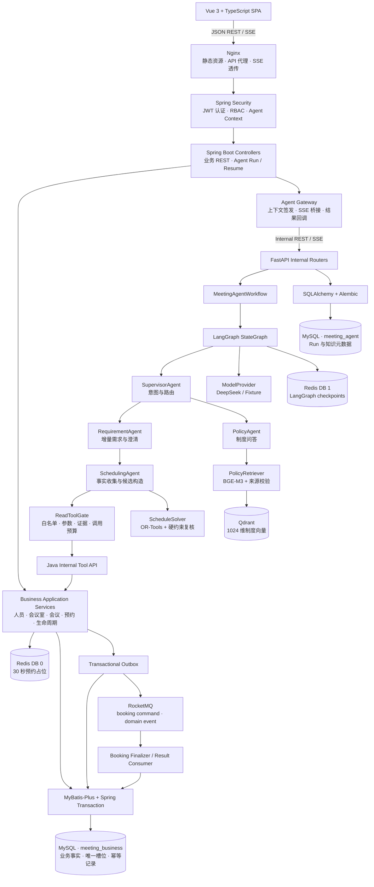
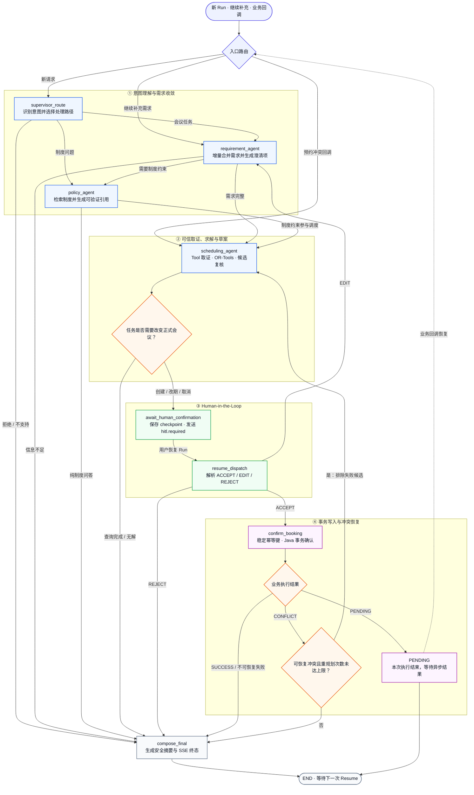
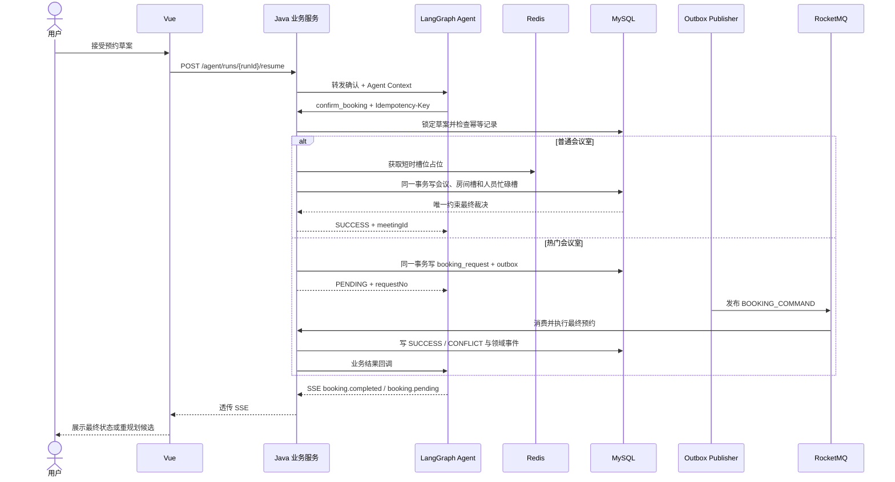
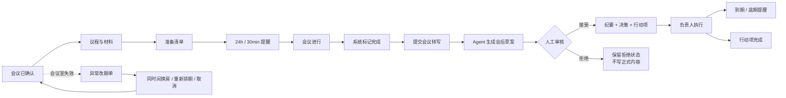

# WeMe

> 基于 LangGraph 多 Agent 编排与 Spring Boot 业务底座的智能会议协作平台

&emsp;&em;WeMe 是一个由多 Agent 驱动的企业会议协作工作台。用户可以通过自然语言创建、查询、修改或取消会议，系统会在多轮对话中持续维护人员、时间、容量和设备等需求，主动澄清缺失或歧义信息，并结合真实的组织与会议室数据生成可解释的候选方案。除了会议调度，WeMe 还覆盖带来源的企业制度问答、会前准备、会议提醒、会后纪要和行动项跟踪。

&emsp;&em;在 Agent 层，WeMe 使用 LangGraph 组织多个职责明确的 Agent 节点。Supervisor Agent 负责意图识别和任务路由，Requirement Agent 负责需求抽取、增量修改与信息澄清，Scheduling Agent 负责查询人员忙闲和会议室资源并组织候选调度，Policy Agent 负责企业制度检索和来源引用。各 Agent 通过共享的结构化状态、需求证据和检查点协作，可以根据用户补充、条件变化或调度冲突在不同节点间继续流转，而不需要重新开始任务。

&emsp;&em;Agent 负责理解和规划，Java 业务系统负责权限、事务和最终执行。模型只能通过受约束的 Tool Gateway 查询授权数据，OR-Tools 和确定性规则负责校验时间、容量、设备及必需参会人等硬约束；创建、改期和取消只会先生成预览草案，经用户确认后才由 Spring Boot 服务写入正式业务数据。MySQL 唯一约束、Redis 占位、幂等控制和异步消息链路进一步处理并发预约、重复请求与故障恢复，使 Agent 的每次决策和业务操作都可验证、可恢复、可追溯。

## 项目演示

[观看完整演示视频](showcase/001.mp4)

## 目录

- [项目演示](#项目演示)
- [核心能力](#核心能力)
- [设计思路](#设计思路)
- [系统架构与设计](#系统架构与设计)
- [技术栈](#技术栈)
- [快速开始](#快速开始docker-compose)
- [项目结构](#项目结构)
- [配置说明](#配置说明)
- [使用流程](#使用流程)
- [测试与评测](#测试与评测)
- [文档索引](#文档索引)
- [Contributors](#contributors)
- [许可证](#许可证)

## 核心能力

### 自然语言会议编排

- 支持创建会议、查找共同时间、推荐会议室、修改会议、取消会议和制度问答。
- 支持信息不足时连续追问，同一任务中保留已确认需求并处理参会人、时间和设备的增删变化。
- 区分硬约束与软偏好，覆盖必需参会人、容量、会议室设备、楼栋、时长和时间窗口。
- 将自然语言中的“我的小组”“刚才那场会”“下午两点”等表达交给受信任业务事实和确定性规则消歧。
- 最多给出 3 个可解释候选；无解时返回冲突类别、阻塞约束和可放宽建议，而不是虚构可用结果。

### 有边界的多 Agent 协作

- Supervisor 只负责路由，Requirement Agent 负责结构化需求，Policy Agent 负责制度证据，Scheduling Agent 负责受限读取计划。
- 模型只能选择允许的只读工具；人员身份、忙闲、会议室和历史会议都由 Java 业务服务返回。
- OR-Tools 根据可信快照构造候选，独立校验器再次检查时段、容量、设备和必需参会人约束。
- 创建、改期和取消先生成有过期时间的草案，用户必须选择接受、编辑或拒绝；确认前不会写入或改变正式会议。
- LangGraph 检查点保存在 Redis，任务可以跨请求恢复，并限制模型调用、工具调用、图节点和冲突重规划次数。

### 可靠预约与并发裁决

- 普通会议室使用 Redis 短时占位和 MySQL 唯一时隙约束完成同步确认。
- 热门会议室使用 Transactional Outbox + RocketMQ 异步排队，避免数据库提交与消息发送之间出现双写裂缝。
- 会议室与必需参会人都按 30 分钟槽位建立唯一约束，最终冲突由业务数据库裁决。
- 用户、操作和幂等键共同组成幂等边界；Agent Tool 调用另有独立审计与响应重放机制。
- 同步或异步确认发生竞争冲突时，保留原硬约束、排除失败候选并最多自动重规划 2 次。

### 会议全生命周期

- 提供会议日历、会议室目录、空闲时间轴、通知中心、员工与会议室管理。
- 会议室停用会为未来受影响会议创建异常改期单，保存原始约束快照并通知组织者。
- 会前维护议程与材料，自动计算准备清单，并发送提醒。
- 会后从会议转写生成待审核草案；接受后写入纪要、决策和行动项，拒绝时不产生正式内容。
- 行动项支持负责人、截止时间、状态和逾期提醒。
- 管理员可维护 Markdown 或PDF 制度文档；BGE-M3 + Qdrant 提供带来源的制度检索。

## 设计思路

WeMe 首先保证会议操作正确、安全、可控，再使用 Agent 提升自然语言交互体验。

1. **模型负责理解，业务系统负责提供事实。** Agent 可以理解用户想创建、修改或取消会议，但人员、忙闲时间、会议室状态和已有会议必须从业务服务实时查询，不能依赖模型猜测。
2. **Agent 生成方案，确定性规则负责校验。** 模型提取时间、人员、容量和设备要求，调度器根据真实数据生成候选，并再次检查时间冲突、会议室容量和必需参会人等硬约束。
3. **重要操作必须经过用户确认。** 创建、改期和取消会议只会先生成预览草案；用户确认后才写入正式会议，拒绝或修改不会产生实际副作用。

## 系统架构与设计

### 系统架构总览



实现映射：[前端路由](frontend/src/router/index.ts)、[Java 安全边界](business-service/src/main/java/com/example/meeting/common/security/SecurityConfiguration.java)、[Agent 入口](agent-service/app/main.py)、[工作流](agent-service/app/workflow.py)、[Compose 拓扑](compose.yaml)。

### 服务职责与数据所有权

| 组件 | 负责 |  | 持久化 |
| --- | --- | --- | --- |
| Vue + Nginx | 页面、JWT 会话、REST/SSE 客户端、统一入口 |  | 浏览器会话状态 |
| `business-service` | 认证、RBAC、人员、会议室、会议、草案、幂等、最终预约、生命周期 |  | `meeting_business`、Redis DB 0 |
| `agent-service` | 路由、需求抽取、制度问答、只读 Tool 规划、求解、HITL 状态机 |  | `meeting_agent`、Redis DB 1 |
| MySQL | 业务事实、Agent 元数据、唯一约束、Outbox |  | 两个隔离数据库与账户 |
| Redis | 预约短时占位、LangGraph checkpoint | AOF，逻辑 DB 0/1 |
| RocketMQ | 热门预约命令和领域事件传递 | Broker Store |
| Qdrant + BGE-M3 | 制度切片向量化与 Top-K 检索 | 版本化 Collection |
| DeepSeek / Fixture | 结构化推理或确定性测试替身 | 不作为业务数据源 |

### LangGraph 状态图




详细状态字段、Agent 职责、工具协议、检查点和 SSE 事件见 [Agent 工作流](docs/AGENT_WORKFLOW.md)。

### 预约一致性：同步快路径与异步热点路径



普通路径追求低延迟，热门路径通过 Outbox 和消息队列吸收竞争；两条路径最终都依赖相同的业务校验、唯一槽位和幂等规则。

| 不变量 | 普通会议室 | 热门会议室 |
| --- | --- | --- |
| HTTP 返回语义 | `SUCCESS + meetingId` | `PENDING + requestNo` |
| 竞争控制 | Redis 短时占位降低碰撞 | RocketMQ 按预约请求异步削峰 |
| 事务原子性 | 会议、房间槽、人员槽同事务 | `booking_request` 与 Outbox 同事务 |
| 最终裁决 | MySQL 唯一槽位约束 | 消费端复用同一套 MySQL 约束 |
| 重试边界 | 幂等记录重放原响应 | Outbox 重投、消费去重、结果回调去重 |
| 冲突处理 | 当前请求内触发重规划 | 回调恢复原 Run 后触发重规划 |

详见 [预约与会议生命周期](docs/BOOKING_AND_LIFECYCLE.md)。

### 会议生命周期闭环



## 技术栈

| 层级 | 主要技术 |
| --- | --- |
| 前端 | Vue 3.5、TypeScript 5.8、Vue Router、Tailwind CSS 4、Vite 7 |
| 边缘入口 | Nginx 1.27、SPA fallback、REST/SSE 反向代理 |
| 业务服务 | Java 21、Spring Boot 3.4、Spring Security、MyBatis-Plus、Flyway |
| Agent 服务 | Python 3.11、FastAPI、LangGraph、Pydantic、SQLAlchemy、Alembic |
| 调度求解 | Google OR-Tools、30 分钟离散时隙、确定性候选复核 |
| 模型服务 | DeepSeek OpenAI-compatible API、确定性 Fixture Provider |
| 制度检索 | BGE-M3 1024 维本地向量、Sentence Transformers、Qdrant |
| 数据与缓存 | MySQL 8.4、Redis 7.4 AOF |
| 异步消息 | Apache RocketMQ 4.9.7、Transactional Outbox、消费去重 |
| 部署与验证 | Docker Compose、分阶段 Dockerfile、pytest、Maven Verify、vue-tsc |

## 快速开始：Docker Compose

### 1. 环境要求

- Windows 11 + Docker Desktop，或安装了 Docker Engine 与 Compose v2 的 Linux。
- 建议至少 12 GB 可用内存；首次构建需要拉取 Java、Python、Node、数据库和消息队列镜像。
- 本地准备 BGE-M3 模型目录；Compose 会只读挂载给 `rag-init` 和 `agent-service`。
- 如使用真实模型，准备 DeepSeek API Key；默认 `fixture` 模式无需外部模型密钥。

先确认 Docker 正常：

```bash
docker version
docker compose version
```

### 2. 创建环境文件

Windows PowerShell：

```powershell
pwsh -File .\scripts\New-LocalEnv.ps1
```

脚本会从 `.env.example` 创建 `.env` 并生成独立的数据库、Redis、JWT 与内部服务密钥；已有非空 `.env` 不会被覆盖。

Linux / WSL：

```bash
cp .env.example .env
```

随后替换 `.env` 中全部 `__REPLACE_*` 占位符。无论使用哪种方式，都要检查 BGE-M3 的宿主机路径：

```dotenv
BGE_M3_HOST_PATH=D:/rag001/bge-m3
RAG_EMBEDDING_MODEL_PATH=/models/bge-m3
RAG_EMBEDDING_DEVICE=cpu
```

若启用真实 DeepSeek：

```dotenv
AGENT_MODEL_PROVIDER=deepseek
DEEPSEEK_API_KEY=your-deepseek-api-key
DEEPSEEK_BASE_URL=https://api.deepseek.com
DEEPSEEK_MODEL=deepseek-v4-flash
```

### 3. 构建并启动

```bash
docker compose up -d --build
docker compose ps
```

首次启动时 `rag-init` 会先执行 Agent 数据库迁移，并将 `deploy/rag-documents` 中的制度文档写入 Qdrant；它成功退出后 Agent 服务才会启动。

### 4. 访问服务

| 服务 | 默认地址 | 说明 |
| --- | --- | --- |
| WeMe Web | [http://localhost](http://localhost) | 统一产品入口 |
| 公共 API | [http://localhost/api/v1](http://localhost/api/v1) | 由 Nginx 代理到 Java |
| 前端健康检查 | [http://localhost/health](http://localhost/health) | Nginx 容器状态 |
| Java Readiness | `http://localhost:8080/actuator/health/readiness` | 仅使用开发端口覆盖时可从宿主机访问 |
| Agent Health | `http://localhost:8000/internal/v1/health` | 仅使用开发端口覆盖时可从宿主机访问 |
| Qdrant | `http://localhost:6333` | 仅开发覆盖暴露，不是浏览器公共入口 |

开发时如需访问内部端口：

```bash
docker compose -f compose.yaml -f compose.dev.yaml up -d --build
```

### 5. 日志与停止

```bash
docker compose logs -f frontend business-service agent-service
docker compose logs -f rocketmq-broker qdrant
docker compose down
```

`docker compose down` 会停止容器但保留命名卷。不要在未备份时使用 `--volumes`。

## 项目结构

```text
WeMe/
├─ frontend/
│  ├─ src/
│  │  ├─ api/                         # REST/SSE 客户端与类型
│  │  ├─ auth/                        # JWT 会话状态
│  │  ├─ components/                  # 对话、Trace、候选、日历与资源组件
│  │  ├─ router/                      # 页面路由和权限守卫
│  │  ├─ views/                       # 产品页面
│  │  └─ styles/                      # 设计令牌与页面样式
│  ├─ Dockerfile                      # Node 构建 + Nginx 运行镜像
│  └─ package.json
├─ business-service/
│  ├─ src/main/java/com/example/meeting/
│  │  ├─ auth/                        # 登录与用户身份
│  │  ├─ organization/                # 部门和员工管理
│  │  ├─ room/                        # 会议室与可用性
│  │  ├─ meeting/                     # 会议 CRUD 与全生命周期
│  │  ├─ booking/                     # 草案、幂等、占位和事务写入
│  │  ├─ agentgateway/                # SSE 网关与受审计 Tool API
│  │  ├─ outbox/、mq/                 # Outbox 与 RocketMQ
│  │  ├─ replan/                      # 资源异常改期
│  │  ├─ knowledge/                   # 制度文档公共网关
│  │  └─ common/                      # 安全、错误、Trace 和响应协议
│  ├─ src/main/resources/db/migration # Flyway 业务库迁移
│  ├─ src/test/                       # Java 集成与并发测试
│  ├─ Dockerfile
│  └─ pom.xml
├─ agent-service/
│  ├─ app/
│  │  ├─ api/                         # 内部 Agent、历史与知识文档 API
│  │  ├─ checkpoints/                 # Redis LangGraph 检查点
│  │  ├─ evaluation/                  # 组件与真实模型评测
│  │  ├─ providers/                   # Fixture / DeepSeek Provider
│  │  ├─ rag/                         # 文档解析、BGE-M3、Qdrant 检索
│  │  ├─ scheduling/                  # OR-Tools 求解器与模型
│  │  ├─ tools/                       # Java Tool 客户端
│  │  ├─ workflow.py                  # LangGraph 工作流
│  │  └─ agent_loop.py                # 证据校验、规范化与 Tool Gate
│  ├─ alembic/                        # Agent 元数据库迁移
│  ├─ tests/                          # Python 单元、回归与契约测试
│  ├─ Dockerfile
│  └─ pyproject.toml
├─ deploy/
│  ├─ mysql/init/                     # 双业务库初始化
│  ├─ nginx/                          # 统一入口代理
│  ├─ rag-documents/                  # 启动时制度语料
│  └─ rocketmq/                       # Broker 配置
├─ scripts/                           # 环境、Smoke、并发、演示与评测脚本
├─ artifacts/                         # 已记录的评测结果
├─ docs/                              # 架构、流程、部署和运维文档
├─ showcase/001.mp4                   # 产品演示
├─ .env.example                       # 完整运行配置模板
├─ compose.yaml                       # 完整部署拓扑
└─ compose.dev.yaml                   # 宿主机开发端口覆盖
```

## 配置说明

主要配置如下，完整影响范围见 [配置说明](docs/CONFIGURATION.md)。

| 配置类别 | 主要变量 | 说明 |
| --- | --- | --- |
| 数据库 | `MYSQL_ROOT_PASSWORD`、`BUSINESS_DB_*`、`AGENT_DB_*` | 一个 MySQL 实例、两个隔离数据库账户 |
| Redis | `REDIS_PASSWORD`、`REDIS_URL`、`AGENT_CHECKPOINT_REDIS_URL` | DB 0 用于预约占位，DB 1 用于 Agent 检查点 |
| 服务安全 | `JWT_SECRET`、`AGENT_CONTEXT_JWT_SECRET`、`INTERNAL_SERVICE_TOKEN` | 浏览器 JWT、短期 Agent 上下文和双向服务认证 |
| Agent 模型 | `AGENT_MODEL_PROVIDER`、`DEEPSEEK_*` | `fixture` 或 `deepseek`，缺少真实密钥时健康状态为 `DEGRADED` |
| 执行预算 | `AGENT_MAX_MODEL_CALLS`、`AGENT_MAX_TOOL_CALLS`、`AGENT_MAX_GRAPH_NODES` | 防止无界循环和工具滥用 |
| 制度检索 | `QDRANT_*`、`RAG_EMBEDDING_*`、`BGE_M3_HOST_PATH` | Qdrant 集合、本地 BGE-M3 与查询缓存 |
| 预约一致性 | `BOOKING_HOLD_TTL_MILLIS`、`BOOKING_IDEMPOTENCY_TTL_HOURS`、`BOOKING_DRAFT_TTL_MINUTES` | 占位、幂等和 HITL 草案有效期 |
| 消息可靠性 | `ROCKETMQ_*`、`OUTBOX_*`、`AGENT_CALLBACK_ENABLED` | 热门预约异步完成和 Agent 结果回调 |
| 生命周期 | `MEETING_LIFECYCLE_SCAN_INTERVAL_MILLIS`、`MEETING_LIFECYCLE_SCAN_BATCH_SIZE` | 自动完成、提醒与行动项扫描 |
| 部署 | `APP_IMAGE_TAG`、镜像变量、`FRONTEND_PORT` | 镜像基线、发布标签与唯一公共端口 |

## 使用流程

1. 登录后在会议助理中输入完整或不完整的自然语言需求。
2. 查看需求清单；如信息不足，补充时间、人员、容量或设备。
3. 对制度问题查看引用；对调度任务查看 Agent 步骤、可信工具调用和候选对比。
4. 创建、改期或取消任务会进入人工确认，选择接受、编辑或拒绝。
5. 热门会议室可能先显示“处理中”；最终结果通过异步回调更新，冲突时系统给出新候选。
6. 在会议日历和会议详情维护会前议程、材料与准备状态。
7. 会后提交转写，审核 Agent 草案，再跟踪决策与行动项。
8. 管理员可维护员工、会议室、制度文档，并处理会议室失效产生的异常改期单。

## 测试与评测

评测覆盖固定组件、真实模型重复运行、隔离写入轨迹和公共 API 多轮对话；核心结果由结构化状态、工具计划、终态与副作用断言共同判定，不只依赖模型评分。

### 评测配置

| 项目 | 配置 |
| --- | --- |
| 固定场景 | 120 条 |
| 稳定性测试 | 30 条核心场景 × 3 次 |
| 隔离写入轨迹 | 8 条 |
| 公共 API 场景 | 16 条 |
| 模型 | `deepseek-v4-flash` |
| Agent 配置 | `meeting-agent-prompts-v11` · `meeting-agent-state-v7` |
|  |

### 综合结果

| 评测范围 | 样本 | 结果 | 说明 |
| --- | ---: | ---: | --- |
| 确定性组件回归 | 120 | **120/120 · 100%** | 固定输入、结构化状态与预期结果校验 |
| 真实模型完整场景 | 120 | **112/120 · 93.33%** | 意图、约束、工具计划与回答质量 |
| 重复运行稳定性 | 90 | **87/90 · 96.67%** | 30 条核心场景分别运行 3 次 |
| 隔离端到端轨迹 | 8 | **8/8 · 100%** | 创建、改期、取消与 HITL 副作用 |
| 公共 API 多轮场景 | 16 | **13/16 · 81.25%** | API、Agent、状态恢复与业务终态 |

### Agent 能力

| 指标 | 结果 |
| --- | ---: |
| 路由准确率 | **117/120 · 97.50%** |
| 意图识别准确率 | **114/120 · 95.00%** |
| 约束字段 F1 | **100%** |
| 计划工具集合准确率 | **117/120 · 97.50%** |
| 引用有效率 | **14/14 · 100%** |
| 原生工具协议合规率 | **100%** |
|  |

### 性能

| 运行范围 | P50 | P95 |
| --- | ---: | ---: |
| 真实模型完整场景 | **3.65s** | **4.99s** |
| 隔离端到端轨迹 | 6.19s | 8.56s |
| 公共 API 多轮场景 | 8.51s | 14.57s |

本轮评测累计使用 259,407 个 input tokens 和 39,149 个 output tokens，其中 239,360 个 input tokens 命中缓存，缓存命中率为 92.27%。

### 已知问题

- 公共 API 当前通过 13/16；3 个失败场景均为 `HITL` 与 `WAITING_INPUT` 终态不符合预期。
- 综合门禁当前为 **FAIL**；结果只适用于上述模型、Prompt、Schema 和固定演示环境。

[评测方法与复现命令](docs/TESTING_AND_EVALUATION.md) · [完整报告](artifacts/agent-eval-v2/report.md) · [结构化摘要](artifacts/agent-eval-v2/summary.json) · [原始评测产物](artifacts/agent-eval-v2/)

## 文档索引

| 文档 | 说明 |
| --- | --- |
| [docs/ARCHITECTURE.md](docs/ARCHITECTURE.md) | 系统边界、服务职责、部署拓扑、数据权威与核心约束 |
| [docs/AGENT_WORKFLOW.md](docs/AGENT_WORKFLOW.md) | 多 Agent 路由、需求证据、工具白名单、HITL、检查点、RAG 与 SSE |
| [docs/BOOKING_AND_LIFECYCLE.md](docs/BOOKING_AND_LIFECYCLE.md) | 同步/异步预约、幂等、冲突重规划、资源异常和会前会后闭环 |
| [docs/HTTP_API.md](docs/HTTP_API.md) | 公共 REST/SSE 契约、端点分组、响应结构和内部 API 边界 |
| [docs/DEPLOYMENT.md](docs/DEPLOYMENT.md) | Compose 拓扑、启动依赖、开发覆盖、健康检查和升级流程 |
| [docs/CONFIGURATION.md](docs/CONFIGURATION.md) | 环境变量分组、默认值、行为影响和密钥轮换 |
| [docs/DATA_AND_RECOVERY.md](docs/DATA_AND_RECOVERY.md) | 数据归属、命名卷、备份一致性、恢复顺序和重建边界 |
| [docs/SECURITY_AND_OPERATIONS.md](docs/SECURITY_AND_OPERATIONS.md) | 身份链路、信任边界、工具审计、Trace、运行监控与安全操作 |
| [docs/TESTING_AND_EVALUATION.md](docs/TESTING_AND_EVALUATION.md) | 测试分层、执行命令、评测指标、已有结果与限制 |
| [docs/TROUBLESHOOTING.md](docs/TROUBLESHOOTING.md) | 服务启动、模型、RAG、SSE、消息堆积和数据冲突排查 |
| [.env.example](.env.example) | 全部运行配置及镜像基线示例 |

## Contributors

- [Azrael](https://github.com/azrael0425)

## 许可证

本项目基于 [MIT License](LICENSE) 开源。
