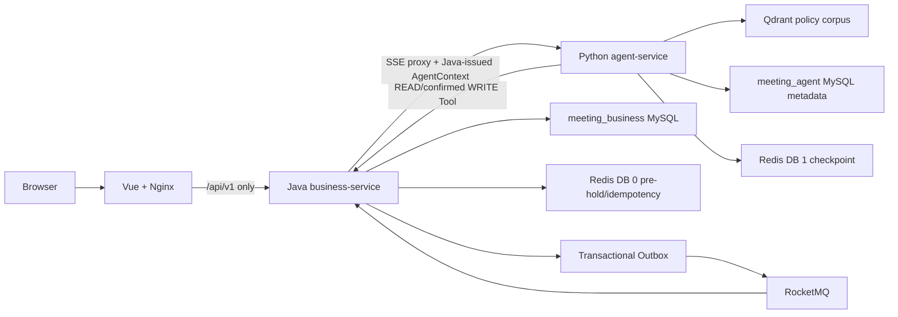
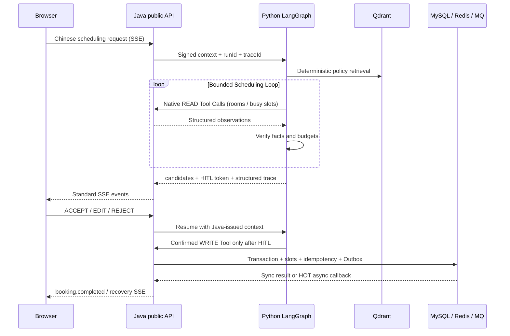

# 企业会议智能调度系统

一个用于技术展示的企业会议智能调度系统。Java 负责鉴权、会议事实源、并发预约、幂等、Outbox 和 RocketMQ；Python 负责固定的四个运行时 Agent、受控反思与重规划、原生 Tool Calling、OR-Tools、HITL 与冲突恢复；Vue 将完整链路呈现给浏览器。

## 能力与架构边界

- 浏览器只访问 Java 的 `/api/v1/**`；前端绝不直连 Python。
- Java 是会议、房间和预约结果的唯一业务事实源；MySQL 唯一约束是并发最终裁决，Redis 仅作预占、缓存和 checkpoint。
- Python 只访问自己的 `meeting_agent` 元数据、Redis DB 1 checkpoint、Qdrant collection，以及 Java 白名单 Tool API；不会读写 Java 业务表。
- 运行时 Agent 固定为 **Supervisor + Requirement + Policy + Scheduling**。Retriever、OR-Tools、HITL 和 Tool 都是确定性节点，不伪装为 Agent。
- Scheduling 使用有预算的 `Plan -> Act -> Observe -> Verify -> Replan` Loop；模型最多 12 次、工具最多 16 次、业务冲突最多重规划 2 次，触顶后进入稳定可恢复状态。
- DeepSeek 路径使用原生 `tools/tool_calls/tool` 协议。Pydantic 参数校验、Java 签发上下文、风险门禁、调用指纹去重和稳定 `toolCallId` 位于确定性 Tool Gate，模型不能伪造身份或直接执行写操作。
- Requirement 使用 Evaluator–Optimizer：确定性评估器只返回结构化反馈，并最多触发一次语义修复；同步 409 和异步 `BOOKING_RESULT(CONFLICT)` 共享同一冲突证据与排除失败候选的重规划路径。
- 默认 `AGENT_MODEL_PROVIDER=fixture`，所有 Smoke、评测和自动测试均不调用真实 DeepSeek；切换为 `deepseek` 时仅在本机 `.env` 填入真实 Key。
- 会议室停用会原子创建异常重排单并通知会议发起人；系统不自动移动会议。异常页支持同一时段硬约束不降级的快速换房，跨时间或约束变化继续由 OR-Tools + RESCHEDULE HITL 处理。
- 会前会后页使用真实 Java 业务数据：议程、材料元数据、动态准备清单、24 小时/30 分钟提醒、自动完成，以及文本会议记录经现有 Requirement Agent 生成的纪要/决策/行动项草案。只有发起人 HITL 接受后行动项才正式写入并开始站内催办。
- 知识库页向所有登录用户展示 Agent 实际检索的会议制度与完整正文；ADMIN 可经 Java 公共 API 上传 Markdown/文本型 PDF、编辑 Markdown 和显式删除，Python 以本地 BGE-M3 统一重建 Qdrant 索引并保留删除 tombstone。





## 快速启动

前置条件：Docker Desktop（Compose v2+）、PowerShell，以及本地 BGE-M3 模型。首次使用会生成被 Git 忽略的本地 `.env`，不会覆盖已有的非空安全配置，也不会输出秘密。启动前确认 `.env` 中 `BGE_M3_HOST_PATH=D:/rag001/bge-m3`、`QDRANT_COLLECTION=meeting_policies_bge_m3_v1`；已有 `.env` 不会被脚本自动覆盖。

```powershell
.\scripts\New-LocalEnv.ps1
docker compose config --quiet
docker compose up -d --build --wait
docker compose ps
```

打开 [http://localhost](http://localhost)。基础 `compose.yaml` 只发布前端端口；需要直接调试 Java、Python、MySQL 等端口时使用开发覆盖：

```powershell
docker compose -f compose.yaml -f compose.dev.yaml up -d --build --wait
```

演示账号：

| 角色 | 用户名 | 密码 |
|---|---|---|
| 员工 | `zhangsan` | `demo-password` |
| 管理员 | `admin` | `demo-password` |

完整的逐页操作、可直接复制的 Agent 输入、预期证据、自动化命令与清理步骤见 [`docs/21-demo-acceptance-runbook.md`](docs/21-demo-acceptance-runbook.md)。

这些仅是虚构演示数据；`.env` 中的数据库、JWT 和服务间密钥必须由 `New-LocalEnv.ps1` 随机生成，永不提交。

## 演示脚本

1. 以 `zhangsan` 登录，在聊天页输入：`下周三下午帮张三安排一个90分钟架构评审，要大屏`。
2. 观察 Java 代理的 SSE 时间线、结构化候选、政策引用和安全 Trace；选择 ACCEPT、EDIT 或 REJECT。EDIT 会重新求解，不能绕过确认写入。
3. 输入 `下周三下午帮张三安排一个90分钟架构评审，10人，要大屏`，可演示 HOT 房间的异步预约、冲突回调和恢复草案。
4. 在“我的会议”创建、修改、取消手动会议；以 `admin` 登录后可在“会议室”创建、编辑或启停会议室。员工只能读取 ACTIVE 房间。
5. 以 `admin` 停用一间承载未来会议的房间并填写原因；发起人从资源失效通知进入“异常重排”，可快速换房，或把带 meetingId 和约束继承要求的开场白带入智能编排后再发送。
6. 打开“会前会后”，为未来会议保存议程和材料状态并查看实时准备清单；选择已完成的演示会议，提交文本记录，先编辑 Agent 草案，再接受并更新行动项状态。
7. 打开“知识库”查阅 22 份会议制度；切换为 `admin` 后可上传 UTF-8 Markdown/文本型 PDF、编辑 Markdown 全文或删除文档。测试时请使用新建的虚构文档，不要修改正式 seed 制度。

自动 Smoke（均使用虚构数据，成功写入的 Smoke 会议会被取消）：

```powershell
# Day 4：Java SSE 代理、Read Tool、Qdrant 引用、Trace
python .\scripts\smoke-day4.py

# Day 5：HITL、EDIT/ACCEPT、HOT conflict recovery；基础 Compose 用 public trace
python .\scripts\smoke-day5.py --public-trace

# Day 6：浏览器所用 public API、手动会议、房间管理、SSE/Trace
python .\scripts\smoke-day6.py

# 资源失效：异常单/通知隔离、同一时段候选、双版本与快速换房
python .\scripts\smoke-exception-replan.py

# 会前会后：真实准备清单、Agent 草案、EDIT 后再确认与行动项状态
python .\scripts\smoke-pre-post-meeting.py

# 知识库：员工只读、管理员上传/查看/编辑/删除与 tombstone
python .\scripts\smoke-rag-document-management.py

# Day 7：全新项目/全新命名卷，完整 Golden Path 连续 3 次；不删除任何卷
.\scripts\Test-Day7EmptyVolume.ps1
```

`Test-Day7EmptyVolume.ps1` 使用独立的 Compose project、临时安全 `.env` 和空命名卷；成功后只停止临时容器/网络，**从不**使用 `down -v`。`-KeepProject` 可保留隔离环境进行人工检查。

## 质量门槛与验收材料

```powershell
Push-Location business-service
.\mvnw.cmd verify
Pop-Location

Push-Location agent-service
uv sync --frozen --group dev
uv run ruff check .
uv run mypy app
uv run pytest
uv run python -m app.evaluation
Pop-Location

Push-Location frontend
npm ci
npm run type-check
npm run build
Pop-Location

# Java HTTP 并发压测：一个房间槽位只能有一个成功；相同幂等键只产生一个会议
python .\scripts\concurrency-day2.py --mode room --requests 100 --workers 32
python .\scripts\concurrency-day2.py --mode idempotency --requests 100 --workers 32
```

Day 7 的全栈验收证据、指标和环境条件在 [docs/REPORTS.md](docs/REPORTS.md)，受控 Agent Loop 的设计与停止条件在 [docs/11-controlled-agent-loop-design.md](docs/11-controlled-agent-loop-design.md)。跨服务实现状态和下一条允许任务以 [docs/HANDOFF.md](docs/HANDOFF.md) 为准。

真实模型评测另提供两个显式入口，报告层级不得互相替代：

```powershell
# 无业务写入的真实 DeepSeek component；未配置 Key 时明确 SKIPPED
Push-Location agent-service
uv run python -m app.evaluation.live --mode component --suite core --repeats 3 --output ..\artifacts\live-eval\component-core.json
uv run python -m app.evaluation.live --mode component --suite full --repeats 1 --output ..\artifacts\live-eval\component-full.json
Pop-Location

# 完整 Compose 上经 Java 公共 API/SSE 运行隔离业务轨迹
python .\scripts\live-model-trajectory.py --public-base http://localhost --output .\artifacts\live-eval\trajectory-final.json
```

2026-08-15 最新结果：完整 live-model 40 条 component 门禁 PASS（Route/Intent/Tool/Native Tool/Citation 均 100%，Constraint F1 95.31%，Source Fidelity Violation 0）；公开 API 多轮对抗场景 16/16 PASS。基线与最终脱敏证据位于 `artifacts/live-eval/component-full-*-20260815.json` 和 `artifacts/product-scenario-evaluation*.json`。真实模型仍具有非确定性，Prompt、模型或 Tool Schema 变更后必须重跑门禁。

## 目录说明

| 目录 | 职责 |
|---|---|
| `business-service/` | Spring Boot / Java 21：鉴权、会议、会前会后事实、并发、Outbox、RocketMQ、Tool Gateway、SSE 与知识库代理 |
| `agent-service/` | FastAPI / LangGraph：四 Agent、会后结构化草案、Provider、RAG 文档/索引、OR-Tools、HITL、checkpoint、Trace、评测 |
| `frontend/` | Vue 3 + TypeScript：聊天、候选确认、Trace、会议/房间管理、知识库、会前准备与会后行动项 |
| `deploy/` | MySQL 初始化、Nginx、RocketMQ 配置 |
| `scripts/` | 可复现 Smoke、并发和空卷验收脚本 |

## 当前范围与限制

- 无真实或 Mock 邮件、日历、视频会议链接或 IoT 供应商；`VIDEO_CONFERENCE` 只表示会议室设备特征。
- 会前会后闭环不包含 RSVP、签到、附件二进制上传、政策检查结果绑定、统计复盘或外部任务平台同步。
- Qdrant 生产集合使用本地 BGE-M3 的 1024 维归一化 dense embedding；4 条固定种子仅供单元测试，运行时不会自动注入。
- `rag-init` 会把 `deploy/rag-documents/` 中的 UTF-8 Markdown 或文本型 PDF 幂等导入版本化新集合，并在 Python 自有 `rag_document` 表登记 checksum 与索引状态；“RAG 测试问题”保留给页面浏览但不索引。ADMIN 可通过 Java 公共 API 管理文档，但不做 OCR、混合稀疏检索、Rerank、富文本编辑、修订差异页或目录镜像删除。
- 不包含 SSO、多租户、多级审批、复杂访客流程、自动移动他人会议、Kubernetes、服务网格、完整 OpenTelemetry/Grafana 或故障注入平台。
- RocketMQ 采用至少一次投递与业务幂等，不宣称 exactly-once。
- DeepSeek 是可替换的 OpenAI-compatible Provider；默认模型名由 `DEEPSEEK_MODEL` 配置，fixture 用于离线可复现验收，不代表真实模型质量或线上 E2E 成功率。

## 规范与协作入口

1. [SPEC.md](SPEC.md)：冻结决策。
2. [AGENTS.md](AGENTS.md)：目录所有权、架构边界和验证规则。
3. [docs/05-data-and-api-spec.md](docs/05-data-and-api-spec.md)：公共 API、Tool、SSE 与数据契约。
4. [docs/07-test-and-evaluation.md](docs/07-test-and-evaluation.md)：并发、Agent 评测和 Docker 验收标准。
5. [docs/HANDOFF.md](docs/HANDOFF.md)：真实进度、命令证据与唯一下一步。
