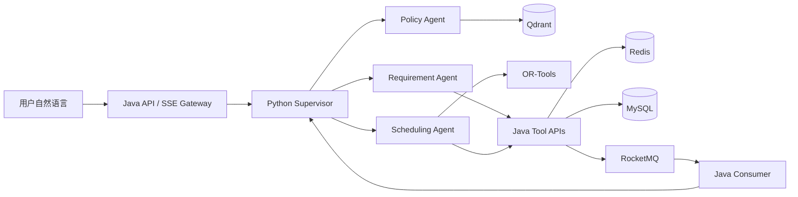

# 00. 项目总览与范围

## 1. 文档目的

本文定义项目的目标、边界、核心技术故事和交付标准。后续实现、测试与演示均以本规范为准。

## 2. 项目目标

构建一个可通过自然语言完成企业会议规划的系统，并通过一条完整链路同时证明：

1. Java 能够可靠处理同一会议室、同一时段的高并发竞争。
2. Python 能够实现有明确职责和结构化交接的 Multi-Agent 工作流。
3. LLM 负责理解、规划和解释，确定性约束由 OR-Tools 和 Java 业务规则裁决。
4. Agent 的副作用操作具有人工确认、幂等和可恢复能力。
5. 整个系统可用 Docker Compose 一键部署，并具有可复现测试结果。

## 3. 核心技术故事

核心展示场景：

1. Supervisor 判断用户需要创建会议。
2. Requirement Agent 将自然语言转换为结构化约束。
3. Policy Agent 从会议规范中检索证据和规则。
4. Scheduling Agent 调用 Java 忙闲工具，并使用 OR-Tools 生成候选方案。
5. 用户查看、编辑或确认预约草案。
6. Java 执行同步预约或返回热门时段异步受理状态。
7. RocketMQ 消费端完成最终竞争并回传结果。
8. LangGraph 根据 `runId` 恢复；成功则结束，冲突则重新规划。

## 4. 用户与角色

一周版本只实现两个角色：

| 角色 | 权限 |
|---|---|
| EMPLOYEE | 查看会议室、查询忙闲、创建/修改/取消自己的会议、使用 Agent |
| ADMIN | EMPLOYEE 的全部权限，外加员工、部门、会议室、设备和文档管理 |

不实现多租户、复杂数据权限和多级审批。

## 5. 功能范围

### 5.1 必须实现

- 用户登录与 JWT 鉴权。
- 员工、部门、会议室、设备基础数据。
- 会议列表、详情、手动创建、修改和取消。
- 固定 30 分钟槽位。
- 参与者忙闲查询。
- 普通同步预约。
- 热门时段异步预约。
- 热门预约冲突后恢复Agent并重新规划。
- 会议室并发防重。
- 站内通知。
- Supervisor + Requirement/Policy/Scheduling 三个专业 Agent。
- DeepSeek Tool Calling。
- 多人时间协调和会议室推荐。
- OR-Tools 硬约束与软约束求解。
- 会议制度简化 RAG。
- 预约、改期和取消的 HITL。
- 显式用户偏好。
- Agent Run/Step/Tool Trace。
- Agent 离线评测。
- Docker Compose 部署。

### 5.2 时间允许时实现

- 前端简单日历视图。
- Prometheus 暴露端点，但不建设完整监控平台。

### 5.3 明确不实现

- 邮箱发送、空调和真实 IoT。
- 企业微信、钉钉、Outlook、Google Calendar 接入。
- 多租户、SSO、多级审批和复杂访客管理。
- 重复会议和会议系列异常实例。
- 真实或 Mock 视频会议链接创建；`VIDEO_CONFERENCE` 仅表示会议室设备特征。
- 自动移动其他用户已有会议。
- OCR、Rerank、知识图谱和复杂 RAG ACL。
- 完整 OpenTelemetry Collector、Grafana 和故障注入平台。
- Kubernetes、服务网格、数据库分库分表。

## 6. 关键设计原则

### 6.1 Java 掌握最终业务事实

- Python 不直连 Java 业务数据库。
- Agent 只能调用 Java 白名单工具。
- 权限、冲突和状态转换全部由 Java 重新校验。
- MySQL 是预约最终事实源，Redis 不是最终裁决者。

### 6.2 LLM 不计算确定性冲突

- LLM 负责提取自然语言约束、决定工具、解释结果。
- OR-Tools 负责候选时间和会议室优化。
- Java 负责最终事务和并发一致性。

### 6.3 副作用必须可控

- 查询类工具可以直接执行。
- Agent发起的预约、改期、取消只生成草案。
- 用户必须通过ACCEPT/EDIT/REJECT确认或编辑Agent草案；手动页面的最终显式提交作为人工确认，不绕行LangGraph。
- Agent草案的确认令牌必须绑定用户、Agent Run 和草案版本；手动入口仍复用相同Java校验与事务服务。

### 6.4 至少一次执行，业务上恰好一次

- RocketMQ 按至少一次投递设计。
- Java 消费端通过事件 ID 幂等。
- Agent Tool 通过 `toolCallId` 和 `idempotencyKey` 幂等。
- 不宣称基础设施提供 exactly-once。

## 7. 技术栈

| 层 | 技术 |
|---|---|
| 前端 | Vue、TypeScript、Vite、基础组件库 |
| Java | Java 21、Spring Boot 4.0.5、Spring Security、MyBatis-Plus 3.5.16、Flyway、Maven |
| Python | Python 3.11+、FastAPI、LangGraph、Pydantic、DeepSeek API、OR-Tools |
| 数据 | MySQL、Redis、Qdrant |
| 消息 | RocketMQ |
| 部署 | Docker、Docker Compose、Nginx |
| 测试 | JUnit、Testcontainers、Pytest、Agent eval dataset、并发压测工具 |

具体依赖版本在实现时固定并写入锁文件，不在设计文档中写易过期的小版本号。

## 8. 非功能目标

| 指标 | 一周版目标 |
|---|---|
| 相同房间槽位并发正确性 | 任意并发下最多一个有效预约 |
| 幂等确认 | 相同幂等键只产生一个业务结果 |
| 普通业务 API | 本地环境 P95 小于 500ms，不含 Agent |
| Agent 端到端 | 常规请求 30 秒内返回候选方案 |
| Agent 硬约束违反率 | 0 |
| Docker 启动 | 一条 Compose 命令启动全部依赖与应用 |
| 可追踪性 | 每次 Agent 请求可通过 traceId 查看完整步骤 |

性能数字是本地演示目标，最终 README 必须记录测试机器、数据规模和压测参数。

## 9. 交付物

- 完整 Monorepo 源码。
- Docker Compose 与环境变量模板。
- Flyway 数据库迁移。
- 初始化演示数据和 RAG 文档。
- OpenAPI 文档。
- Java 单元、集成和并发测试。
- Python 单元、图路由和评测测试。
- 前端可操作演示。
- 架构图、时序图、压测报告和 Agent 评测报告。
- 项目 README 和演示脚本。
