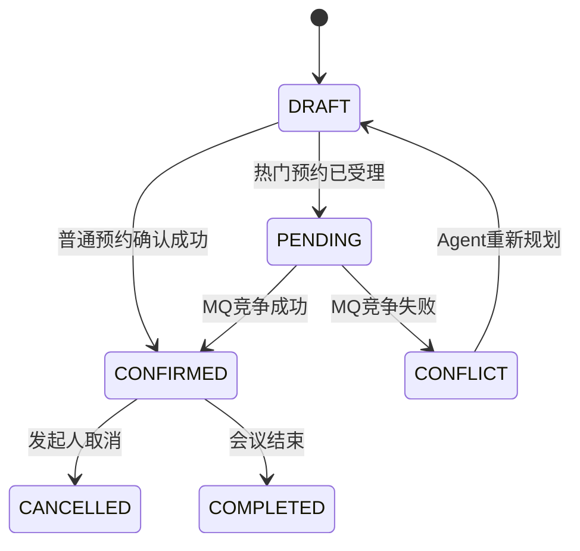

# 01. 功能与验收规范

## 1. 业务对象

| 对象 | 说明 |
|---|---|
| Employee | 企业员工，可属于一个部门 |
| Department | 部门及默认办公位置 |
| MeetingRoom | 会议室，包含容量、楼栋、楼层和热门标记 |
| RoomFeature | 白板、大屏、视频会议等设备特征 |
| Meeting | 会议主记录 |
| MeetingParticipant | 参会者及 REQUIRED/OPTIONAL 类型 |
| RoomSlot | 会议室 30 分钟占用槽位 |
| EmployeeBusySlot | 必须参加者 30 分钟忙碌槽位 |
| BookingDraft | Agent 产生的待确认草案 |
| BookingRequest | 热门预约异步请求 |
| UserPreference | 用户明确保存的调度偏好 |
| Notification | 站内通知 |
| AgentRun/AgentStep | Agent 运行轨迹 |

## 2. 会议状态

下图表示面向用户的完整预约生命周期，逻辑状态分布在 `booking_draft`、`booking_request` 和 `meeting` 三类记录中；正式 `meeting` 只在预约成功后创建。

状态约束：

- `DRAFT` 不占用会议室。
- `PENDING` 表示请求被受理，但不代表预约成功。
- 只有 `CONFIRMED` 会议占用正式业务槽位。
- 一周版本不实现审批和签到状态。
- 取消操作必须使用条件更新，只有 `CONFIRMED` 可取消。

## 3. 用户故事

### US-01 普通预约

输入：

> 帮我预约明天下午 3 点到 4 点的会议室，6 个人，要白板。

期望：

1. 解析日期、起止时间、人数和设备。
2. 查询可用会议室。
3. 返回最多 3 个候选方案。
4. 用户确认后创建会议。
5. 所有参会者获得站内通知。

### US-02 多人时间协调

输入：

> 帮我找下周三下午张三、李四、王五都有空的 1 小时时间。

期望：

- 三人默认均为 REQUIRED。
- 在指定时间窗口内寻找连续 2 个槽位。
- 如存在多个方案，按时间偏好和房间距离排序。
- 只查询时可不创建草案。

### US-03 复杂约束调度

输入：

> 下周给支付组和订单组安排一个 90 分钟架构评审，王经理必须参加，最好下午 3 点以后，不能超过 6 点，要大屏。

期望：

- 部门成员可以展开为 OPTIONAL；明确指定的王经理为 REQUIRED。
- 15:00 以后为软偏好，18:00 前结束为硬约束。
- 大屏是硬约束。
- Policy Agent 检索架构评审规范并提供引用。
- OR-Tools 选择连续 3 个槽位。

### US-04 会议室推荐

输入：

> 找一个能坐 10 个人、有视频会议设备，而且离研发部门近一点的会议室。

期望：

- 容量与设备是硬约束。
- 距离是软约束。
- 若未给时间，Agent 追问时间窗口，不猜测。

### US-05 冲突最少方案

输入：

> 大家都没有完全空闲的时间怎么办？找一个冲突最少的方案。

期望：

- REQUIRED 参与者仍不可冲突。
- OPTIONAL 参与者允许冲突并计入惩罚。
- 返回冲突人员、冲突成本和替代建议。
- 不自动移动已有会议。

### US-06 规则查询

输入：

> 客户会议能不能用 VIP 会议室？

期望：

- Supervisor 只路由 Policy Agent。
- 回答必须附带文档、章节或 chunk 引用。
- 无可靠证据时明确表示未找到，不编造规则。

### US-07 上下文修改

输入：

> 把刚才那个会议延长半小时，换一个有白板的会议室。

期望：

- 解析“刚才那个会议”为当前会话最近会议或草案。
- 查询新的连续槽位和候选房间。
- 生成变更前后差异草案。
- 用户确认前不改变原会议。

### US-08 取消会议

输入：

> 取消明天下午的架构评审。

期望：

- 只在当前用户可管理的会议内搜索。
- 存在多个匹配时必须追问或展示候选。
- 返回取消预览并等待确认。

### US-09 显式偏好

输入：

> 以后技术会议尽量安排在研发楼，不要周五下午。

期望：

- Requirement Agent 识别为 `UPDATE_PREFERENCE`。
- 保存结构化偏好。
- 偏好作为软约束，不能覆盖硬约束。

## 4. Agent 澄清规则

以下情况必须追问：

- 创建会议但没有任何日期或时间窗口。
- 创建会议但会议时长既未明确给出，也不能从固定起止时间或已验证会议类型规则中推导。
- 创建会议但必需参会者范围仍然缺失、存在多个解释或无法在通讯录中唯一解析。
- 参与者姓名存在多个同名员工。
- 修改或取消请求匹配多个会议。
- 没有会议时长且无法从会议类型规则中确定。
- 用户要求违反明确硬规则。

以下信息可以使用默认值：

| 信息 | 默认值 |
|---|---|
| 未说明参与者类型 | 明确点名者，以及明确作为参会范围的“我的小组”成员为 REQUIRED；仅作宽泛候选的部门展开成员为 OPTIONAL |
| 未说明设备 | 无强制设备；可以与刚需追问一并提示，但不得阻塞查询 |
| 未说明地点 | 使用用户偏好和部门默认位置排序 |
| 未说明候选数量 | 最多 3 个 |
| 未说明时区 | Asia/Shanghai |

部分时间表达使用下列确定性补全，补全结果必须在澄清回复和需求摘要中标记为“系统补全”，用户后续明确说明可覆盖：

| 表达 | 默认解释 |
|---|---|
| `25号` | 当前月份的25日 |
| `周三` | 当前周周三 |
| 只说明时刻 | 当前日期 |
| 上午/早上 | `06:00-12:00` |
| 中午 | `11:00-14:00` |
| 下午 | `12:00-18:00` |
| 晚上 | 当日 `18:00` 至次日 `06:00` |

- 当前月日期、当前周星期或当天时刻补全后已经过去时必须追问，不得自动改为下月、下周或次日。
- 只给明确24小时制开始时刻、尚未给会议时长时，必须保留该开始时刻并只追问时长；下一轮不得丢失首轮时刻。单独“2点”等上午/下午不明的表达必须确认。
- “最好/尽量在2点开始”是软偏好；“必须/就2点开始”才是固定开始时间硬约束。
- 一次澄清应同时展示已确认事实、系统补全、通讯录推定和全部阻塞问题；用户可以用一句自然语言同时补充多个字段。
- 单一所属部门时，“我的小组/同组人员”可以暂按当前用户所属部门解释并展示 ACTIVE 成员名单；无法确定唯一人员范围时必须追问。

## 5. 预约模式

### 5.1 普通同步预约

- 适用于普通会议室和非热点时段。
- 确认接口在一个数据库事务内完成最终预约。
- 返回 `SUCCESS` 或 `CONFLICT`。

### 5.2 热门异步预约

- 会议室或具体日期时段可标记为 HOT。
- 确认接口创建 `BookingRequest` 和 Outbox 事件。
- 返回 `PENDING` 和 `requestNo`。
- MQ 消费端在事务内完成最终预约。
- 处理结果通过回调或状态查询恢复 Agent。

## 6. HITL 规范

敏感工具：

- `create_booking_draft`
- `create_reschedule_draft`
- `create_cancellation_preview`

用户操作：

| 操作 | 行为 |
|---|---|
| ACCEPT | 使用当前草案参数调用 Java 确认接口 |
| EDIT | 更新草案参数，重新执行规则与可用性校验 |
| REJECT | 草案失效，Agent Run 结束 |
| FEEDBACK | 将反馈加入状态，返回 Scheduling Agent 重新规划 |

确认令牌默认有效期 10 分钟，只能使用一次。

## 7. 前端功能

### 7.1 登录页

- 用户名密码登录。
- 保存短期访问令牌。
- 401 时回到登录页。

### 7.2 Agent 聊天页

- SSE 流式显示回答。
- 显示当前 Agent 和工具步骤。
- 展示候选方案卡片。
- 支持接受、编辑、拒绝和反馈。
- 可查看引用文档。

### 7.3 我的会议

- 按时间查询自己的会议。
- 查看会议详情和参与者。
- 手动创建、修改、取消。
- 显示 `PENDING/CONFIRMED/CONFLICT/CANCELLED`。

### 7.4 会议室管理

- EMPLOYEE：查询房间、容量、位置、设备和可用时间。
- ADMIN：新增、修改、启停会议室，配置 HOT 标记。

### 7.5 Agent Trace

- 展示 Run 总状态和耗时。
- 展示各 Agent Step。
- 展示 Tool 名称、脱敏参数、结果摘要和耗时。
- 展示 RAG 引用和 OR-Tools 结果摘要。
- 不展示 DeepSeek 的隐藏推理内容。

## 8. 验收标准

| ID | 验收条件 |
|---|---|
| AC-01 | 自然语言普通预约能够生成候选并在确认后落库 |
| AC-02 | 多人协调结果不违反 REQUIRED 参与者忙闲 |
| AC-03 | 复杂约束请求由 OR-Tools 返回可验证结果 |
| AC-04 | 规则回答包含有效文档引用 |
| AC-05 | 预约、改期、取消在确认前没有业务副作用 |
| AC-06 | 同一确认令牌重复调用只产生一个结果 |
| AC-07 | 同一房间槽位并发预约最多一个成功 |
| AC-08 | 热门预约可以从 PENDING 进入最终状态 |
| AC-09 | 热门预约冲突后 Agent Run 可以恢复并给出替代方案 |
| AC-10 | 前端可查看完整 Agent Step 和 Tool Trace |
| AC-11 | 所有服务可通过 Docker Compose 启动 |
| AC-12 | README 包含压测和 Agent 评测结果 |
| AC-13 | 改期能唯一识别目标会议，并将新时间与原会议选择条件分离；未明确修改的时长、人员、标题、类型和要求保持不变 |
| AC-14 | 改期忙闲与房间查询只排除已鉴权目标会议自身占用，不能把自身占用误判为冲突，也不能排除其他会议 |
| AC-15 | 无解响应和恢复视图包含请求窗口、时长、类别、具体冲突人员/时段/会议标识及有限建议，聊天页可直接查看这些证据 |
