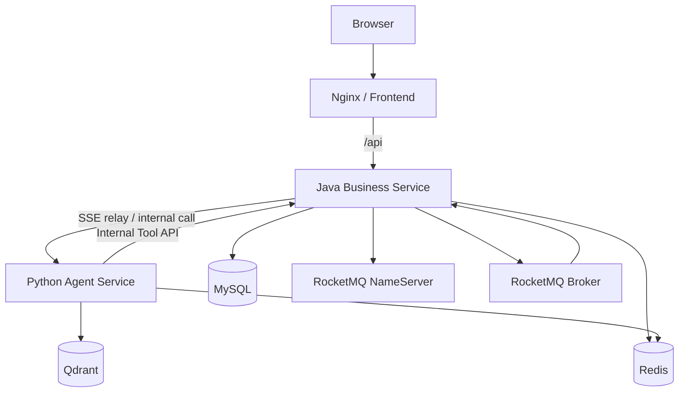
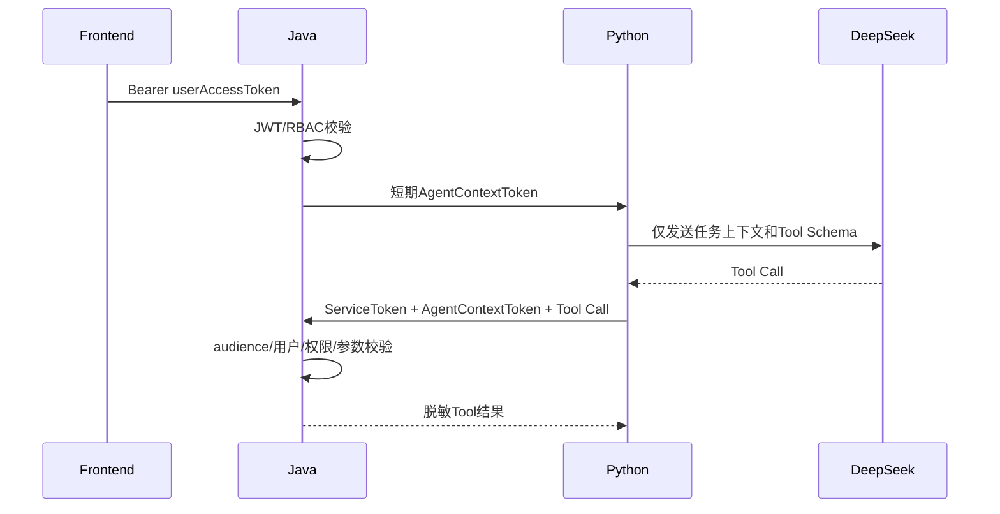
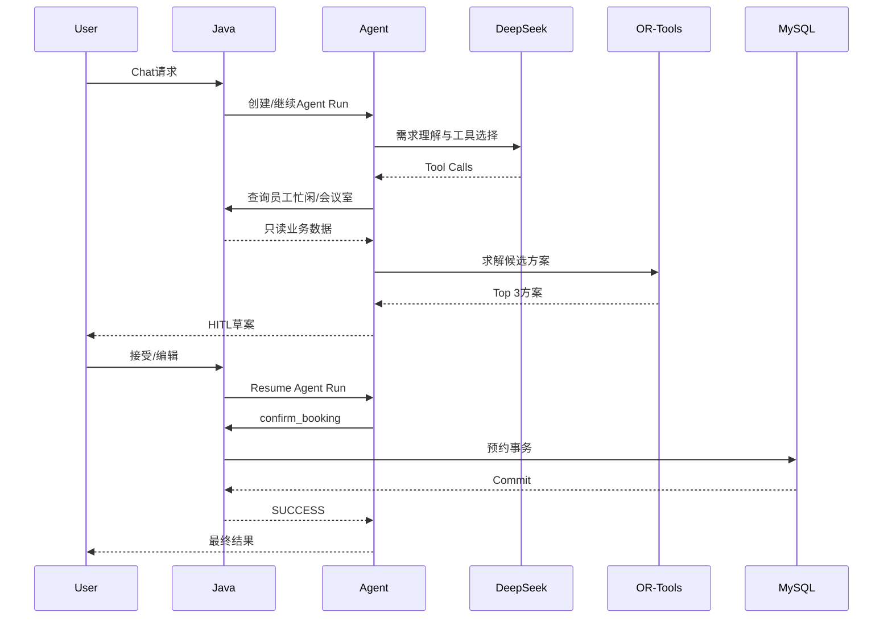
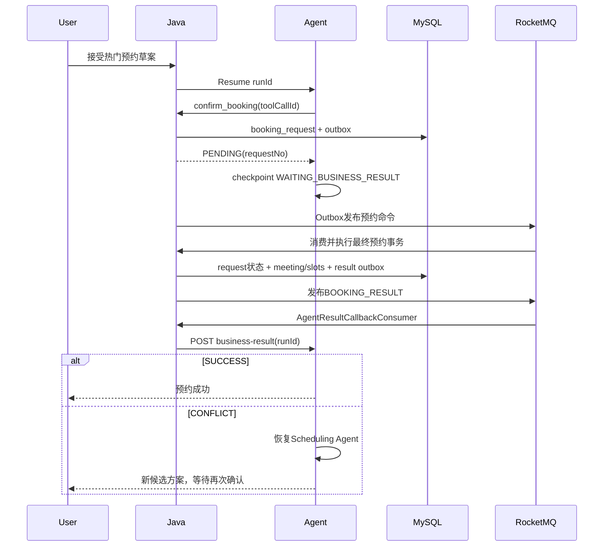

# 02. 系统架构规范

## 1. 总体架构

系统采用 Monorepo、三个应用服务和四个基础设施组件：



### 1.1 应用服务

| 服务 | 职责 |
|---|---|
| frontend | 登录、聊天、会议管理、会议室管理、HITL 和 Trace 展示 |
| business-service | 鉴权、业务数据、并发预约、草案确认、Tool Gateway、MQ 和 SSE 代理 |
| agent-service | LangGraph Multi-Agent、DeepSeek、OR-Tools、RAG、checkpoint 和评测 |

### 1.2 基础设施

| 组件 | 用途 |
|---|---|
| MySQL | 两个隔离逻辑库：Java业务事实与Outbox；Python Agent Run/Step元数据 |
| Redis | 预约预占、限流、重复提交、LangGraph checkpoint |
| RocketMQ | 热门预约、领域事件、异步结果通知 |
| Qdrant | 会议规范文档向量索引 |

## 2. Monorepo 结构

```text
.
├─ frontend/                       # Vue + TypeScript
├─ business-service/               # Spring Boot
├─ agent-service/                  # FastAPI + LangGraph
├─ docs/                            # 设计文档
├─ deploy/
│  ├─ mysql/init/
│  ├─ rocketmq/
│  ├─ nginx/
│  └─ rag-documents/
├─ scripts/                         # 初始化、评测、压测脚本
├─ compose.yaml
├─ .env.example
└─ README.md
```

## 3. 服务所有权

### 3.1 Java 所有的数据

- 用户、角色、部门。
- 会议室、设备特征。
- 会议、参与者、会议室槽位、员工忙碌槽位。
- 预约草案和确认令牌。
- 热门预约请求。
- 幂等记录。
- Outbox、消费记录和站内通知。
- 业务侧 Agent Tool 审计。
- 会前议程、材料元数据、提醒投递日志、会后草案、正式纪要/决策/行动项和催办投递日志。

### 3.2 Python 所有的数据

- 对话线程。
- Agent checkpoint。
- Agent Run、Step 和模型调用摘要。
- 显式调度偏好。
- RAG 文档解析元数据与向量索引。
- Agent 评测数据与结果。

### 3.3 禁止的访问

- Python 禁止直接读取或写入 Java 业务表。
- Java 不实现 LLM 路由、Prompt 和 OR-Tools 求解。
- 前端禁止直接访问 Python 服务。
- DeepSeek 不得看到 JWT、内部服务令牌、数据库 ID 白名单或原始敏感日志。

## 4. 信任与鉴权边界



### 4.1 用户令牌

- 前端只持有 Java 颁发的访问令牌。
- 默认有效期 2 小时。
- 一周版本不实现 Refresh Token。

### 4.2 AgentContextToken

Java 在启动 Agent Run 时创建短期内部 JWT，建议载荷：

```json
{
  "sub": "10001",
  "roles": ["EMPLOYEE"],
  "traceId": "trc_...",
  "runId": "run_...",
  "aud": "agent-service",
  "exp": 1780000000
}
```

- 默认有效期 10 分钟。
- Python 调用 Java Tool 时同时携带固定服务令牌和该上下文令牌。
- 令牌不进入 Prompt、Agent State 的可见消息或 Trace 参数。

## 5. 普通预约时序



## 6. 热门异步预约与 Agent 恢复



结果回调要求：

- 回调以 `eventId` 幂等。
- Python 只有在checkpoint成功更新后才返回 2xx。
- Python 不可用时由 RocketMQ 重试。
- 新方案修改了时间或房间时必须再次确认。

## 7. SSE 设计

前端只连接 Java：

```text
POST /api/v1/agent/runs/stream
Content-Type: application/json
Accept: text/event-stream
```

Java调用 Python 内部流式接口并转发以下事件：

| 事件 | 载荷 |
|---|---|
| run.started | runId、threadId、traceId |
| agent.started | agentName |
| agent.completed | agentName、summary、durationMs |
| tool.started | toolCallId、toolName、sanitizedArgs |
| tool.completed | toolCallId、resultSummary、durationMs |
| plan.candidates | 候选方案数组 |
| hitl.required | confirmationToken、draft |
| booking.pending | requestNo |
| booking.completed | meetingId、status |
| run.completed | finalAnswer |
| run.failed | errorCode、userMessage |

要求：

- SSE 断开不取消已经进入 `PENDING` 的业务请求。
- 前端重新连接时可以通过 `runId` 查询快照。
- Java转发时禁止输出内部令牌和原始模型隐藏推理。

## 8. 全链路标识

| 标识 | 产生方 | 生命周期 |
|---|---|---|
| traceId | Java Gateway | 一次端到端用户动作 |
| threadId | Python | 一段聊天会话 |
| runId | Python/Java协商 | 一次Agent任务，允许暂停恢复 |
| stepId | Python | 一个Agent节点 |
| toolCallId | DeepSeek/Python | 一次工具请求 |
| confirmationToken | Java | 一份可确认草案 |
| idempotencyKey | 前端或Python | 一次业务写命令 |
| requestNo | Java | 热门异步预约请求 |
| eventId | Java | 一条Outbox/MQ事件 |

所有应用日志至少包含 `traceId`；Agent和业务异步链路同时包含 `runId`。

## 9. 一致性模型

| 场景 | 一致性策略 |
|---|---|
| 会议室槽位 | MySQL唯一约束，强一致 |
| 必须参加者忙碌槽位 | MySQL唯一约束，强一致 |
| Redis预占 | 性能优化，允许短暂偏差 |
| 热门预约状态 | 最终一致，由requestNo查询 |
| 站内通知 | 最终一致 |
| Agent Trace | 最终一致，不影响业务结果 |
| RAG索引 | 最终一致 |
| 房间停用、异常单与资源失效通知 | 单个 Java 本地事务，强一致 |
| 会议改期/取消与异常单终态 | 同一 Java 业务事务，强一致 |
| 会前准备聚合 | Java 当前事实动态计算；保存使用独立乐观版本 |
| 会后草案审核与正式记录 | ACCEPT 在单个 Java 本地事务中强一致 |
| 定时提醒与行动项催办 | 数据库唯一投递键保证应用级幂等 |

## 10. 降级策略

- DeepSeek不可用：手动会议功能正常，Agent返回明确不可用状态。
- Agent服务不可用：Java业务API和手动预约正常。
- Qdrant不可用：Policy Agent返回无证据状态；Scheduling Agent可在无RAG时继续执行基础规则。
- Redis不可用：普通预约允许降级到数据库唯一约束；关闭热门异步入口或限制流量。
- RocketMQ不可用：普通同步预约仍可执行；Outbox保留待发布事件；热门预约暂时拒绝或保持PENDING。

## 11. 架构决策记录

### ADR-001 Java作为唯一前端业务入口

原因：集中鉴权、权限、审计和SSE入口，避免前端同时信任两个后端。

### ADR-002 Python Agent只使用Java Tool API

原因：保证模型无法绕过业务层直接访问数据库。

### ADR-003 固定30分钟槽位

原因：把区间重叠问题转换成唯一键竞争，降低一周实现风险并便于压测证明。

### ADR-004 OR-Tools负责约束求解

原因：保证调度结果可重复、可验证，避免LLM进行不可靠的日期和冲突计算。

### ADR-005 同步和热门异步双通道

原因：同步通道符合普通会议体验，异步通道用于展示高竞争受理、MQ可靠执行和Agent恢复。

### ADR-006 异常单由 Java 持有且不自动重排

原因：资源状态、会议和权限均由 Java 最终裁决。会议室失效只产生待办与通知；异常页固定时段换房是人工业务入口，跨时间或约束变化交给 Python OR-Tools 并继续经过 HITL，避免后台故障事件越过用户意图自动移动会议。

### ADR-007 会后文本分析复用 Requirement Agent

会后纪要抽取不增加新的运行时 Agent。Java 先鉴权并提交 `PROCESSING` 草案，再在事务外将长度受限的会议快照与文本记录发送给 Python；现有 Requirement Agent 以 `POST_MEETING_ANALYSIS` 结构化模式生成草案。Python 不持有正式会议内容，Java 在 HITL `ACCEPT` 时重新校验负责人、截止时间、权限和草案版本并写入正式表。

### ADR-008 定时任务只产生项目内业务状态和站内通知

自动完成、会前提醒和行动项催办均由 Java 有界扫描完成，使用数据库条件更新与唯一投递键去重。不接入邮件、短信、真实日历、Slack/Teams 或外部任务平台，也不把 Redis 当作投递事实源。
