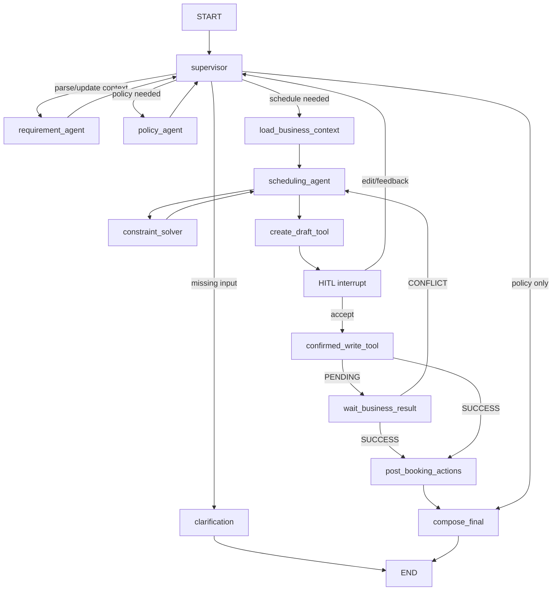

# 04. Multi-Agent 规范

## 0. Spec 1.1：受控 Agent Loop 升级

本节覆盖后续章节中与一次性固定 Tool 计划冲突的旧描述。运行时 Agent 数量仍固定为 Supervisor、Requirement、Policy、Scheduling；Evaluator、Tool Executor、Verifier、Solver、HITL 和 Conflict Repair Handler 均为确定性组件，不新增 Critic Agent，也不引入 DeepAgents。

### 0.1 主循环

Scheduling Agent 使用有界 `PLAN -> ACT -> OBSERVE -> VERIFY -> SOLVE/REPLAN`：

1. PLAN：DeepSeek 通过 OpenAI-compatible `tools` 选择 Java READ Tool，并生成符合 JSON Schema 的参数。
2. ACT：Tool Gate 校验名称、Pydantic 参数、AgentContext 派生的用户身份、时间/人数上限、风险等级和调用指纹；模型不得提供可信 userId、runId 或权限。
3. OBSERVE：只把脱敏、限量的 Tool 结果作为 `role=tool` 消息返回模型，并将结构化摘要写 Trace。
4. VERIFY：确定性 Evaluator 检查所需事实是否齐备、调用是否重复、参数是否偏离 canonical requirement、预算是否耗尽；不通过时把结构化 feedback 返回同一 Scheduling Agent。
5. SOLVE：事实齐备后由 OR-Tools 求解，结果必须再经过独立 HardConstraintValidator。
6. REPLAN：Tool 校验失败、可恢复 Tool 错误、无效计划或 Java 最终冲突可触发重规划；不得绕过验证直接创建业务记录。

普通 `https://api.deepseek.com` 端点使用原生 Tool Calling，但不发送 Beta 专属的 `function.strict=true`；严格性由本地 Pydantic `extra=forbid`、canonical context 和 Tool Gate 保证。只有显式将 Base URL 配为 `/beta` 并完成兼容测试后，才允许启用服务端 strict mode。Tool Loop 显式设置 `thinking.type=disabled`，避免 V4 默认思考模式要求跨轮回传 `reasoning_content`；本系统不存储或展示该隐藏推理。默认示例模型使用当前仍受支持的 `deepseek-v4-flash`，实际模型名始终由环境变量注入。

### 0.2 预算与停止条件

- 单次 Scheduling Tool Loop 最多4轮；同一 `(toolName, canonicalArgsHash)` 不得重复执行。
- 全 Run 最多12次模型调用、16次 Tool 调用、2次业务冲突重规划；Schema 修复和 Evaluator 修复均计入模型调用，该预算允许初始规划加两次完整的事实刷新，沿用图节点上限作为最后保险。达到预算统一返回稳定 `BUDGET_EXHAUSTED`，而不是笼统内部错误。
- 预算终态固定为 `READY_FOR_CONFIRMATION`、`NEED_CLARIFICATION`、`NO_SOLUTION`、`BUDGET_EXHAUSTED`、`TOOL_UNAVAILABLE`、`WAITING_BUSINESS_RESULT`、`COMPLETED`、`FAILED`。
- Loop 到达 `READY_FOR_CONFIRMATION` 后才允许确定性节点创建无占用草案；确认写 Tool 只在 HITL ACCEPT 后暴露给确定性确认节点。

### 0.3 Requirement Evaluator-Optimizer

- 第一次 Requirement 输出仍由 Pydantic 校验；Schema 修复重试和语义优化重试分别最多1次，但同一次错误不得触发无界嵌套重试。
- 语义 Evaluator 至少检查：服务端注入的 `requestTime`、Asia/Shanghai 相对日期基准、30分钟槽位、持续时间、必需参会者、容量与人员数一致性、修改/取消 targetMeetingId、硬软约束冲突。
- 可自动修复的问题以 `RequirementFeedback{codes,summary}` 返回同一 Requirement Agent；必须由用户提供的信息进入 `WAITING_USER_INPUT`，禁止模型猜测。

### 0.4 并发冲突修复

- Java `BOOKING_RESULT.CONFLICT` 仍是最终事实；Python 从回调、失败草案和原始约束派生 `ConflictRepairFeedback`。
- Feedback 至少包含 conflictType、failedCandidateId、preservedConstraints、excludedCandidateIds、replanCount 和可向用户展示的变更原因。
- 重规划必须重新读取 Java 忙闲/房间事实、排除失败候选、保留硬约束并重新经过 OR-Tools 与独立 Validator。
- 只有候选或约束发生真实变化才生成新草案；重复候选、超过2次冲突或必须放宽硬约束时停止并请求用户决策。

### 0.5 Trace 与评测

- Trace 可记录 loop phase、iteration、decision、tool name、参数摘要、observation 摘要、feedback code、replan count、stop reason、剩余预算、模型/Prompt/Schema 版本和 API 返回的 Token usage；不得记录隐藏推理或秘密。
- Fixture 评测只能命名为组件/回归评测。`E2E Task Success` 必须实际运行完整 Graph；真实模型报告必须单独标注 provider/model、重复次数、网络调用、延迟、Token/成本和失败样本。

## 1. 目标

Agent服务负责把自然语言会议任务转换为可验证、可确认、可执行的业务动作。它不拥有会议业务事实，也不直接写业务数据库。

系统固定为四个Agent：

1. Supervisor Agent。
2. Requirement Agent。
3. Policy Agent。
4. Scheduling Agent。

工具、OR-Tools、RAG Retriever和HITL Handler是确定性节点，不额外包装成Agent。

## 2. Agent职责

### 2.1 Supervisor Agent

职责：

- 识别工作流阶段和下一执行节点。
- 根据任务决定是否需要Policy Agent和Scheduling Agent。
- 控制最大迭代次数。
- 发现缺失信息时生成澄清问题。
- 汇总专业Agent结果。
- 决定进入HITL、等待异步结果或结束。

允许的路由：

```text
REQUIREMENT
POLICY
SCHEDULING
CLARIFICATION
HITL
WAIT_BUSINESS_RESULT
FINAL
FAIL
```

Supervisor不得直接调用业务写工具。

### 2.2 Requirement Agent

职责：

- 意图识别。
- 相对日期和时间窗口规范化。
- 会议时长、参与者、房间和设备提取。
- REQUIRED与OPTIONAL参与者划分。
- 硬约束与软约束划分。
- “刚才那个会议”等指代解析。
- 显式偏好更新识别。
- 对不完整请求生成结构化缺失字段。

输出必须符合 `MeetingRequest` Schema，不允许直接输出预约结论。

### 2.3 Policy Agent

职责：

- 将用户问题和会议类型转换为检索查询。
- 调用简化RAG。
- 选择支持答案的证据。
- 输出规则摘要、引用和置信度。
- 将可识别规则转换为有限枚举约束。

允许转换的规则类型：

```text
MAX_DURATION_MINUTES
ALLOWED_ROOM_TYPES
REQUIRED_ROOM_FEATURE
DISALLOWED_TIME_WINDOW
ADVISORY_ONLY
```

RAG产生的规则不能绕过Java最终校验。证据不足时标记 `UNVERIFIED`。

RAG 语料导入是确定性基础设施组件，不是新的 Agent：

- 只接受会议制度与会议规范的 UTF-8 Markdown 和文本型 PDF；不做 OCR、Rerank 或知识图谱。
- 按标题路径切片并保留 documentId、chunkId、标题、页码、版本、优先级和 checksum，Policy Agent 只能引用本轮真实召回且能重新打开的 chunk。
- 文件导入失败不得用内置模型知识补齐；检索无可验证依据时必须回答“未找到可验证证据”并标记 `UNVERIFIED`。
- 文档索引最终一致，不改变 Java 业务事实、预约权限或硬约束；Java 写入前仍重新校验全部业务规则。

### 2.4 Scheduling Agent

职责：

- 决定调用哪些忙闲和会议室查询工具。
- 把Requirement和Policy结果转换为OR-Tools输入。
- 对求解结果进行业务语义解释。
- 处理无解原因和约束松弛建议。
- 创建预约、改期或取消草案。
- 热门预约冲突恢复后重新规划。

Scheduling Agent不能自行修改其他用户会议。

## 3. LangGraph结构



实现要求：

- 每个专业Agent使用独立system prompt和结构化输出Schema。
- 每个专业Agent是独立LangGraph节点或子图。
- Agent间只通过共享State中的结构化字段交接。
- 不依赖自然语言消息作为唯一内部协议。
- 每个Run最多12次模型调用、16次工具调用和20个图节点。
- 超限后返回 `AGENT_STEP_LIMIT_EXCEEDED`。

## 4. 共享状态

建议Pydantic模型：

```python
class MeetingAgentState(BaseModel):
    thread_id: str
    run_id: str
    trace_id: str
    user_id: int
    messages: list[Message]
    intent: Intent | None
    meeting_request: MeetingRequest | None
    missing_fields: list[str] = []
    policy_result: PolicyResult | None
    employee_context: EmployeeContext | None
    availability_snapshot: AvailabilitySnapshot | None
    schedule_candidates: list[ScheduleCandidate] = []
    selected_candidate_id: str | None
    draft: BookingDraftView | None
    confirmation_token: str | None
    pending_request_no: str | None
    business_result: BusinessResult | None
    user_preferences: SchedulingPreferences | None
    citations: list[Citation] = []
    step_count: int = 0
    tool_call_count: int = 0
    status: RunStatus
    error: AgentError | None
```

关键枚举：

```text
Intent:
CREATE_MEETING
FIND_COMMON_TIME
RECOMMEND_ROOM
MODIFY_MEETING
CANCEL_MEETING
QUERY_POLICY
UPDATE_PREFERENCE

RunStatus:
RUNNING
WAITING_USER_INPUT
WAITING_CONFIRMATION
WAITING_BUSINESS_RESULT
SUCCEEDED
FAILED
CANCELLED
```

## 5. MeetingRequest Schema

```json
{
  "intent": "CREATE_MEETING",
  "title": "架构评审",
  "meetingType": "ARCHITECTURE_REVIEW",
  "durationMinutes": 90,
  "timeWindow": {
    "start": "2026-08-19T13:00:00+08:00",
    "end": "2026-08-19T18:00:00+08:00"
  },
  "requiredParticipants": [
    {"name": "王经理", "employeeId": null}
  ],
  "optionalGroups": ["支付组", "订单组"],
  "requiredFeatures": ["LARGE_SCREEN"],
  "minimumCapacity": null,
  "preferredBuildings": [],
  "hardConstraints": [
    {"type": "END_BEFORE", "value": "18:00"}
  ],
  "softConstraints": [
    {"type": "START_AFTER", "value": "15:00", "weight": 20}
  ],
  "targetMeetingId": null
}
```

所有日期必须转换为绝对时间后再调用业务工具。

## 6. Tool目录

### 6.1 Java业务工具

| Tool | 风险 | 直接执行 | 说明 |
|---|---|---:|---|
| resolve_employees | READ | 是 | 姓名、部门解析 |
| get_employee_free_busy | READ | 是 | 忙碌槽位 |
| search_available_rooms | READ | 是 | 房间和空闲槽位 |
| get_recent_meeting | READ | 是 | 上下文会议解析 |
| create_booking_draft | DRAFT | 是 | 创建无业务占用草案 |
| create_reschedule_draft | DRAFT | 是 | 创建变更草案 |
| create_cancellation_preview | DRAFT | 是 | 取消预检 |
| confirm_booking | WRITE | 否 | 必须经过HITL |
| confirm_reschedule | WRITE | 否 | 必须经过HITL |
| confirm_cancellation | WRITE | 否 | 必须经过HITL |

### 6.2 Python内部工具

| Tool | 说明 |
|---|---|
| search_meeting_policy | Qdrant检索会议制度 |
| open_policy_chunks | 打开本轮候选chunk正文 |
| solve_schedule | OR-Tools求解Top K方案 |
| save_explicit_preference | 保存用户明确表达的偏好 |

### 6.3 Tool Schema规则

- 所有工具参数使用Pydantic模型。
- `additionalProperties`逻辑上禁止。
- ID、数组长度、时间跨度和返回条数必须设上限。
- 模型输出参数解析失败时最多修复重试1次。
- Tool结果返回结构化摘要，不把大对象全部写入消息历史。
- Tool异常转换为有限错误码，由Agent决定重试、追问或终止。

## 7. DeepSeek适配

### 7.1 模型角色

- Supervisor：结构化路由，temperature 0。
- Requirement：结构化抽取，temperature 0。
- Policy：证据选择和回答生成，低temperature。
- Scheduling：工具选择和方案解释，低temperature。

### 7.2 调用规则

- 使用OpenAI-compatible接口封装在 `ModelProvider` 中。
- 模型名、Base URL、API Key和超时通过环境变量配置。
- 不在业务代码中硬编码具体模型版本。
- 对Tool参数和结构化输出执行Pydantic校验。
- JSON空响应、截断、429和5xx使用有限重试。
- 不保存或展示模型隐藏推理内容；Trace只记录路由理由摘要。
- API Key只存在于Agent服务环境变量。

## 8. HITL与Checkpoint

### 8.1 暂停点

- 预约确认前。
- 改期确认前。
- 取消确认前。
- Agent需要关键缺失信息时。

### 8.2 持久化

- 使用Redis持久化LangGraph checkpoint，并启用AOF卷。
- checkpoint key至少包含 `threadId + runId`。
- Run默认保留24小时。
- BookingDraft确认令牌默认保留10分钟。
- 恢复时重新加载当前权限、偏好和业务状态。

### 8.3 Resume输入

```json
{
  "action": "ACCEPT",
  "confirmationToken": "cfm_uuid",
  "editedDraft": null,
  "feedback": null
}
```

`EDIT`后必须重新进入Requirement或Scheduling流程，不能直接执行编辑后的参数。

## 9. 热门预约结果恢复

Python内部回调：

```text
POST /internal/v1/agent-runs/{runId}/business-result
```

处理步骤：

1. 验证Java服务签名。
2. 以 `eventId` 检查回调幂等。
3. 加载runId checkpoint。
4. 验证当前状态为 `WAITING_BUSINESS_RESULT` 且requestNo一致。
5. 写入BusinessResult。
6. SUCCESS进入后置动作和最终回答。
7. CONFLICT清除旧候选，回到Scheduling Agent。
8. 更新Agent Run和回调幂等记录。

若run已结束，回调返回2xx并记录忽略原因，防止MQ无限重试。

## 10. OR-Tools模型

### 10.1 候选集合

Java先返回指定窗口内：

- 房间基本信息。
- 房间可用槽位。
- REQUIRED和OPTIONAL参与者忙碌槽位。

Python生成候选 `(room, startSlot)`，会议持续槽位数：

```text
slotCount = durationMinutes / 30
```

### 10.2 决策变量

对每个候选建立布尔变量：

```text
x(room, startSlot) ∈ {0, 1}
```

单次方案要求：

```text
Σ x(room, startSlot) = 1
```

### 10.3 硬约束

- 起止时间在用户窗口内。
- 会议占用的全部连续槽位可用。
- 所有REQUIRED参与者在全部槽位可用。
- 房间容量满足人数。
- 房间包含全部必需设备。
- 满足可机器执行的政策约束。

不满足硬约束的候选在建模前直接过滤。

### 10.4 软约束目标

最小化：

```text
totalCost =
  optionalParticipantConflictCount * 100
  + preferredTimeDeviationSlots * 20
  + buildingDistanceScore * 10
  + capacityWaste * 2
  + userPreferenceViolation * 15
  + roomChangeCost * 30
```

权重集中配置并记录到Trace，便于解释和评测。

### 10.5 Top 3方案

- 求得最优方案后记录结果。
- 增加排除该候选的no-good约束。
- 最多重复3次。
- 返回每个方案的总成本和分项成本。

### 10.6 无解处理

按以下顺序分析：

1. 检查会议室设备/容量是否导致候选为空。
2. 检查REQUIRED参与者共同空闲。
3. 检查时间窗口和持续时长。
4. 检查政策硬约束。
5. 生成有限的松弛建议，不自动应用。

## 11. 简化RAG

### 11.1 文档范围

- 会议室管理制度。
- VIP会议室使用规则。
- 访客和保密会议规定。
- 取消/改期规则。
- 架构评审、需求评审、Kickoff、复盘和客户会议规范。
- 视频、投影、白板设备说明。
- 部门规范和FAQ。

### 11.2 入库

- 一周版本支持Markdown、文本型PDF。
- 通过CLI或管理员接口触发。
- 按标题层级切片，目标500至800 tokens，重叠约80 tokens。
- 使用本地中文Embedding模型，模型名通过环境变量配置。
- 不做OCR和Rerank。

### 11.3 元数据

```json
{
  "documentId": "doc_uuid",
  "title": "架构评审规范",
  "documentType": "MEETING_STANDARD",
  "department": "研发部",
  "version": "1.0",
  "effectiveDate": "2026-01-01",
  "headingPath": ["架构评审", "参会要求"],
  "page": 2,
  "chunkId": "chunk_uuid"
}
```

### 11.4 检索

采用两阶段读取：

1. `search_meeting_policy`返回Top 5候选摘要和chunkId。
2. `open_policy_chunks`只允许打开本轮候选中的Top 2至3个正文。

回答必须带文档名、标题路径和页码或chunkId。

## 12. 用户偏好

只保存明确表达的偏好：

```json
{
  "preferredBuildings": ["研发楼"],
  "avoidWeekdays": ["FRIDAY"],
  "avoidTimeRanges": [{"start": "13:00", "end": "18:00"}],
  "preferredTimeRanges": [],
  "updatedFromRunId": "run_uuid"
}
```

- 不从行为历史自动推断。
- 用户可以查看和删除。
- 偏好都是软约束。

## 13. Trace规范

### 13.1 Agent Run

- runId、threadId、traceId、userId。
- 原始问题的脱敏摘要。
- intent、status、startedAt、finishedAt。
- modelCalls、toolCalls、tokenUsage、durationMs。
- 最终错误码或答案摘要。

### 13.2 Agent Step

- stepId、runId、agentName、nodeName。
- inputSummary、outputSummary。
- startedAt、finishedAt、durationMs。
- status和errorCode。

### 13.3 Tool Call

- toolCallId、runId、toolName、riskLevel。
- sanitizedArgs、resultSummary。
- durationMs、status、idempotencyKey。

不得记录：API Key、JWT、Service Token、完整文档正文和隐藏推理。

## 14. Agent测试要求

- Router单元测试。
- Requirement结构化抽取测试。
- Tool Schema和错误映射测试。
- LangGraph节点与条件边测试。
- HITL accept/edit/reject/resume测试。
- 异步业务结果重复回调测试。
- OR-Tools硬约束属性测试。
- RAG引用存在性测试。
- 离线评测集端到端测试。
