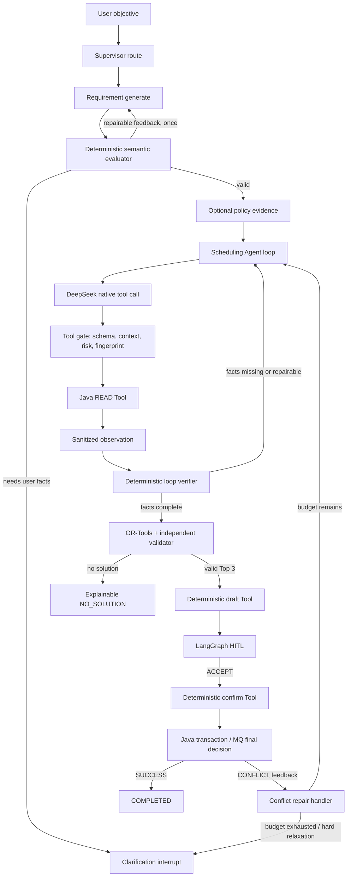

# 11. 受控 Agent Loop 设计

## 1. 目标与非目标

本升级把会议助手从一次性固定工作流提升为可验证的受控自治系统，重点证明 AI 应用工程能力：原生 Tool Calling、动态规划、观察反馈、语义修复、并发冲突重规划、预算控制、恢复和轨迹评测。

非目标：不引入 DeepAgents，不增加第五个产品 Agent，不让模型获得确认写 Tool，不改变 Java 业务事实源和 MySQL 最终裁决地位。

## 2. 总体架构

## 3. 信任边界

### 3.1 模型可以决定

- 在当前 Agent 明确授权的 READ Tool 集合中选择下一 Tool。
- 生成候选 Tool 参数，但不能生成可信身份、权限、runId 或跨服务 toolCallId。
- 根据脱敏 Observation 判断还缺少哪类事实。
- 根据结构化 feedback 修复需求或只读计划。

### 3.2 模型不能决定

- 用户身份、角色、Tool 风险等级、Java Tool 路径和参数上限。
- 是否跳过 HITL、是否执行确认、确认令牌或幂等键。
- OR-Tools 硬约束是否通过、数据库唯一键冲突是否成立。
- Loop 是否可超过预算，或者是否可以重复执行相同 Tool 指纹。

## 4. 原生 Tool Calling

DeepSeek 请求使用 `tools` 与 `tool_choice=auto`。Scheduling Agent 每轮返回零或多个 `tool_calls`；Python 按以下顺序处理：

1. 校验 provider response 和 tool call envelope。
2. 将 arguments JSON 解析为对应 Pydantic Tool Input，`extra=forbid`。
3. 用服务端 canonical requirement 对时间窗口、人员、容量和设备做一致性校验。
4. 生成 `sha256(toolName + canonicalArgs)` 指纹并拒绝重复。
5. 用 `runId + toolName + factEpoch + canonicalArgsHash` 生成独立稳定的业务 `toolCallId` 调用 Java；同一 EDIT/冲突修复 epoch 内可安全重试，不同 epoch 不复用旧事实；DeepSeek call ID 只在模型消息中关联。
6. 对 Tool 输出做大小限制和 Pydantic/结构检查，再作为 `role=tool` Observation 返回模型。

默认正式端点不附带 Beta 专属的 `function.strict=true`。即使未来显式切换到 `/beta` strict mode，本地参数校验与 Tool Gate 也必须保留，因为远端 Schema 约束不能替代身份、权限、业务上下文和重复调用防线。请求同时显式关闭 V4 thinking mode；否则带 Tool 的后续轮次必须回传 `reasoning_content`，与本项目“不持久化隐藏推理”的边界冲突。

模型从不获得 `confirm_booking`、改期确认或取消确认工具。草案和写入仍是图中的确定性节点。

## 5. Requirement Evaluator-Optimizer

Requirement Agent 的 Prompt 显式包含服务端 `requestTime`、时区和 30 分钟槽位语义。首次输出先经 Pydantic Schema 验证，再经确定性语义 Evaluator 检查：

- 相对日期是否已转换成带 `+08:00` 的绝对时间；
- 时间窗口和时长能否组成至少一个候选；
- CREATE/RECOMMEND/FIND 是否包含足够参会信息；
- MODIFY/CANCEL 是否具有 targetMeetingId；
- 容量是否不小于明确人数；
- 硬约束之间是否互相矛盾。

可修复项返回结构化 feedback 并最多重新调用 Requirement Agent 一次；必须由用户提供的信息写入 `missingFields`，进入澄清终态。Evaluator 不调用模型，不算第五个 Agent。

## 6. Loop 不变量

- `iteration <= 4`，`modelCallCount <= 12`，`toolCallCount <= 16`，`replanCount <= 2`。
- `executedToolFingerprints` 单调增长，任一指纹最多执行一次。
- 每轮必须产生新 Observation、新 feedback、进入求解或终止；无状态进展的轮次立即停止。
- 任何可见候选必须通过独立 HardConstraintValidator。
- HITL 前 Java 会议/槽位副作用为零；草案不占用业务资源。
- 所有写入结果由 Java 返回，模型生成的成功/冲突陈述不可信。

## 7. 冲突修复

当同步确认返回 `BOOKING_CONFLICT` 或 HOT `BOOKING_RESULT.CONFLICT` 时，Conflict Repair Handler：

1. 从 checkpoint 读取原始 MeetingRequest、selectedCandidate 和已执行轨迹。
2. 生成 `ConflictRepairFeedback`，记录 Java conflict type/room/slots。
3. 将失败候选加入 `excludedCandidateIds`，`replanCount + 1`。
4. 清空过期 availability/draft/confirmation 字段，但保留硬约束与用户确认的编辑。
5. 重新执行 READ Tool Loop，获取最新 Java 事实。
6. OR-Tools 求解时排除失败候选，新的候选必须与旧候选不同。
7. 新草案重新进入 HITL；不得沿用旧 confirmation token。

超过2次冲突、无法产生新候选或需要放宽硬约束时进入 `NEED_CLARIFICATION/NO_SOLUTION`。

## 8. Trace 与隐私

Trace 记录：phase、iteration、tool、参数字段级摘要、observation 计数/范围、feedback code、候选 ID、replan count、stop reason、耗时和模型/Prompt/Schema 版本。

Trace 不记录：隐藏推理、完整 Tool 大结果、JWT、Service Token、confirmation token、DeepSeek API Key、数据库连接串或敏感正文。

## 9. 验收证据

- Provider HTTP mock 证明发送 `tools` 并消费 `tool_calls`，完成 `assistant -> tool -> assistant`。
- 参数额外字段、身份伪造、重复指纹、未知/写 Tool 和预算耗尽均稳定失败且无副作用。
- Requirement 首次语义错误能在一次 feedback 后修复；第二次失败停止。
- 完整轨迹集成测试经过真实 LangGraph，至少包含 CREATE、澄清、REJECT、EDIT、同步确认和 HOT CONFLICT 重规划。
- Fixture 报告明确命名为组件回归；真实 DeepSeek 报告必须单独生成且不提交 Key。
