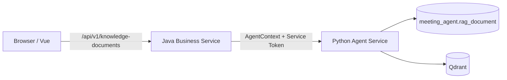
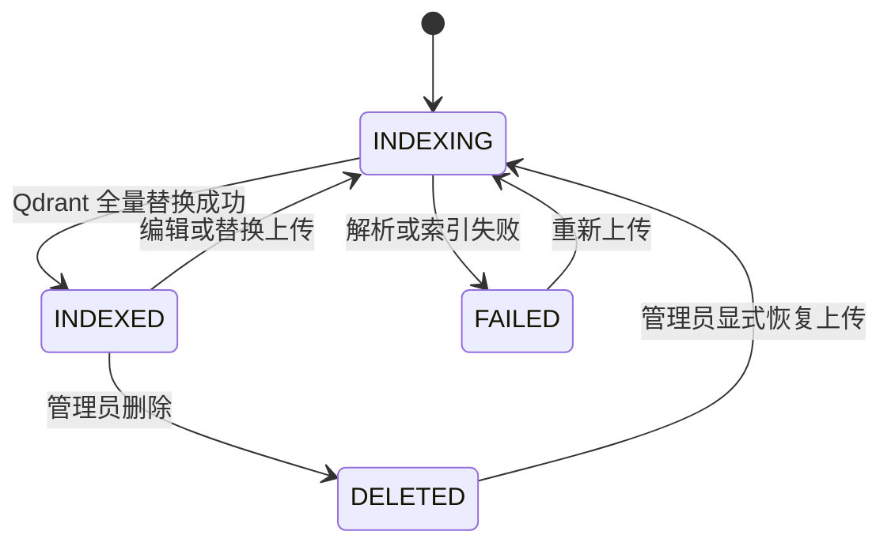

# 20. 会议制度知识库浏览与管理

## 1. 目标与范围

本切片把已经部署并索引的会议制度文档从“仅由部署期 CLI 管理”升级为用户可浏览、管理员可维护的知识库页面。

- 所有登录用户可分页检索文档、按类型筛选、查看元数据和规范化正文。
- ADMIN 可上传 Markdown 或文本型 PDF、在线编辑 Markdown、删除文档。
- PDF 正文可查看但不做浏览器内二进制编辑；需要变更 PDF 时由管理员重新上传。Markdown 编辑和 PDF 替换都会完整重建该文档的 Qdrant 切片。
- 不新增 OCR、Rerank、知识图谱、外部文档平台或新的运行时 Agent。

## 2. 架构与信任边界



- 浏览器仍只访问 Java；Java 负责 JWT、ADMIN RBAC、请求大小和文件类型第一道校验。
- Python 是 RAG 文档元数据、可浏览正文和索引的唯一事实源，负责严格 Front Matter/PDF 文本提取、checksum、切片、Qdrant 重建和最终管理权限复核。
- Java 不读写 `meeting_agent`，不实现切片、Embedding 或索引逻辑；Python 不读写 Java 业务表。

## 3. 文档状态与删除语义

状态扩展为 `INDEXING | INDEXED | FAILED | DELETED`：



- 删除是显式管理命令：先删除该 `documentId` 的 Qdrant points，再将元数据标记为 `DELETED` 并清空可浏览正文，不物理删除记录。
- `DELETED` tombstone 会阻止部署期 `rag-init` 因只读种子目录仍存在而静默恢复文档；只有管理员显式上传同一 `documentId` 才可恢复。
- 删除和索引是跨 MySQL/Qdrant 的最终一致操作。Qdrant 失败时不得把文档标记为 `DELETED`；编辑重建失败时记录 `FAILED`，检索端只使用 Qdrant 当前可用事实且管理页明确展示失败状态。

## 4. 数据与并发

`rag_document` 新增：

- `department/effective_date/priority`：文档管理筛选与展示元数据。
- `file_name/media_type/content_text`：原文件名、`text/markdown|application/pdf`、可浏览的规范化正文。
- `record_version`：管理员编辑/删除的乐观版本。
- `updated_at/deleted_at`：维护与 tombstone 时间。

Markdown 保存完整 UTF-8/LF 源文档（含 Front Matter）；PDF 只保存提取后的规范化文本，不保存二进制。上传体最大 5 MiB；Markdown 完整源文档或 PDF 提取正文最大 500,000 字符。

## 5. API

公共 Java API：

```text
GET    /api/v1/knowledge-documents?keyword=&documentType=&page=&size=
GET    /api/v1/knowledge-documents/{documentId}
POST   /api/v1/admin/knowledge-documents
PUT    /api/v1/admin/knowledge-documents/{documentId}
DELETE /api/v1/admin/knowledge-documents/{documentId}?expectedVersion=
```

- 列表/详情允许 EMPLOYEE 与 ADMIN；默认不返回 `DELETED`。
- 上传使用 `multipart/form-data`：`file` 必填；PDF 的 `metadata` 为 Front Matter 形状 JSON，Markdown 元数据仍从文件内读取。
- 编辑请求为 `{"content":"完整 Markdown 源文档","expectedVersion":1}`，只允许当前 `mediaType=text/markdown` 的文档。
- 删除使用 `expectedVersion` 防止覆盖并发编辑。
- 返回统一 Java 成功/错误信封；稳定错误码为 `RAG_DOCUMENT_NOT_FOUND`、`RAG_DOCUMENT_INVALID`、`RAG_DOCUMENT_CONFLICT`，Python/Qdrant 不可用映射为 `AGENT_UNAVAILABLE`。

Python 内部 API 使用相同资源语义，全部要求 Service Token、AgentContextToken 和一致的 trace/run 头；写接口还必须复核 `ADMIN`：

```text
GET    /internal/v1/knowledge-documents
GET    /internal/v1/knowledge-documents/{documentId}
POST   /internal/v1/knowledge-documents
PUT    /internal/v1/knowledge-documents/{documentId}
DELETE /internal/v1/knowledge-documents/{documentId}
```

## 6. 前端体验

- 侧栏“知识库”对所有登录用户可见。
- 页面提供关键字、文档类型筛选、索引状态、版本、部门、生效日期、切片数和最近更新时间。
- 点击文档在详情区阅读完整正文；Markdown 使用纯文本安全渲染，不执行文档中的 HTML 或脚本。
- ADMIN 额外看到上传、编辑、删除入口；删除使用二次确认并说明会同步移除检索切片。
- 上传和编辑完成后刷新列表与详情；版本冲突提示用户刷新，不静默覆盖。

## 7. 验收

1. EMPLOYEE 能浏览 22 份已索引制度文档，但不能调用管理 API。
2. ADMIN 上传合法 Markdown 后，列表、详情和 Qdrant 检索均出现新文档；重复 checksum 被拒绝或幂等返回同一文档。
3. ADMIN 编辑 Markdown 后 `recordVersion` 增加，旧 chunks 被替换，引用只命中新内容；过期版本返回 409。
4. ADMIN 删除后文档不再出现在默认列表或 Qdrant，重复 `rag-init` 不会恢复 tombstone。
5. 文本型 PDF 可上传和查看提取正文；扫描型/空文本 PDF 明确失败且不做 OCR。
6. 前端只访问 Java `/api/v1/**`，移动端无横向溢出，普通用户看不到管理按钮。
