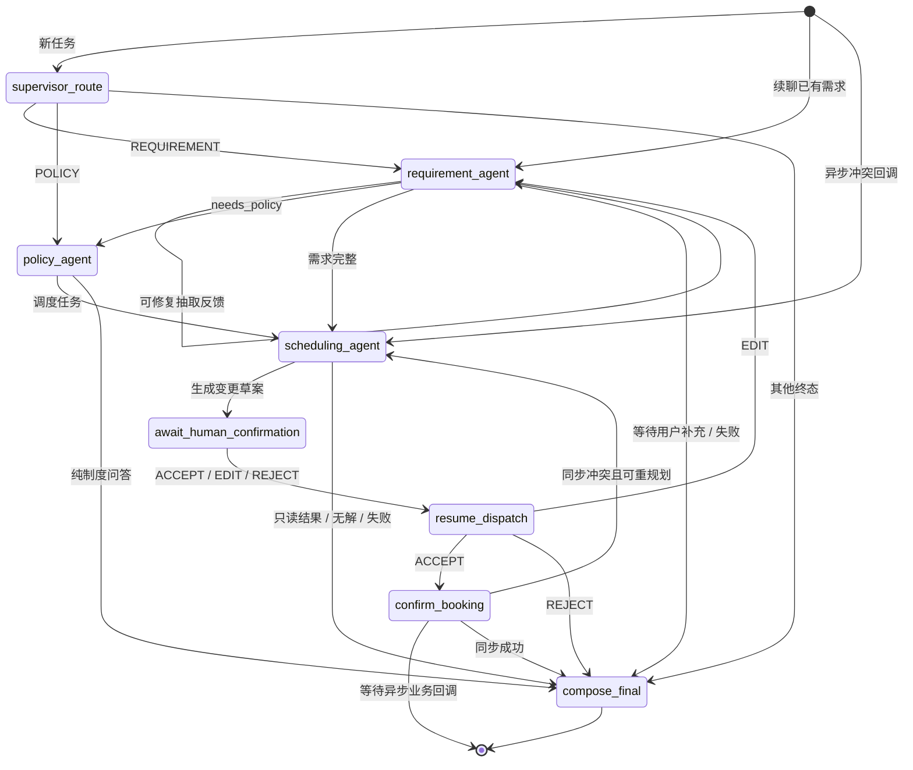
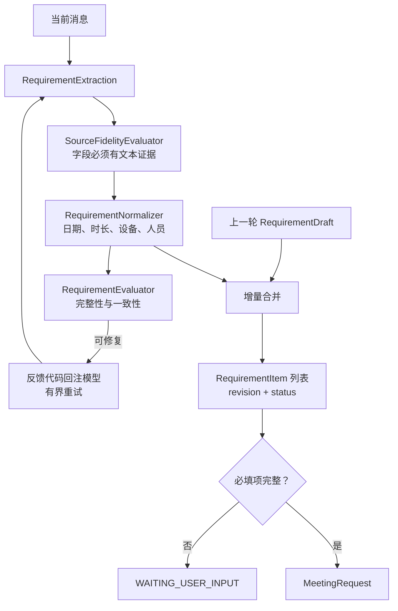
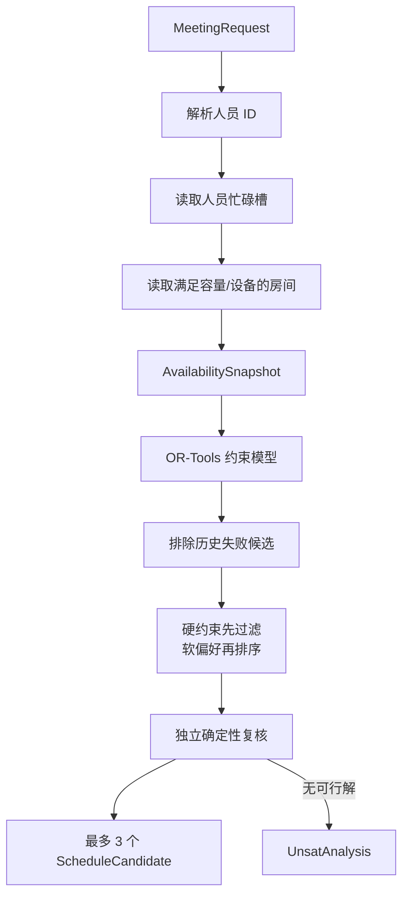
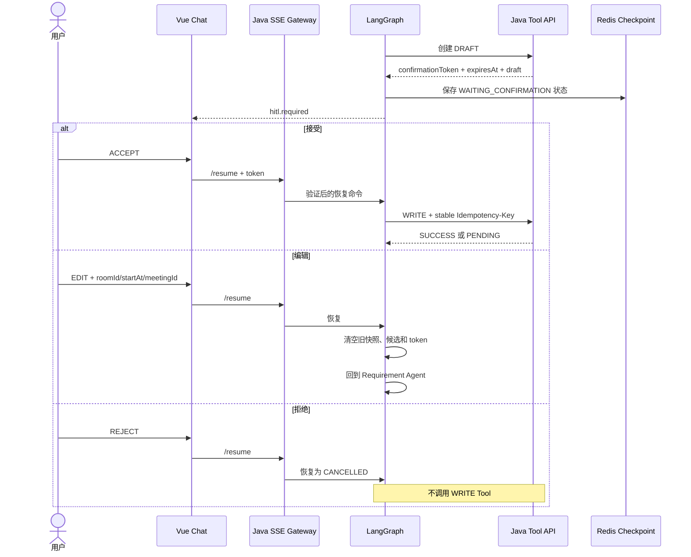
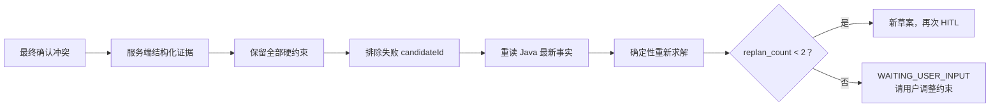
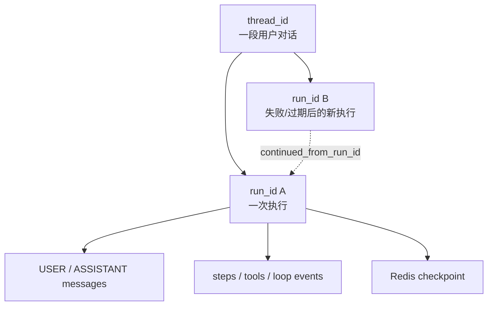
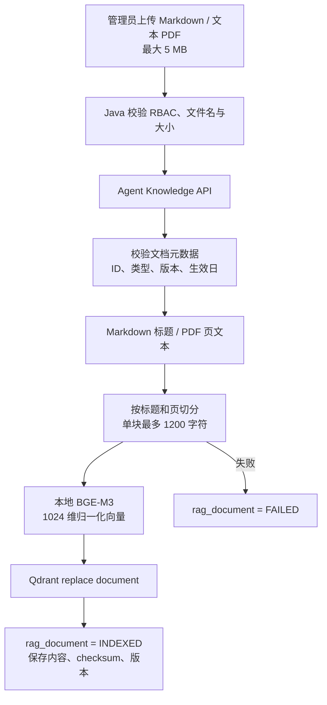
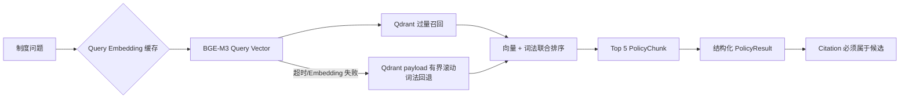

# Agent 工作流

本文说明 WeMe 如何把自然语言变成可验证的会议操作，以及模型、确定性代码、业务 Tool、HITL 和检查点之间的边界。

## 1. 支持的意图

| Intent | 用户目标 | 是否生成候选 | 是否需要 HITL |
| --- | --- | --- | --- |
| `CREATE_MEETING` | 创建会议 | 是 | 是 |
| `FIND_COMMON_TIME` | 只查共同时间 | 是 | 否 |
| `RECOMMEND_ROOM` | 只推荐会议室 | 是 | 否 |
| `MODIFY_MEETING` | 修改既有会议 | 是 | 是 |
| `CANCEL_MEETING` | 取消既有会议 | 否，展示目标预览 | 是 |
| `QUERY_POLICY` | 查询会议制度 | 否 | 否 |
| `UPDATE_PREFERENCE` | 更新调度偏好 | 由需求处理结果决定 | 不直接产生业务写入 |

意图只是路由提示。真正决定是否可以调度的，是经过证据校验和规范化后的 `MeetingRequest`。

## 2. 图状态机

图由 `WorkflowRun._build_graph()` 构建，Redis Checkpointer 以 `thread_id + run_id` 隔离状态。

## 3. Agent 分工

### Supervisor Agent

- 输入原始用户消息和已有状态。
- 输出 `route`、`intent_hint`、置信度、证据和摘要。
- `RouteEvaluator` 会检查路由是否符合文本；模型结果不可接受时使用确定性回退。
- 不读取业务工具，不生成会议候选，不执行写操作。

### Requirement Agent

- 把消息提取为 `RequirementDraft`。
- 保存字段级证据：字段、来源片段与证据来源类型。
- 处理连续对话中的增量变化，不把上一轮字段无条件覆盖为模型新猜测。
- 使用确定性规则规范中文日期、时段、时长、设备同义词、当前用户参与关系和目标会议引用。
- 对“我的小组”等范围表达调用 Java 的 `resolve_participant_scope`，不允许模型自行枚举人员。
- 缺失或含歧义时生成用户可见澄清问题；澄清文本不能泄露内部错误码，也不能宣称尚未发生的业务效果。

### Policy Agent

- 使用 BGE-M3 + Qdrant 检索会议制度分块。
- 组合向量得分与词法得分，最多向回答提供 5 个候选。
- 输出经过 Schema 限制的约束类型：最大时长、允许会议室类型、必需设备、禁用时间或仅建议。
- 只接受实际检索候选中存在的 Citation；无法验证时返回 `UNVERIFIED`，不会编造来源。

### Scheduling Agent

- 模型只输出结构化只读 Tool 计划。
- `ReadToolGate` 校验工具名、参数、用户上下文、时间窗口、人员范围、目标会议排除项和重复指纹。
- Java 返回事实后，Python 使用 OR-Tools 构造候选并进行独立复核。
- 对创建、改期、取消调用 DRAFT Tool；真正的 WRITE Tool 只能从 HITL 恢复分支进入。

## 4. 需求从草案到可执行请求

`MeetingRequest` 的关键约束：

- 时长 30–480 分钟，且必须是 30 分钟倍数。
- 时间使用 `Asia/Shanghai`，调度槽为 30 分钟。
- 必需参会人最多 50 人；设备、偏好楼栋、硬/软约束都有长度上限。
- 修改和取消需要可验证的 `target_meeting_id`；无法唯一识别时必须澄清。
- 当前用户是否作为参会人由显式文本与确定性默认共同决定。

## 5. 可信 Tool 边界

### 模型可规划的 READ Tool

| Tool | 事实来源 | Gate 的关键校验 |
| --- | --- | --- |
| `resolve_employees` | Java 用户目录 | 名称必须等于结构化需求中的必需参会人名称 |
| `get_employee_free_busy` | Java 忙碌槽 | 人员集合、时间窗和排除会议必须与请求一致 |
| `search_available_rooms` | Java 会议室与房间槽 | 时间窗、容量、设备、数量上限和排除会议一致 |
| `get_recent_meeting` | Java 当前用户可管理会议 | 只允许修改或取消意图使用 |

`resolve_participant_scope` 是 Requirement Agent 的确定性辅助调用，不由调度模型自由规划。

### 代码控制的 DRAFT / WRITE Tool

| 风险 | Tool | 触发位置 |
| --- | --- | --- |
| DRAFT | `create_booking_draft` | 候选通过复核后 |
| DRAFT | `create_reschedule_draft` | 已加载原会议快照且新候选通过复核后 |
| DRAFT | `create_cancellation_preview` | 已唯一识别目标会议后 |
| WRITE | `confirm_booking` | HITL `ACCEPT` |
| WRITE | `confirm_reschedule` | HITL `ACCEPT` |
| WRITE | `confirm_cancellation` | HITL `ACCEPT` |

Tool 调用使用稳定 ID。Python 保存安全化参数和摘要，Java 按 `(run_id, tool_call_id, tool_name)` 审计并支持相同请求的响应重放。

## 6. 调度与候选复核

候选生成只代表“基于该时刻可信快照可行”，不代表已经占位。确认时 Java 会重新执行最终校验。

修改会议时，系统先从 Java 获取目标会议快照，然后：

- 只覆盖用户明确要求修改的字段。
- 保留时长、人员、设备等未变约束。
- 在查忙闲和查房间时通过 `exclude_meeting_id` 排除会议自身占用。

## 7. HITL 与确认

`confirmationToken` 只在 `hitl.required` 瞬时事件中返回。历史 Run/Thread 读取会省略它，Java 网关也会清除可能出现的内部令牌字段。

## 8. 冲突修复

确认冲突分两类：

1. **同步冲突**：Java 立刻返回 `TOOL_CONFLICT` 和结构化冲突证据。
2. **异步冲突**：热门预约消费者完成裁决后回调 `BusinessResultCallback(CONFLICT)`。

两者都会形成 `ConflictRepairFeedbackState`：冲突类型、失败候选、保留约束、房间/槽位证据、排除候选和当前重规划次数。

冲突重规划不会因为之前的对话消耗了模型预算而再次依赖模型：代码会直接重读事实并运行确定性求解。

## 9. 检查点、续聊与恢复

### 标识关系

- 信息不足时，`POST /agent/runs/{runId}/input` 在同一 Run 上继续，客户端必须携带期望 `requirement_revision`。
- 失败或确认草案已过期时，可创建新 Run 并通过 `base_run_id` 继承可恢复需求。
- 恢复、业务回调和同一 Run 的执行使用进程内锁串行化，避免同时推进同一状态。
- Checkpoint TTL 默认 24 小时；草案 TTL 默认 10 分钟，两者不是同一个生命周期。

## 10. Run 状态

| 状态 | 含义 | 可继续方式 |
| --- | --- | --- |
| `RUNNING` | 图正在执行 | 等待 SSE |
| `WAITING_USER_INPUT` | 需求缺失、歧义或重规划超限 | `/input` 补充需求 |
| `WAITING_CONFIRMATION` | 有限时草案等待用户决策 | `/resume` 接受、编辑或拒绝 |
| `WAITING_BUSINESS_RESULT` | 热门预约已排队 | 等待业务回调，不重复确认 |
| `SUCCEEDED` | 只读结果或同步任务完成 | 可开始新输入 |
| `FAILED` | 受控或非预期失败 | 读取错误与 Trace，必要时使用 `base_run_id` |
| `CANCELLED` | 用户拒绝草案 | 无业务写入，可开始新任务 |

## 11. SSE 事件

| 事件 | 主要内容 | 前端用途 |
| --- | --- | --- |
| `run.started` | run/thread/trace/status | 初始化任务 |
| `run.resumed` | run/status/revision | 续聊或 HITL 恢复 |
| `requirement.updated` | revision、ready、items | 渲染需求清单 |
| `agent.step` | Agent、节点、摘要、耗时、状态 | 步骤时间线 |
| `tool.call` | Tool、风险、状态、摘要、耗时 | Tool Trace |
| `agent.loop` | 阶段、迭代、反馈码、剩余预算 | 循环与修复可视化 |
| `plan.candidates` | 最多 3 个候选 | 候选比较 |
| `plan.unsat` | 无解类别、冲突与建议 | 无解分析卡 |
| `hitl.required` | 草案、操作类型、token、过期时间 | 接受/编辑/拒绝栏 |
| `booking.pending` | requestNo | 异步等待状态 |
| `booking.completed` | meetingId、actionType | 最终成功 |
| `run.completed` | 状态、回答、指标 | 正常终止 |
| `run.failed` | 稳定错误码与可见消息 | 失败终止 |

SSE 每帧是命名事件和单行 JSON；Nginx 与 Java 网关都关闭缓冲，代理读取超时为 300 秒。

## 12. 制度文档入库与检索

### 入库

支持的文档类型：`MEETING_POLICY`、`MEETING_STANDARD`、`ROOM_POLICY`、`SECURITY_POLICY`、`EQUIPMENT_GUIDE`、`DEPARTMENT_POLICY`、`FAQ`。PDF 必须能提取文本；当前没有 OCR 路径。

### 检索

查询缓存默认 128 条、TTL 3600 秒。Embedding 失败时的词法回退仍依赖 Qdrant 中已有 payload；Qdrant 整体不可用时检索失败。

## 13. 预算与防失控

| 预算 | 默认值 | Schema 硬上限 |
| --- | ---: | ---: |
| 模型调用 | 12 | 12 |
| Tool 调用 | 16 | 16 |
| 图节点 | 20 | 20 |
| 调度 Tool Loop | 4 轮 | 代码固定 |
| 并发冲突重规划 | 2 次 | 2 |
| 可见候选 | 3 个 | 3 |

预算在外部调用前预留，在实际完成后按真实调用数记录。耗尽时返回稳定错误或请求用户调整，不继续无限调用。

## 14. 可观测性

每个 Run 记录：

- 模型 Provider、配置模型、实际响应模型。
- Prompt 版本、Agent State Schema 版本。
- 输入、输出、缓存命中与未命中 Token。
- 每个 Agent Step、Tool 调用和循环事件的顺序、状态与耗时。
- 安全化 Tool 参数、结果摘要和错误码。

Java 与 Python 共享 `traceId`、`runId` 和 `toolCallId`。任何面向用户的故障排查应先从 Run Trace 和同一 `traceId` 的服务日志开始。

## 15. 实现映射

- Schema：`agent-service/app/schemas/agent.py`
- 工作流：`agent-service/app/workflow.py`
- 需求证据与 Tool Gate：`agent-service/app/agent_loop.py`
- 求解器：`agent-service/app/scheduling/solver.py`
- Checkpoint：`agent-service/app/checkpoints/redis.py`
- 元数据：`agent-service/app/persistence.py`
- Provider：`agent-service/app/providers/`
- RAG：`agent-service/app/rag/`
- Java Tool 客户端：`agent-service/app/tools/java.py`
- 内部 API 与 SSE：`agent-service/app/api/internal.py`
