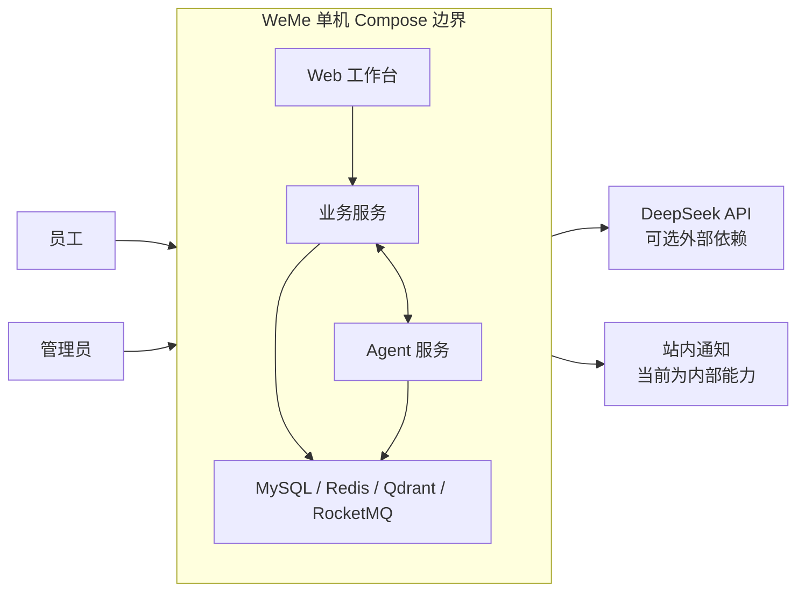
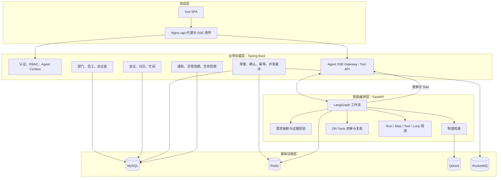
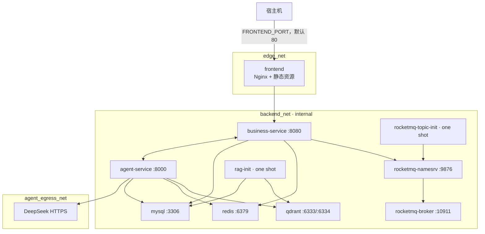
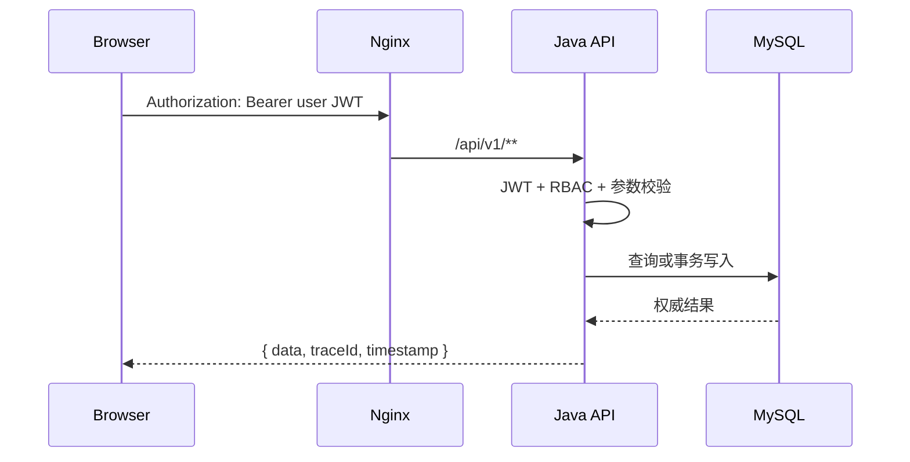
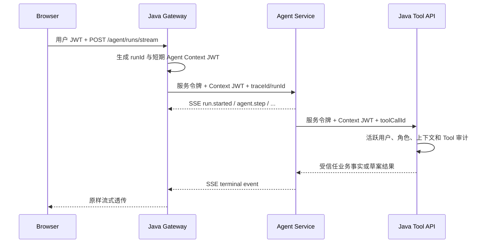

# WeMe 系统架构

本文描述最终代码所体现的系统边界、服务职责、数据权威来源和不可破坏的架构约束。部署步骤见 [DEPLOYMENT.md](DEPLOYMENT.md)，Agent 细节见 [AGENT_WORKFLOW.md](AGENT_WORKFLOW.md)。

## 1. 设计目标

WeMe 需要同时解决三类问题：

1. 让用户用自然语言表达不完整、含歧义或会继续变化的会议需求。
2. 在多人、会议室和制度约束下给出可解释候选，并保证模型不能绕过权限与业务规则。
3. 在并发预约、异步消息、服务重启和资源故障下保持结果可判定、可恢复、可追踪。

系统因此采用“智能编排域与业务权威域分离”的架构：模型可以理解、规划和解释，但不能成为人员身份、空闲状态或会议写入的事实来源。

## 2. 系统上下文

外部用户只有两个角色：`EMPLOYEE` 与 `ADMIN`。外部模型服务只接收 Agent 构造的结构化提示；业务服务不会把数据库写权限交给模型。

## 3. 逻辑分层

## 4. 服务职责

| 服务 | 对外边界 | 核心职责 | 明确不负责 |
| --- | --- | --- | --- |
| `frontend` | 公开 80 端口 | 页面、身份状态、REST 调用、SSE 消费、候选/HITL/Trace 展示 | 不保存权威业务状态，不直连内部服务 |
| `business-service` | Nginx 代理 `/api/v1/**` | 登录、RBAC、人员/会议室/会议、草案、最终写入、幂等、消息、通知、生命周期 | 不把模型输出直接当作业务事实 |
| `agent-service` | 仅内部 `/internal/v1/**` | 路由、需求结构化、制度问答、调度编排、检查点、Run Trace | 不接受浏览器 JWT，不直接写业务表 |
| `rag-init` | 一次性任务 | Agent 迁移、启动语料解析、BGE-M3 向量化、Qdrant 建集 | 不长期提供请求 |
| `mysql` | 内部网络 | `meeting_business` 与 `meeting_agent` 两个数据库 | 不承担缓存或消息角色 |
| `redis` | 内部网络 | DB 0 预约占位；DB 1 LangGraph 检查点 | 不作为会议最终一致性的唯一依据 |
| `qdrant` | 内部网络 | 会议制度分块的 1024 维向量和检索负载 | 不保存文档管理的唯一元数据 |
| `rocketmq-*` | 内部网络 | 热门预约命令与领域事件的异步传输 | 不替代 Outbox 和业务状态表 |

## 5. 运行时部署拓扑

基础 `compose.yaml` 只向宿主机发布前端端口。`compose.dev.yaml` 额外发布数据库、缓存、消息队列、Qdrant、Java 和 Agent 端口，用于本地诊断而不是生产暴露。

## 6. 数据权威与派生关系

| 数据 | 权威来源 | 派生或缓存 | 写入者 |
| --- | --- | --- | --- |
| 用户、部门、角色 | 业务库 `sys_user`、`department` | JWT 中的短期身份快照 | Java |
| 会议与必需人员忙碌 | 业务库 `meeting`、`meeting_*_slot` | Redis 短时占位、前端日历 | Java |
| Agent 对话与 Trace | Agent 库 `agent_thread/run/message/step/tool_call/loop_event` | 前端会话状态 | Python |
| LangGraph 可恢复状态 | Redis DB 1 | Agent 库中的摘要和可见消息 | Python |
| 制度文档管理记录 | Agent 库 `rag_document` | Qdrant 分块向量 | Python，经 Java 网关 |
| 热门预约命令 | 业务库 `booking_request` + `message_outbox` | RocketMQ Broker | Java |
| 通知、改期单、会后内容 | 业务库对应表 | 前端列表 | Java |

MySQL 唯一约束是时隙冲突的最终裁判。Redis 占位用于缩小高并发事务竞争窗口，即使 Redis 失效，也不能放松 MySQL 层的唯一性。

## 7. 三条核心调用链

### 7.1 普通业务 REST

### 7.2 Agent SSE

### 7.3 热门预约异步链路

业务事务只同时写 `booking_request` 和 `message_outbox`。定时 Publisher 认领 Outbox 记录并发送 RocketMQ；消费者使用 `event_consume_record` 去重，落库后生成完成/冲突事件，最终回调 Agent Run。

## 8. 核心不变量

以下约束是理解代码和扩展功能时最重要的边界：

1. **业务身份来自 Java。** Python 不接受请求体中的用户 ID 作为授权依据。
2. **模型不拥有写工具规划权。** 调度模型只允许规划 `resolve_employees`、`get_employee_free_busy`、`search_available_rooms`、`get_recent_meeting`。
3. **所有变更先草案后确认。** 创建、改期、取消都必须经过 HITL；拒绝不会调用写工具。
4. **候选不等于预留。** 候选生成后到确认前仍可能被抢占，最终确认必须重新校验。
5. **MySQL 决定最终冲突。** 房间槽和必需人员槽都有唯一约束。
6. **每个确认可重放但不可换请求。** 相同幂等键和相同请求可返回既有结果；相同键换负载会返回冲突。
7. **消息发送不与业务事务双写。** 先提交 Outbox，再异步发布。
8. **内部敏感字段不进入历史接口。** Java 网关会清除令牌字段，历史读取会省略 `confirmationToken`。
9. **执行有硬预算。** 模型、工具、图节点和重规划都有上限。
10. **制度证据可追踪。** Policy 结果携带 chunk、标题、标题路径与页码，未知答案允许无引用拒答。

## 9. 故障与降级边界

| 故障 | 预期行为 |
| --- | --- |
| DeepSeek 未配置 | Agent 健康为 `DEGRADED`；`fixture` 可用于确定性测试 |
| BGE-M3 加载失败 | Agent 启动/制度检索不可用，不静默切换到云端 Embedding |
| Query Embedding 超时 | 制度检索在有可用 Qdrant 负载时使用有界词法回退 |
| Redis Checkpoint 不可用 | Agent 健康 `DOWN`，不可承诺任务恢复 |
| Redis 预约占位失败 | 预约返回依赖不可用或冲突；不能绕过 MySQL 校验继续写入 |
| RocketMQ 不可用 | Outbox 保留并按退避重试，达到上限进入 `DEAD` |
| Agent SSE 中断 | 已写检查点和元数据可用于读取/恢复；前端不能仅凭连接断开推断业务失败 |
| 热门预约最终冲突 | `booking_request` 进入 `CONFLICT`，回调 Agent 后触发受限重规划 |

## 10. 扩展指南

新增功能前先判断事实归属：

- 新的业务实体、权限、最终写入或并发规则应放在 Java 业务域。
- 新的语言理解、路由、只读计划或解释能力可放在 Agent 域。
- 新写操作必须增加草案、用户确认、幂等、审计和最终校验；不能只新增一个模型 Tool。
- 新的跨事务消息必须进入 Outbox；不能在业务事务提交前直接发送 MQ。
- 新的制度检索字段要同步更新文档元数据、Qdrant payload、Citation 和管理 API。

## 11. 实现入口

- 前端入口：`frontend/src/main.ts`、`frontend/src/router/index.ts`
- Java 入口：`business-service/src/main/java/com/example/meeting/MeetingApplication.java`
- Agent 入口：`agent-service/app/main.py`
- LangGraph：`agent-service/app/workflow.py`
- 需求与 Tool Gate：`agent-service/app/agent_loop.py`
- 调度求解器：`agent-service/app/scheduling/solver.py`
- Agent 网关：`business-service/src/main/java/com/example/meeting/agentgateway/`
- 预约一致性：`business-service/src/main/java/com/example/meeting/booking/`
- Outbox 与 MQ：`business-service/src/main/java/com/example/meeting/outbox/`、`mq/`
- 数据迁移：`business-service/src/main/resources/db/migration/`、`agent-service/alembic/`
