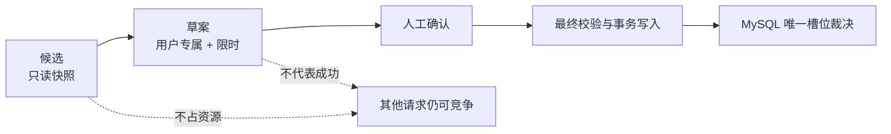
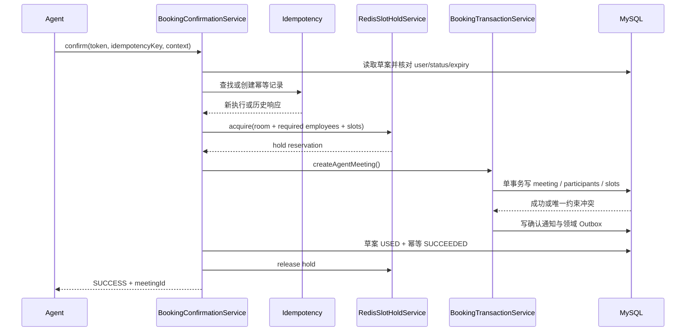
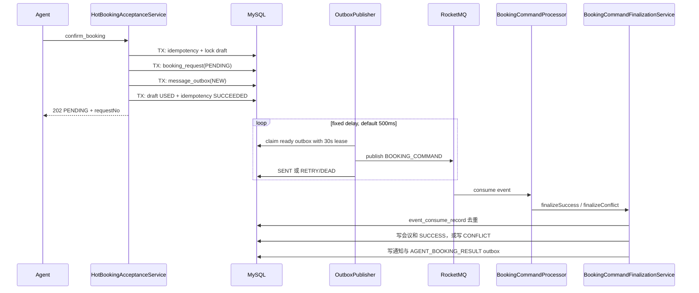
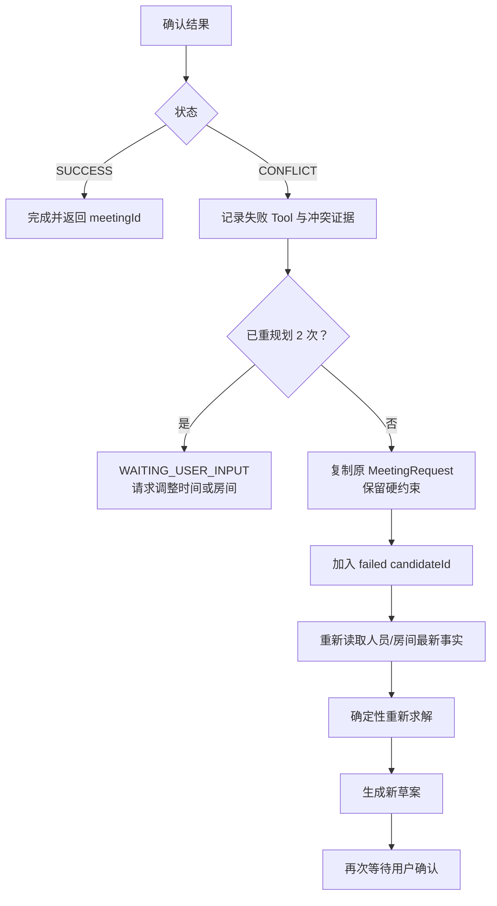
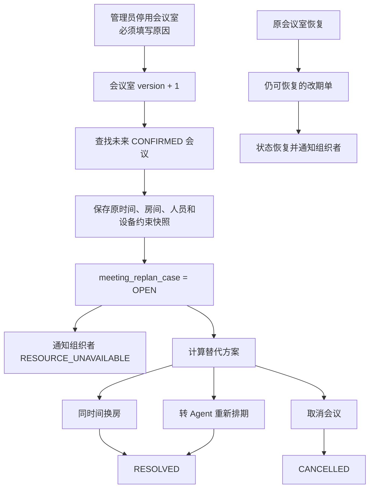
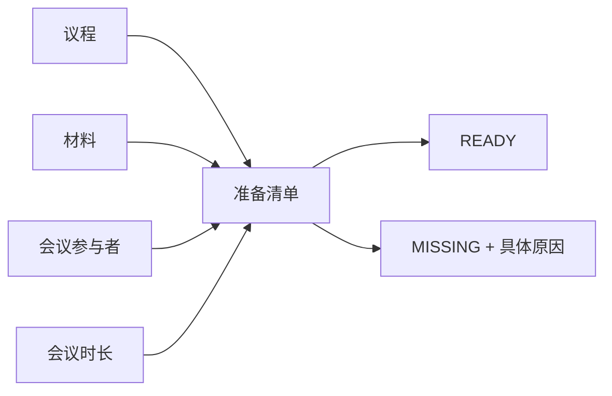
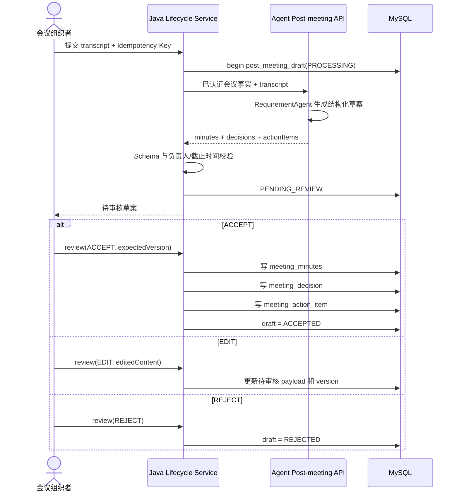

# 预约一致性与会议生命周期

本文覆盖 WeMe 从候选到最终预约、从并发冲突到自动重规划，以及从会议确认到行动项闭环的业务机制。

## 1. 为什么候选与预约分离

候选基于查询时刻的人员忙闲与会议室快照生成。在用户阅读候选和点击确认之间，其他用户可能占用同一时段。因此系统把流程拆成三层：



创建、改期和取消都使用相同原则：预览不是业务效果，只有确认事务返回成功或异步最终结果为成功，业务状态才改变。

## 2. 30 分钟槽位模型

每个自然日被离散为 48 个槽位：

- `meeting_room_slot` 对 `(room_id, booking_date, slot_index)` 建唯一约束。
- `employee_busy_slot` 对 `(employee_id, booking_date, slot_index)` 建唯一约束。
- 只有必需参会人写忙碌槽；可选参会人不阻塞预约。
- 时长必须是 30 分钟倍数，所有写入前由 `TimeSlotCalculator` 生成标准槽序列。

```mermaid
gantt
    title 60 分钟会议占用两个连续槽
    dateFormat HH:mm
    axisFormat %H:%M
    section 会议室 A
    slot 28 :done, s1, 14:00, 30m
    slot 29 :done, s2, 14:30, 30m
    section 必需参会人
    张三 busy :done, p1, 14:00, 60m
    李四 busy :done, p2, 14:00, 60m
```



Redis 占位只是一层短期竞争抑制；任何绕过或丢失占位的请求仍会被数据库唯一约束拒绝。

## 3. 草案

### 创建草案

`booking_draft` 保存：

- 随机 `confirmation_token`。
- 用户、Run 与 Tool Call 归属。
- 操作类型、规范化负载与 SHA-256 hash。
- `PENDING` 状态、乐观锁版本、创建时间和过期时间。

默认有效期 10 分钟。草案只能被所属用户确认，只能从 `PENDING` 使用一次，过期或已使用都返回稳定冲突错误。

### 改期与取消草案

改期草案保存目标会议、目标版本和新的会议负载；取消预览保存目标会议与预期版本。确认时会再次验证：

- 当前用户仍可管理该会议。
- 会议仍处于允许变更的状态。
- 版本未被其他操作推进。
- 改期后的房间、人员与时隙仍然有效。

## 4. 普通会议室同步确认



关键点：

- 幂等边界是 `(user_id, operation, idempotency_key)`。
- 请求 hash 包含草案 token 与草案 payload hash；换负载复用键会被拒绝。
- Redis Hold 无论成功或失败都会在 `finally` 中释放，另有 TTL 防止进程崩溃造成永久占位。
- 数据库出现 `DataIntegrityViolationException` 时映射为结构化预约冲突。

## 5. 热门会议室异步确认

热门会议室通过 `meeting_room.is_hot` 标识。当 `APP_HOT_BOOKING_ENABLED=true` 时，确认先接受请求，再由消息消费者完成最终写入。



### Outbox 重试

- 每批最多认领 50 条。
- `SENDING` 租约为 30 秒，进程中断后记录可重新认领。
- 失败按 `2^attempt` 秒退避，最大 60 秒。
- 默认最多重试 10 次，随后进入 `DEAD`，需要人工调查。
- 消费者使用 `(consumer_group, event_id)` 唯一键实现消费去重。

## 6. 业务结果回调

热门预约的最终领域事件由 Java 消费，并回调 Agent 的：

```text
POST /internal/v1/agent-runs/{runId}/business-result
```

回调负载只允许两种形状：

- `SUCCESS`：必须有 `meetingId`，不能有冲突对象。
- `CONFLICT`：必须有冲突对象，不能有 `meetingId`。

Agent 以 `event_id` 去重，校验 `request_no` 与 Run 的待处理请求一致，再恢复检查点。成功完成 Run；冲突进入受限重规划。

## 7. 并发冲突重规划



重规划不复用旧忙闲快照，不自动放宽硬约束，也不会自动确认新候选。

## 8. 手工会议与 Agent 会议

系统保留两条写入口：

| 路径 | 入口 | 适用场景 | 一致性 |
| --- | --- | --- | --- |
| 手工会议 | `/api/v1/meetings` | 日历页面直接创建/编辑/取消 | 同样使用规范化命令、时隙表、幂等与事务服务 |
| Agent 会议 | 内部 DRAFT/WRITE Tool | 自然语言候选与 HITL | 额外具有草案、Tool 审计、Run 归属与异步回调 |

两条路径最终汇入 `BookingTransactionService`，因此不会形成“AI 会议绕过普通业务约束”的第二套规则。

## 9. 会议室资源异常

管理员把会议室从 `ACTIVE` 改为不可用时，系统在同一事务中为该会议室未来的已确认会议创建改期单。



唯一键 `(meeting_id, failed_room_id, room_status_version)` 防止同一次停用重复建单。改期单和会议都使用乐观锁版本，候选过期时返回 `REPLAN_CANDIDATE_STALE`，要求重新读取。

## 10. 会前准备

组织者可保存：

- 有顺序的议程项：主题、负责人和计划分钟数。
- 有顺序的材料项：标题、负责人、是否必需、`MISSING/READY`、版本标签与说明。

`PreparationChecklistEvaluator` 结合会议状态、议程总时长、必需材料和负责人生成清单。保存使用 `preparation_version` 做乐观并发控制。



## 11. 自动生命周期扫描

`MeetingLifecycleScheduler` 默认每 60 秒扫描，单批默认 100、最大 500：

1. 把结束时间已过的会议标为完成。
2. 给 24 小时内的会议发送提醒。
3. 给 30 分钟内的会议发送更近提醒。
4. 准备清单未完成时只提醒组织者。
5. 给 24 小时内到期或已逾期的行动项发送提醒。

提醒投递表使用会议/行动项、目标时间、收件人和提醒类型的唯一约束，保证定时扫描重复运行不会重复发送。

## 12. 会后草案与审核



Agent 返回的行动项负责人如果不在会议参与者集合中，会被清空并要求人工处理。正式纪要、决策和行动项只在 `ACCEPT` 后写入。

## 13. 行动项

行动项状态为 `OPEN`、`IN_PROGRESS`、`DONE`。更新必须同时满足：

- 当前用户有权查看相关会议。
- 当前用户是组织者、管理员或该行动项负责人。
- `expectedVersion` 与数据库版本一致。
- 状态转移和完成时间符合服务端规则。

## 14. 通知类型

通知按用户隔离，支持分页、类型过滤、只看未读、单条已读与全部已读。主要类型包括：

- 预约确认或冲突结果。
- `RESOURCE_UNAVAILABLE`、`RESOURCE_RESTORED`。
- `MEETING_REMINDER_24H`、`MEETING_REMINDER_30M`。
- `PREPARATION_MISSING`。
- `ACTION_ITEM_DUE_SOON`、`ACTION_ITEM_OVERDUE`。

管理员也不能通过通知 API 修改其他用户的通知状态。

## 15. 关键错误与客户端处理

| 错误码 | 含义 | 建议处理 |
| --- | --- | --- |
| `DRAFT_EXPIRED` | HITL 草案过期 | 使用已有需求创建新 Run 或重新生成草案 |
| `DRAFT_ALREADY_USED` | 草案已确认或拒绝 | 刷新 Run，不要重复提交 |
| `BOOKING_CONFLICT` | 最终槽位竞争失败 | 等待 Agent 重规划或手工刷新可用性 |
| `IDEMPOTENCY_KEY_REUSED` | 同一键绑定了不同请求 | 使用新的客户端请求 ID/幂等键 |
| `MEETING_STATE_CONFLICT` | 会议状态或版本变化 | 重新读取会议后再提交 |
| `REPLAN_CANDIDATE_STALE` | 替代候选已过期 | 重新加载替代方案 |
| `POST_MEETING_DRAFT_STATE_CONFLICT` | 草案版本或审核状态变化 | 刷新生命周期详情 |
| `ACTION_ITEM_STATE_CONFLICT` | 行动项版本、状态或权限冲突 | 刷新行动项并按最新版本提交 |

## 16. 实现映射

- 槽位领域：`business-service/src/main/java/com/example/meeting/booking/domain/`
- 同步/异步确认：`business-service/src/main/java/com/example/meeting/booking/application/`
- Redis Hold：`business-service/src/main/java/com/example/meeting/booking/infrastructure/RedisSlotHoldService.java`
- Outbox：`business-service/src/main/java/com/example/meeting/outbox/`
- RocketMQ：`business-service/src/main/java/com/example/meeting/mq/`
- 资源异常：`business-service/src/main/java/com/example/meeting/replan/`
- 生命周期：`business-service/src/main/java/com/example/meeting/meeting/lifecycle/`
- 通知：`business-service/src/main/java/com/example/meeting/notification/`
- Agent 冲突修复：`agent-service/app/workflow.py`
