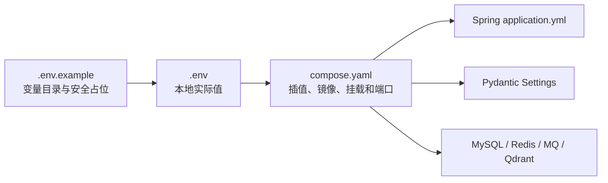
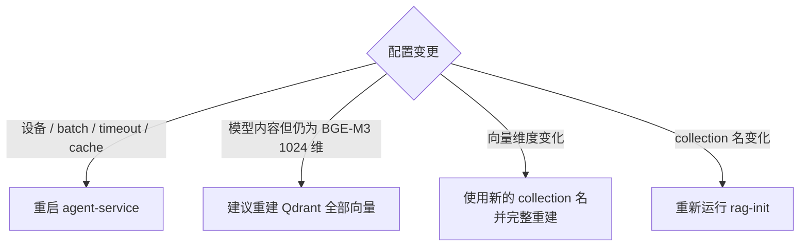

# 配置说明

WeMe 的运行配置以环境变量为主。`.env.example` 是变量清单，`compose.yaml` 负责把变量传入各容器，Java 的 `application.yml` 和 Python 的 `Settings` 再进行类型、范围与默认值校验。

## 1. 配置加载关系



优先级遵循 Docker Compose 环境插值规则：Shell 已导出的变量可覆盖 `.env`，Compose `environment` 再决定容器内值。为了可复现，日常运行建议只维护一份受保护的 `.env`，不要在多个 Shell 中长期导出同名变量。

## 2. 镜像基线

| 变量 | 示例默认值 | 作用 |
| --- | --- | --- |
| `MYSQL_IMAGE` | `mysql:8.4` | MySQL 镜像 |
| `REDIS_IMAGE` | `redis:7.4-alpine` | Redis 镜像 |
| `ROCKETMQ_IMAGE` | `apache/rocketmq:4.9.7` | NameServer/Broker/初始化工具 |
| `QDRANT_IMAGE` | `qdrant/qdrant:v1.12.5` | 向量库 |
| `MAVEN_IMAGE` | `maven:3.9.11-eclipse-temurin-21` | Java 构建阶段 |
| `JAVA_RUNTIME_IMAGE` | `eclipse-temurin:21-jre-jammy` | Java 运行阶段 |
| `PYTHON_RUNTIME_IMAGE` | 固定 digest 的 `python:3.11-slim` | Python 运行阶段 |
| `NODE_BUILD_IMAGE` | `node:22-alpine` | 前端构建阶段 |
| `NGINX_RUNTIME_IMAGE` | `nginx:1.27-alpine` | 前端运行阶段 |
| `UV_VERSION` | `0.10.9` | Python 依赖工具版本 |
| `APP_IMAGE_TAG` | `1.0.0` | 三个应用镜像的本地标签 |

发布环境建议把所有基础镜像固定为经过验证的 digest，而不只使用可移动 tag。

## 3. MySQL

| 变量 | 必填 | 说明 |
| --- | --- | --- |
| `MYSQL_ROOT_PASSWORD` | 是 | 初始化与运维 Root 密码 |
| `BUSINESS_DB_NAME` | 否 | 默认 `meeting_business` |
| `BUSINESS_DB_USER` | 否 | 默认 `meeting_business` |
| `BUSINESS_DB_PASSWORD` | 是 | 业务服务独立账户密码 |
| `AGENT_DB_NAME` | 否 | 默认 `meeting_agent` |
| `AGENT_DB_USER` | 否 | 默认 `meeting_agent` |
| `AGENT_DB_PASSWORD` | 是 | Agent 服务独立账户密码 |

`deploy/mysql/init/00-create-databases.sh` 在空数据目录初始化两个数据库和最小权限账户。修改数据库名或用户名只影响空卷初始化；对已有卷修改 `.env` 不会自动重命名数据库或用户。

## 4. Redis

| 变量 | 默认/示例 | 说明 |
| --- | --- | --- |
| `REDIS_PASSWORD` | 必填随机值 | Redis `requirepass` |
| `REDIS_URL` | `redis://:<password>@redis:6379/0` | 预约侧预留连接配置 |
| `AGENT_CHECKPOINT_REDIS_URL` | `redis://:<password>@redis:6379/1` | LangGraph 检查点 |
| `AGENT_CHECKPOINT_TTL_SECONDS` | Python 默认 86400 | 检查点最大保留 24 小时；Schema 下限 60 秒 |

Compose 为 Redis 开启 AOF，`appendfsync everysec`。DB 0 与 DB 1 共用同一实例和密码，但承担不同职责。

## 5. 身份与内部安全

| 变量 | 默认 | 说明 |
| --- | --- | --- |
| `JWT_SECRET` | 无 | 浏览器 Access Token HMAC 密钥，至少 32 随机字节 |
| `JWT_EXPIRATION_SECONDS` | `7200` | 用户 Access Token 有效期 |
| `AGENT_CONTEXT_JWT_SECRET` | 无 | Java 签发内部 Agent Context JWT |
| `AGENT_CONTEXT_AUDIENCE` | `agent-service` | Python 校验的 JWT audience |
| `INTERNAL_SERVICE_TOKEN` | 无 | Java/Python 双向内部服务令牌 |

三类密钥必须不同。轮换 `JWT_SECRET` 会使现有用户 Token 失效；轮换 Agent Context 或服务令牌会使正在执行的内部请求失败，必须先停止应用写入者。

## 6. Agent 模型

| 变量 | 默认 | 范围/影响 |
| --- | --- | --- |
| `AGENT_MODEL_PROVIDER` | `fixture` | `fixture` 或 `deepseek` |
| `DEEPSEEK_API_KEY` | 空 | 真实模型密钥 |
| `DEEPSEEK_BASE_URL` | `https://api.deepseek.com` | OpenAI-compatible 基础地址 |
| `DEEPSEEK_MODEL` | `deepseek-v4-flash` | 请求模型名，并记录到 Run |
| `MODEL_TIMEOUT_SECONDS` | `20` | 大于 0、最多 120 秒 |
| `MODEL_MAX_RETRIES` | `1` | 0–3 次 |
| `FIXTURE_NOW` | Python 内置演示时间 | 仅 Fixture 的确定性当前时间 |

当 Provider 为 `deepseek` 时，Key、Base URL、Model 必须同时有效。未配置时健康状态为 `DEGRADED`，不会静默用 Fixture 回答真实用户请求。

## 7. Agent 执行预算

| 变量 | 默认 | 允许范围 | 作用 |
| --- | ---: | ---: | --- |
| `AGENT_MAX_MODEL_CALLS` | 12 | 1–12 | 一个 Run 的模型调用上限 |
| `AGENT_MAX_TOOL_CALLS` | 16 | 1–16 | 一个 Run 的 Java Tool 上限 |
| `AGENT_MAX_GRAPH_NODES` | 20 | 1–20 | LangGraph 步骤上限 |

降低预算可以减少成本，但会提高复杂多轮任务提前停止的概率。提高环境值不能越过 Pydantic Schema 硬上限。

## 8. 服务地址

| 变量 | 默认 | 使用者 |
| --- | --- | --- |
| `BUSINESS_SERVICE_URL` | `http://business-service:8080` | Python Tool Client |
| `AGENT_SERVICE_URL` | `http://agent-service:8000` | Java SSE Gateway 与会后 Agent Client |
| `AGENT_SSE_ASYNC_TIMEOUT_MILLIS` | `300000` | Spring MVC 异步请求与 SSE 上游窗口 |

地址应使用 Compose 服务名而不是 `localhost`；容器内的 `localhost` 指向容器自身。

## 9. 制度检索与 BGE-M3

| 变量 | 默认 | 说明 |
| --- | --- | --- |
| `QDRANT_URL` | `http://qdrant:6333` | Qdrant HTTP 地址 |
| `QDRANT_COLLECTION` | `meeting_policies_bge_m3_v1` | 制度分块集合 |
| `RAG_SOURCE_DIR` | `/app/rag-documents` | 启动语料目录 |
| `RAG_EMBEDDING_PROVIDER` | `bge_m3` | 生产 Compose 使用 `bge_m3`；测试可用 `deterministic` |
| `BGE_M3_HOST_PATH` | 示例 Windows 路径 | 宿主机只读模型目录 |
| `RAG_EMBEDDING_MODEL_PATH` | `/models/bge-m3` | 容器内模型路径 |
| `RAG_EMBEDDING_DEVICE` | `cpu` | `cpu` 或 `cuda` |
| `RAG_EMBEDDING_BATCH_SIZE` | `4` | 1–32 |
| `RAG_EMBEDDING_MAX_LENGTH` | `2048` | 128–8192 Token |
| `RAG_EMBEDDING_TIMEOUT_SECONDS` | `8` | Query Embedding 预算，最大 30 秒 |
| `RAG_KEEPALIVE_INTERVAL_SECONDS` | `180` | 0 表示关闭模型保温，最大 3600 秒 |
| `RAG_QUERY_CACHE_SIZE` | `128` | 0 表示关闭查询向量缓存，最大 2048 |
| `RAG_QUERY_CACHE_TTL_SECONDS` | `3600` | 0 表示关闭 TTL 缓存，最大 86400 秒 |

### 变更影响



Qdrant 集合会校验向量维度；当前代码固定 BGE-M3 为 1024 维。不要把不同模型生成的同维向量混进同一个集合。

## 10. 预约一致性

| 变量 | 默认 | 说明 |
| --- | ---: | --- |
| `APP_HOT_BOOKING_ENABLED` | `true` | 是否允许热门会议室走异步预约 |
| `BOOKING_HOLD_TTL_MILLIS` | `30000` | Redis 槽位占位 TTL |
| `BOOKING_IDEMPOTENCY_TTL_HOURS` | `24` | 确认与手工写入幂等响应保留期 |
| `BOOKING_DRAFT_TTL_MINUTES` | `10` | Agent HITL 草案有效期 |
| `BOOKING_REDIS_HOLD_ENABLED` | Spring 默认 `true` | 是否启用 Redis Hold；不在示例文件中 |

草案 TTL 应短于 Checkpoint TTL。占位 TTL 只覆盖单次确认事务，不应被调大成资源预订机制。

## 11. RocketMQ 与 Outbox

| 变量 | 默认 | 说明 |
| --- | --- | --- |
| `ROCKETMQ_NAMESRV_ADDR` | `rocketmq-namesrv:9876` | Java NameServer 地址 |
| `ROCKETMQ_ENABLED` | `true` | 关闭后 Outbox Publisher 不发送 |
| `ROCKETMQ_BOOKING_TOPIC` | `meeting-booking` | 热门预约命令 |
| `ROCKETMQ_DOMAIN_TOPIC` | `meeting-domain` | 预约结果等领域事件 |
| `ROCKETMQ_BOOKING_CONSUMER_GROUP` | `meeting-booking-finalizer` | 预约命令消费组 |
| `ROCKETMQ_RESULT_CONSUMER_GROUP` | `meeting-agent-result-callback` | Agent 结果回调消费组 |
| `OUTBOX_PUBLISH_INTERVAL_MILLIS` | `500` | Publisher 扫描间隔 |
| `OUTBOX_MAX_RETRIES` | `10` | 达到后记录进入 `DEAD` |
| `AGENT_CALLBACK_ENABLED` | `true` | 是否把最终热门预约结果回调 Agent |

变更 Topic 或 Consumer Group 会改变消息路由和消费去重边界。升级时必须同时更新 Topic 初始化、生产者与消费者，不能只改一端。

## 12. 会议生命周期

| 变量 | 默认 | 说明 |
| --- | ---: | --- |
| `MEETING_LIFECYCLE_SCAN_INTERVAL_MILLIS` | `60000` | 自动完成和提醒扫描间隔 |
| `MEETING_LIFECYCLE_SCAN_BATCH_SIZE` | `100` | 单批 1–500 |
| `APP_TIMEZONE` | `Asia/Shanghai` | Java、Python、MySQL、Redis、MQ 的统一业务时区 |

Python Schema 当前只接受 `Asia/Shanghai`。修改时区不是简单配置切换，需要重新评估槽位、迁移数据、Fixture 和日期解析规则。

## 13. 演示数据

| 变量 | 默认 | 说明 |
| --- | --- | --- |
| `APP_DEMO_DATA_ENABLED` | `true` | Flyway placeholder，控制演示账户、会议与场景数据 |

只对新执行的相关迁移生效。已有卷上把它改为 `false` 不会自动删除演示数据。生产部署应从空业务库以 `false` 初始化，并通过受控迁移或专用运维流程创建首个管理员；当前没有匿名 Bootstrap Admin API。

## 14. 日志

| 变量 | 默认 | 说明 |
| --- | --- | --- |
| `LOG_LEVEL` | `INFO` | Python 日志级别：`CRITICAL/ERROR/WARNING/INFO/DEBUG` |

Compose 使用 `json-file`，单文件 10 MB、最多 3 个。Java 默认日志级别沿用 Spring 配置，日志 pattern 包含 `traceId`。

`DEBUG` 只用于短期诊断。即使代码会清洗令牌，也不应在生产长期启用高详细度日志。

## 15. 主机端口

| 变量 | 默认 | 基础 Compose 是否发布 |
| --- | ---: | --- |
| `FRONTEND_PORT` | 80 | 是 |
| `BUSINESS_PORT` | 8080 | 仅开发覆盖 |
| `AGENT_PORT` | 8000 | 仅开发覆盖 |
| `MYSQL_PORT` | 3306 | 仅开发覆盖 |
| `REDIS_PORT` | 6379 | 仅开发覆盖 |
| `ROCKETMQ_NAMESRV_PORT` | 9876 | 仅开发覆盖 |
| `ROCKETMQ_BROKER_PORT` | 10911 | 仅开发覆盖 |
| `QDRANT_PORT` | 6333 | 仅开发覆盖 |

生产环境不要为了方便诊断叠加 `compose.dev.yaml`。

## 16. 安全生成与轮换

首次创建：

```powershell
pwsh -File .\scripts\New-LocalEnv.ps1
```

本地轮换：

```powershell
docker compose stop frontend business-service agent-service
pwsh -File .\scripts\Rotate-LocalSecrets.ps1
docker compose up -d
```

脚本不打印新密钥，但 `.env` 仍是明文敏感文件。备份它时应单独加密，并与数据备份分开控制访问。

## 17. 配置检查清单

启动前：

- `docker compose config --quiet` 通过。
- `.env` 不含 `__REPLACE_*`。
- 三类安全密钥互不相同。
- `BGE_M3_HOST_PATH` 是存在的绝对路径。
- 生产环境关闭演示数据和开发端口。
- DeepSeek 模式已填写 Key、Base URL 与模型名。
- 数据库名、Topic、Consumer Group 与已有数据/消息兼容。

变更后：

- 只重启真正读取该变量的服务。
- 模型/集合变化时执行完整 RAG 验证。
- JWT/服务密钥变化时接受会话和在途 Agent 请求失效。
- 预约、消息与生命周期参数变化后运行对应 Smoke。
