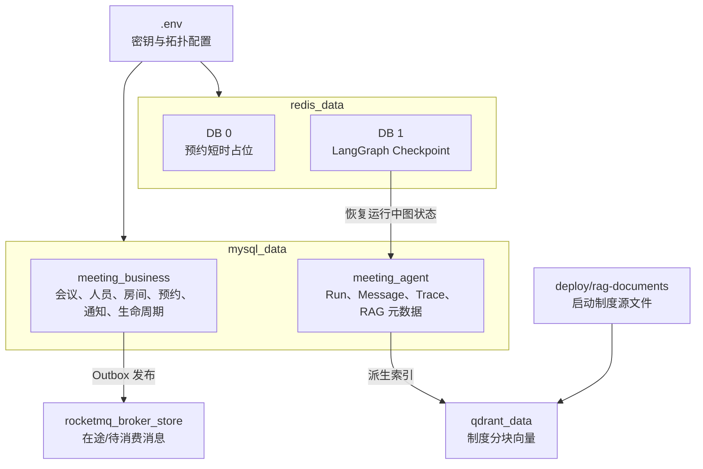
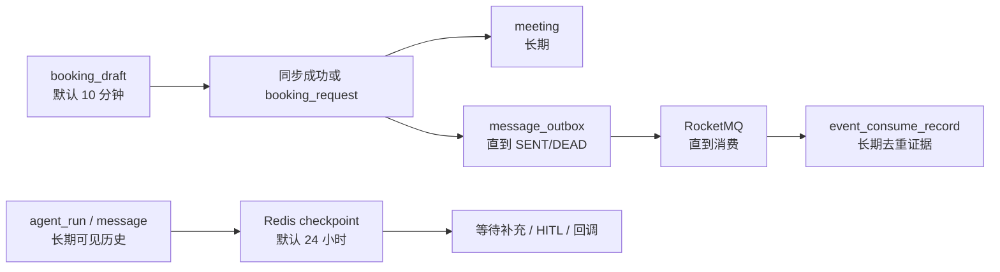
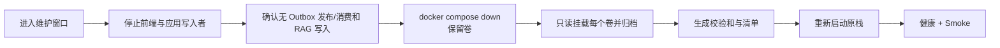
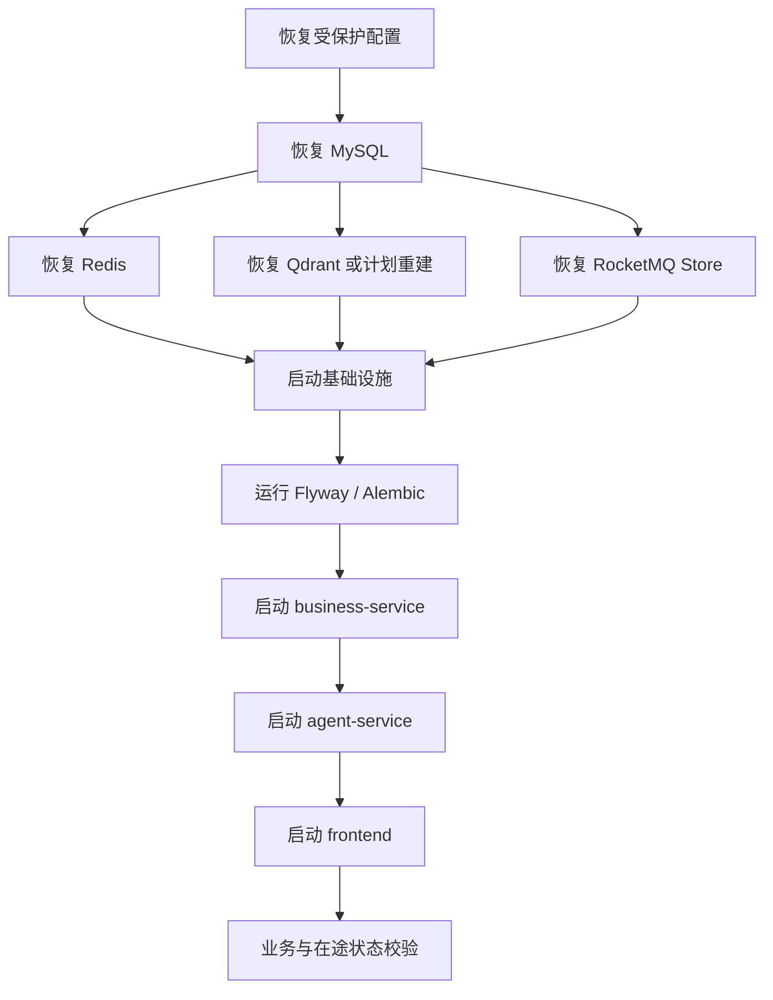

# 数据、备份与恢复

本文说明 WeMe 的数据归属、命名卷、备份一致性和恢复顺序。所有恢复操作都应先在隔离 Compose Project 中演练，不能把“容器能启动”当作业务数据已经一致。

## 1. 数据地图



## 2. 命名卷

`compose.yaml` 声明：

| Compose 卷 | 容器路径 | 数据 |
| --- | --- | --- |
| `mysql_data` | `/var/lib/mysql` | 两个 MySQL 数据库、Flyway/Alembic Schema |
| `redis_data` | `/data` | Redis AOF、预约 Hold、Agent Checkpoint |
| `qdrant_data` | `/qdrant/storage` | Qdrant collection、payload、向量 |
| `rocketmq_broker_store` | `/home/rocketmq/store` | CommitLog、ConsumeQueue 与 Broker 元数据 |

Compose Project 名固定为 `meeting-scheduler` 时，Docker 通常把它们解析为 `meeting-scheduler_mysql_data` 等名称。不要硬编码猜测，先查询：

```bash
docker volume ls --filter label=com.docker.compose.project=meeting-scheduler
docker volume inspect meeting-scheduler_mysql_data
```

## 3. 权威数据与可重建数据

| 数据 | 是否权威 | 丢失影响 | 重建方式 |
| --- | --- | --- | --- |
| 业务 MySQL | 是 | 会议、账户、预约、通知和生命周期丢失 | 只能从数据库备份恢复 |
| Agent MySQL | 是 | 对话、Trace、RAG 文档内容与管理状态丢失 | 只能从数据库备份恢复；启动语料只能补回种子文档 |
| Redis DB 0 Hold | 否，短期 | 在途确认需要重试 | MySQL 最终约束仍保护一致性 |
| Redis DB 1 Checkpoint | 对运行中 Agent 是关键 | 等待输入/HITL/回调的图状态不可恢复 | 从 Redis 备份恢复；Agent MySQL 摘要不能完整替代图状态 |
| Qdrant | 派生索引 | 制度检索不可用 | 从受管文档内容和启动源重新入库；必须验证墓碑与版本 |
| RocketMQ Store | 对在途消息关键 | 已标记 Outbox `SENT` 但尚未消费的事件可能丢失 | 优先恢复 Broker；不能假设 Outbox 会自动重发 `SENT` |
| `.env` | 配置关键 | 无法解密/连接既有数据服务、Token 全部变化 | 从加密配置备份恢复或按轮换流程重建 |

## 4. 生命周期关系



草案过期不删除会议历史；Checkpoint 过期不删除 Run 摘要，但会失去继续执行该图的能力。

## 5. 备份层级

### 5.1 最小业务备份

适合只保护长期业务与 Agent 元数据：

- MySQL 两个数据库的同一时刻逻辑备份。
- 加密备份 `.env`。
- 保存当前应用镜像版本、`.env.example` 和 Compose 配置版本。

这不保护运行中 LangGraph Checkpoint、Qdrant 索引或在途 RocketMQ 消息。

### 5.2 完整运行时备份

适合需要恢复在途任务和消息：

- 一致性 MySQL 备份。
- Redis AOF 卷。
- Qdrant 卷。
- RocketMQ Broker Store 卷。
- 加密 `.env` 和启动 RAG 源文件。

最安全的单机方式是短暂停止全部写入者并做冷备。

## 6. 一致性冷备流程



建议步骤：

1. 告知用户维护窗口，停止新请求。
2. `docker compose stop frontend agent-service business-service`。
3. 确认 `message_outbox` 没有正在变化的 `SENDING` 记录，或记录当前状态用于恢复校验。
4. `docker compose down`，不要加 `--volumes`。
5. 查询实际卷名并以只读方式归档四个命名卷。
6. 对归档生成 SHA-256，记录时间、Compose Project、应用镜像标签和卷名。
7. `docker compose up -d`，检查健康并运行最小 Smoke。

## 7. MySQL 逻辑备份

在线逻辑备份可缩短停机，但它不能与 Redis、Qdrant 和 RocketMQ 形成一个全局原子快照。

Linux / WSL 示例：

```bash
mkdir -p backups
docker compose exec -T mysql sh -c \
  'MYSQL_PWD="$MYSQL_ROOT_PASSWORD" mysqldump -uroot --single-transaction --routines --events --databases "$BUSINESS_DB_NAME" "$AGENT_DB_NAME"' \
  > backups/weme-mysql.sql
sha256sum backups/weme-mysql.sql > backups/weme-mysql.sql.sha256
```

PowerShell 示例：

```powershell
New-Item -ItemType Directory -Force backups | Out-Null
docker compose exec -T mysql sh -c 'MYSQL_PWD="$MYSQL_ROOT_PASSWORD" mysqldump -uroot --single-transaction --routines --events --databases "$BUSINESS_DB_NAME" "$AGENT_DB_NAME"' |
  Set-Content -Encoding utf8NoBOM backups/weme-mysql.sql
Get-FileHash -Algorithm SHA256 backups/weme-mysql.sql
```

注意：PowerShell 文本管道可能改变编码。正式备份更适合使用二进制安全的重定向工具或在容器内先生成文件，再复制并校验。

## 8. 卷归档原则

卷冷备应满足：

- 源卷已停止写入。
- 挂载源为只读。
- 备份目录不是同一个 Docker 卷。
- 归档包含隐藏文件、权限和符号链接。
- 每个卷单独归档和校验，避免部分恢复时无法辨识。

示意命令中的卷名和备份路径必须先替换为实际绝对值：

```bash
docker run --rm \
  -v meeting-scheduler_mysql_data:/source:ro \
  -v /absolute/path/to/backups:/backup \
  alpine:3.20 sh -c 'cd /source && tar -czf /backup/mysql-data.tgz .'
```

对 Redis、Qdrant 和 RocketMQ 分别重复，不要把四个卷混进同一个未知根目录。

## 9. 恢复策略

### 9.1 先恢复到隔离环境

不要直接覆盖现有卷。创建新的 Compose Project、独立端口和新卷，在其中验证：

- MySQL 两个数据库都能迁移/启动。
- Java readiness 为 `UP`。
- Redis DB 1 中等待任务与 Agent Run 能对应。
- Qdrant collection 数量、维度、文档和分块数匹配。
- RocketMQ Broker 能读取 Store，消费组状态合理。
- 登录、会议读取、制度问答和一个不产生业务写入的 Agent 任务通过。

### 9.2 恢复顺序



如果备份来自旧版本，先使用与备份匹配的应用镜像验证，再按正常升级流程迁移。不要直接用最新代码解释未知旧 Schema。

## 10. 只重建 Qdrant

Qdrant 丢失而 MySQL 与制度源完整时：

1. 停止 Agent 请求，避免检索期间集合处于半重建状态。
2. 使用新的空 Qdrant 卷或新的 collection 名。
3. 运行 `docker compose run --rm rag-init` 重建启动语料。
4. 对管理员上传/编辑的受管文档，确认 `rag_document.content_text`、元数据和删除墓碑完整，再通过受支持的管理/入库路径重建。
5. 运行 `scripts/smoke-rag-ingestion.py` 和 `scripts/smoke-rag-document-management.py`。

当前没有一个声明为“从数据库自动完整重放所有受管文档”的独立运维命令，因此不能在未验证前承诺仅运行 `rag-init` 就恢复所有管理员历史文档。

## 11. Redis 丢失

### DB 0

短时 Hold 会丢失。恢复前应停止确认请求，等待数据库事务结束；启动后由新请求重新建立 Hold。MySQL 唯一槽仍是最终保护。

### DB 1

等待补充、HITL 或异步回调的 Run 可能无法恢复。处理原则：

- 不伪造 Checkpoint。
- 读取 Agent MySQL 的 Run/Message/Trace 判断最后可见状态。
- 对可恢复需求使用新的 Run 和 `base_run_id`；如果缺少完整草案状态，让用户重新确认需求。
- 已进入 `WAITING_BUSINESS_RESULT` 的预约还要查询 `booking_request`，不能因 Checkpoint 丢失而重复下单。

## 12. RocketMQ Store 丢失

先比较 MySQL：

- `message_outbox.status`。
- `booking_request.status`。
- `event_consume_record`。

`NEW/RETRY` Outbox 会重新发送；`SENT` 但没有消费记录的事件可能已经随 Broker Store 丢失。当前 Publisher 不会自动把所有 `SENT` 记录改回可发送状态，人工补偿必须先证明事件未被消费，并保持原 `event_id` 或设计新的受审计补偿事件。

不要直接批量更新 Outbox 状态。

## 13. 恢复验收

最少检查：

- 服务健康与容器启动顺序正确。
- 用户能登录，角色与员工状态正确。
- 随机会议的参与者、房间、时间和槽位一致。
- `booking_request` 的终态与会议/错误一致。
- Outbox 没有异常增长的 `RETRY/DEAD/SENDING`。
- Agent Thread/Run/Message 数量合理，历史接口不泄露 token。
- Redis Checkpoint 可恢复一个专门准备的等待任务。
- RAG 文档数、INDEXED 数、Qdrant 点数和代表性引用通过。
- 异常改期单、通知、会议生命周期和行动项能读取。

## 14. 保留与清理

当前代码没有通用历史清理任务。制定保留策略时要保持关联：

- Run、Step、Tool、Loop、Message 与 Checkpoint。
- Meeting、Participant、Room Slot、Busy Slot。
- Booking Request、Outbox、Consume Record、Tool Audit。
- Post-meeting Draft、Minutes、Decision、Action Item、Reminder Delivery。

任何清理都应通过新增受测试的应用迁移或维护任务实现，不应在生产数据库手工级联删除。

## 15. 禁止操作

- 未备份时执行 `docker compose down --volumes`。
- 在运行中的 MySQL/Redis/Qdrant/RocketMQ 卷上直接打 tar 冷备。
- 只恢复 MySQL 后立刻重放全部消息，而不核对 Outbox 与消费记录。
- 通过清空 Redis 强制“修复”卡住的 Agent。
- 删除 `rag_document` 墓碑后运行种子入库。
- 用旧 `.env` 连接新恢复的数据而不核对账户密码和 JWT 影响。
