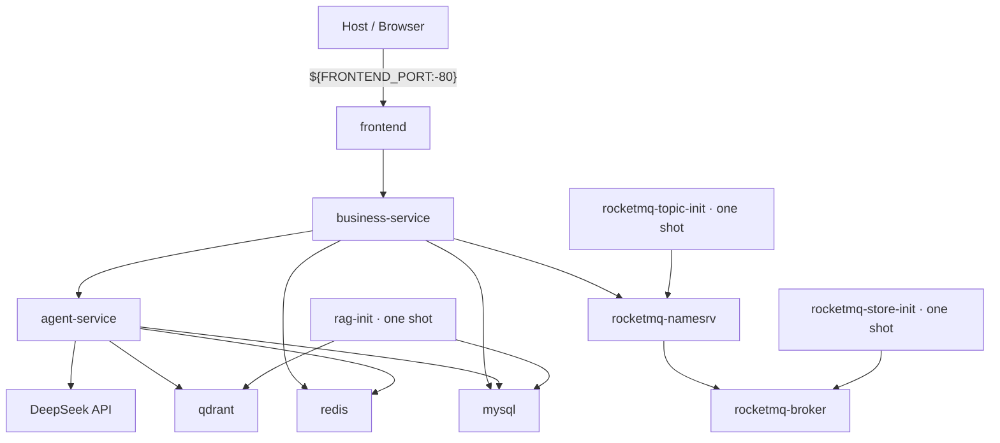
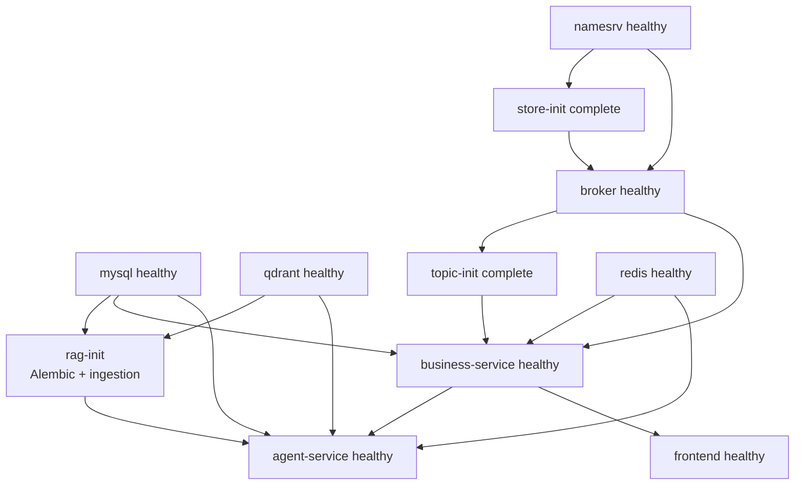
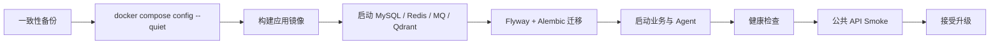

# 部署与升级

本文说明 WeMe 的 Docker Compose 部署、启动依赖、开发端口、健康验证、升级和停止边界。

## 1. 部署模式

| 模式 | Compose 文件 | 宿主机暴露 | 用途 |
| --- | --- | --- | --- |
| 完整单机部署 | `compose.yaml` | 仅 `FRONTEND_PORT` | 日常运行与演示 |
| 本地开发/诊断 | `compose.yaml` + `compose.dev.yaml` | 额外暴露 Java、Agent、MySQL、Redis、RocketMQ、Qdrant | 本地调试和 Smoke |
| 空卷验收 | `scripts/Test-Day7EmptyVolume.ps1` | 独立随机 Compose 项目与端口 | 验证从全新卷启动，不影响现有栈 |

## 2. 环境要求

- Docker Engine 24+ 或当前 Docker Desktop。
- Docker Compose v2。
- 建议至少 12 GB 可用内存和 20 GB 可用磁盘。
- 首次构建需要访问镜像仓库和 Python/Node/Maven 依赖源。
- BGE-M3 模型必须已经存在于宿主机目录。
- Windows 路径可写为 `D:/models/bge-m3`；Linux 使用绝对路径。

Compose 中长期服务的内存上限合计约 8.4 GB；`rag-init` 在首次索引期间另有 5 GB 上限。实际需求取决于 BGE 模型、文档数量和并发。

## 3. 服务拓扑



## 4. 启动依赖



`rag-init` 与 `rocketmq-*-init` 成功退出是正常状态。不要因为它们不是 `running` 就判定部署失败。

## 5. 创建环境文件

### PowerShell 推荐路径

```powershell
pwsh -File .\scripts\New-LocalEnv.ps1
```

行为：

- 读取 `.env.example`。
- 为 3 组数据库密钥、Redis、浏览器 JWT、Agent Context JWT 和服务令牌生成独立随机值。
- 已有 `.env` 时默认保留，不覆盖。
- 不把生成的密钥输出到终端。

### 手工路径

```bash
cp .env.example .env
```

必须替换全部 `__REPLACE_*` 值，并至少检查：

```dotenv
BGE_M3_HOST_PATH=/absolute/host/path/to/bge-m3
RAG_EMBEDDING_MODEL_PATH=/models/bge-m3
APP_DEMO_DATA_ENABLED=true
AGENT_MODEL_PROVIDER=fixture
FRONTEND_PORT=80
```

`.env` 是本地密钥文件，不应提交或复制到文档、日志和评测产物。

## 6. 启动

### 完整部署

```bash
docker compose config --quiet
docker compose up -d --build
docker compose ps
```

### 开发覆盖

```bash
docker compose -f compose.yaml -f compose.dev.yaml config --quiet
docker compose -f compose.yaml -f compose.dev.yaml up -d --build
```

默认开发端口：

| 服务 | 端口 |
| --- | ---: |
| Web | 80 |
| Java | 8080 |
| Agent | 8000 |
| MySQL | 3306 |
| Redis | 6379 |
| RocketMQ NameServer | 9876 |
| RocketMQ Broker | 10911 |
| Qdrant HTTP | 6333 |

端口都可以通过 `.env` 对应变量覆盖。

## 7. 镜像构建

### business-service

1. Maven + Java 21 构建阶段执行 `./mvnw -B -ntp verify`。
2. 只有测试与格式检查通过才产生 JAR。
3. 运行阶段使用 Java 21 JRE 和非 root UID 10001。

### agent-service

1. Python 3.11 安装固定版本 `uv`。
2. `uv sync --frozen --no-dev --no-install-project` 严格使用 `uv.lock`。
3. 运行时非 root，启动先 `alembic upgrade head`，再运行 Uvicorn。

### frontend

1. Node 22 执行 `npm ci`。
2. `npm run build` 先跑 `vue-tsc --noEmit`，再 Vite 构建。
3. 运行阶段只保留 Nginx 和静态产物。

## 8. 健康验证

```bash
docker compose ps
curl http://localhost/health
```

开发覆盖下：

```bash
curl http://localhost:8080/actuator/health/readiness
curl http://localhost:8000/internal/v1/health
```

预期：

- Nginx 返回 `{"status":"UP"}`。
- Java readiness 只有数据库、Redis、RocketMQ 都可用时为 `UP`。
- Agent 的数据库或 Redis Checkpoint 不可用时返回 HTTP 503。
- DeepSeek 未配置时 Agent 可返回 `DEGRADED`；这不影响 `fixture` 模式的确定性 Smoke。

基础部署没有把 Java/Agent 端口发布到宿主机，可以改用容器内探针：

```bash
docker compose exec agent-service python -c "import urllib.request; print(urllib.request.urlopen('http://127.0.0.1:8000/internal/v1/health').read().decode())"
docker compose exec business-service java -cp /opt/meeting-health com.example.meeting.common.health.ContainerHealthProbe
```

## 9. 首次 RAG 初始化

`rag-init` 执行：

```text
alembic upgrade head
python -m app.rag.ingest --source-dir /app/rag-documents
```

它需要：

- Agent MySQL 数据库可用。
- Qdrant 可用。
- `BGE_M3_HOST_PATH` 内含可由 Sentence Transformers 加载的本地模型。
- `deploy/rag-documents` 可读。

检查退出状态与日志：

```bash
docker compose ps -a rag-init
docker compose logs rag-init
```

需要重新运行启动语料入库时：

```bash
docker compose run --rm rag-init
```

该操作按文档 ID、checksum、记录版本和删除墓碑执行，不应用来绕过管理员文档管理 API。

## 10. 模型模式

### Fixture

```dotenv
AGENT_MODEL_PROVIDER=fixture
DEEPSEEK_API_KEY=
```

Fixture 用于本地 Smoke 和确定性回归。它不能代表真实自然语言模型质量。

### DeepSeek

```dotenv
AGENT_MODEL_PROVIDER=deepseek
DEEPSEEK_API_KEY=...
DEEPSEEK_BASE_URL=https://api.deepseek.com
DEEPSEEK_MODEL=deepseek-v4-flash
```

变更后重建 Agent 容器：

```bash
docker compose up -d --force-recreate agent-service
```

不要把 API Key 放进 Compose 命令行、截图或日志。

## 11. 日志

### 应用链路

```bash
docker compose logs -f --tail=200 frontend business-service agent-service
```

### 数据与消息

```bash
docker compose logs -f --tail=200 mysql redis qdrant
docker compose logs -f --tail=200 rocketmq-namesrv rocketmq-broker
```

Java 日志格式包含 MDC `traceId`；Agent 日志也记录 Run 和检索阶段。排查时优先使用 API 返回的 `traceId` 与 `runId`，不要粘贴令牌。

## 12. 停止与重启

保留数据停止：

```bash
docker compose down
```

滚动重建单个应用：

```bash
docker compose up -d --build business-service
docker compose up -d --build agent-service
docker compose up -d --build frontend
```

不要在没有一致性备份时运行：

```text
docker compose down --volumes
```

它会删除 MySQL、Redis、RocketMQ 和 Qdrant 命名卷。

## 13. 升级流程



建议步骤：

1. 按 [DATA_AND_RECOVERY.md](DATA_AND_RECOVERY.md) 完成一致性备份。
2. 检查新 `.env.example` 与现有 `.env` 的变量差异，不覆盖密钥。
3. 运行 `docker compose config --quiet`。
4. 构建镜像：`docker compose build business-service agent-service frontend`。
5. 执行 `docker compose up -d`；Flyway 和 Alembic 会前向迁移。
6. 检查 `rag-init`、长期服务健康和迁移日志。
7. 至少运行 Day 1、公共 UI、RAG 文档管理和业务关键 Smoke。

数据库迁移脚本只实现前向升级；回退应用版本前必须确认旧代码能读取新 Schema。不能把“换回旧镜像”视为数据库回滚。

## 14. 本地密钥轮换

停止应用写入者：

```bash
docker compose stop frontend business-service agent-service
```

然后运行：

```powershell
pwsh -File .\scripts\Rotate-LocalSecrets.ps1
```

脚本会：

- 拒绝在 `business-service` 或 `agent-service` 仍运行时执行。
- 轮换 MySQL 用户/Root、Redis 密码、浏览器 JWT、Agent Context JWT 和服务令牌。
- 更新 `.env`，但不打印新值。
- 重建 MySQL 与 Redis 容器。

完成后：

```bash
docker compose up -d
docker compose ps
```

轮换 JWT 后现有用户登录与 Agent 上下文会失效，这是预期行为。

## 15. 空卷验收

PowerShell：

```powershell
pwsh -File .\scripts\Test-Day7EmptyVolume.ps1
```

该脚本创建独立 Compose Project 和新的命名卷，执行完整 Golden Path，并且不会删除这些验证卷。失败时保留现场用于诊断；使用 `-KeepProject` 可在成功后继续检查容器。

## 16. 生产化注意事项

当前 Compose 是单机拓扑。对外生产部署前至少补充：

- TLS 终止和可信域名。
- Docker Secret、Vault 或云密钥管理，替代普通 `.env`。
- 关闭演示数据，通过受控迁移或专用运维流程创建首个管理员，并更换所有默认账户；当前没有匿名管理员自举端点。
- MySQL、Redis、Qdrant、RocketMQ 的监控、备份与容量告警。
- Outbox `DEAD`、消费者堆积、Agent `DEGRADED/DOWN` 告警。
- 外部模型的出站代理、配额和数据合规审查。
- 多实例部署下的共享锁、调度器单例和 SSE 粘性/无状态验证。

## 17. 相关文件

- `compose.yaml`
- `compose.dev.yaml`
- `.env.example`
- `scripts/New-LocalEnv.ps1`
- `scripts/Rotate-LocalSecrets.ps1`
- `scripts/Test-Day7EmptyVolume.ps1`
- `deploy/nginx/default.conf`
- `deploy/rocketmq/broker.conf`
- `business-service/Dockerfile`
- `agent-service/Dockerfile`
- `frontend/Dockerfile`
