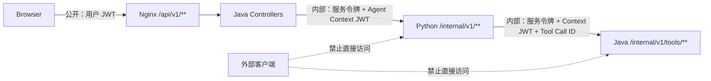
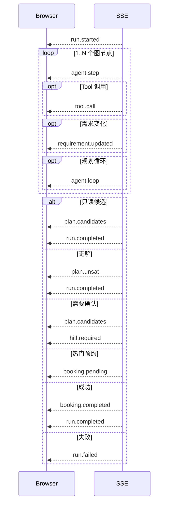
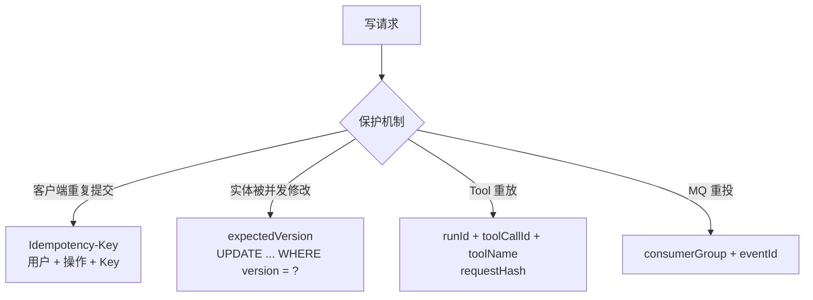

# HTTP 与 SSE API

本文给出 WeMe 的浏览器公共 API、Agent 内部 API、统一响应格式、幂等和 SSE 事件契约。字段级约束以 Java Record/Pydantic Schema 为最终依据。

## 1. API 边界



基础 Compose 只暴露 Nginx。Java `8080`、Agent `8000` 和数据端口只有在叠加 `compose.dev.yaml` 时才发布到宿主机。

## 2. 公共请求约定

- 基础路径：`/api/v1`。
- JSON 编码：UTF-8，字段使用 `camelCase`。
- 登录后使用 `Authorization: Bearer <accessToken>`。
- 所有时间都应携带偏移，例如 `2026-08-23T14:00:00+08:00`。
- 分页从 1 开始；常用默认值为 `page=1&size=20`。
- 写入 DTO 使用 Bean Validation；非法参数返回 `VALIDATION_ERROR`。
- 每个响应都带 `traceId`，排查跨服务问题时应保留该值。

### 成功响应

```json
{
  "data": {},
  "traceId": "trace_...",
  "timestamp": "2026-08-16T10:00:00+08:00"
}
```

### 错误响应

```json
{
  "code": "BOOKING_CONFLICT",
  "message": "会议室或必须参加者在该时段已被占用",
  "details": [
    { "field": "conflict.type", "reason": "ROOM_OR_REQUIRED_PARTICIPANT" }
  ],
  "traceId": "trace_..."
}
```

错误消息适合直接展示，但客户端流程判断应使用稳定 `code`，不要依赖中文文案。

## 3. 认证与权限

| 方法 | 路径 | 权限 | 说明 |
| --- | --- | --- | --- |
| POST | `/auth/login` | 公开 | 用户名密码登录，返回 Access Token 与用户 |
| GET | `/auth/me` | EMPLOYEE / ADMIN | 获取当前用户 |

`/api/v1/admin/**` 统一要求 `ADMIN`。普通业务端点要求 `EMPLOYEE` 或 `ADMIN`，但服务层还会继续校验对象归属，例如会议是否可见、是否可管理、通知是否属于当前用户。

## 4. Agent 对话与 Trace

| 方法 | 路径 | 说明 |
| --- | --- | --- |
| POST | `/agent/runs/stream` | 创建 Run 并返回 SSE；可携带 `threadId`、`baseRunId` |
| POST | `/agent/runs/{runId}/input` | 在 `WAITING_USER_INPUT` Run 中补充需求 |
| POST | `/agent/runs/{runId}/resume` | 对 HITL 草案执行 `ACCEPT`、`EDIT` 或 `REJECT` |
| GET | `/agent/runs/{runId}` | 读取当前用户所属 Run 摘要 |
| GET | `/agent/runs/{runId}/trace` | 读取步骤、Tool、循环和模型指标 |
| GET | `/agent/threads` | 分页读取对话线程，可按 Run 状态过滤 |
| GET | `/agent/threads/{threadId}` | 读取线程、可见消息和 Run 列表 |

### 创建 Run

```http
POST /api/v1/agent/runs/stream
Authorization: Bearer <user-jwt>
Content-Type: application/json
Accept: text/event-stream

{
  "threadId": null,
  "message": "请帮我找李四明天下午都方便的一个小时，先不要预约。",
  "clientRequestId": "ui-8f4d...",
  "baseRunId": null
}
```

`clientRequestId` 用于用户消息幂等；同一用户、同一客户端请求和同一角色不能重复写消息。

### 补充需求

```json
{
  "message": "下午两点到五点，至少 6 人，需要白板。",
  "clientRequestId": "ui-d2ac...",
  "expectedRevision": 2
}
```

`expectedRevision` 防止多个页面基于不同需求版本同时续写。

### HITL 恢复

接受：

```json
{
  "action": "ACCEPT",
  "confirmationToken": "...",
  "editedDraft": null,
  "feedback": null
}
```

编辑：

```json
{
  "action": "EDIT",
  "confirmationToken": "...",
  "editedDraft": {
    "roomId": 102,
    "startAt": "2026-08-23T15:00:00+08:00",
    "meetingId": null
  },
  "feedback": "优先选择 15:00"
}
```

`EDIT` 至少包含 `roomId`、`startAt`、`meetingId` 之一；非 EDIT 操作不能带 `editedDraft`。

## 5. SSE 契约

响应头：

- `Content-Type: text/event-stream`
- `Cache-Control: no-cache`
- `X-Run-Id: run_...`

帧格式：

```text
event: requirement.updated
data: {"runId":"run_...","revision":1,"ready":true,"items":[]}

```

主要事件顺序：



事件字段详见 [AGENT_WORKFLOW.md](AGENT_WORKFLOW.md#11-sse-事件)。浏览器应把终态识别为：

- `hitl.required`
- `booking.pending`
- `run.completed`
- `run.failed`

连接断开不自动等于失败，应使用 `X-Run-Id` 查询 Run。

## 6. 会议

| 方法 | 路径 | 说明 |
| --- | --- | --- |
| POST | `/meetings` | 手工创建会议；建议携带 `Idempotency-Key` |
| GET | `/meetings` | 按时间范围、状态和分页读取可见会议 |
| GET | `/meetings/{meetingId}` | 读取会议详情 |
| PUT | `/meetings/{meetingId}` | 更新可管理会议，负载含期望版本 |
| DELETE | `/meetings/{meetingId}` | 取消可管理会议 |
| GET | `/booking-requests/{requestNo}` | 查询当前用户的异步热门预约状态 |

会议 DTO 将必需与可选参会人分开。创建/更新会规范化时间并写 30 分钟槽；客户端不要预先假设“查询到空闲”等于创建一定成功。

## 7. 会议室

| 方法 | 路径 | 权限 | 说明 |
| --- | --- | --- | --- |
| GET | `/rooms` | EMPLOYEE / ADMIN | 普通员工只看到可见房间，管理员可见全部管理状态 |
| GET | `/rooms/{roomId}` | EMPLOYEE / ADMIN | 房间详情与设备 |
| GET | `/rooms/{roomId}/availability` | EMPLOYEE / ADMIN | 查询时间窗内占用槽 |
| POST | `/admin/rooms` | ADMIN | 新增会议室 |
| PUT | `/admin/rooms/{roomId}` | ADMIN | 按 `expectedVersion` 编辑 |
| PATCH | `/admin/rooms/{roomId}/status` | ADMIN | 启用/停用；停用必须提供原因 |

会议室状态变化可能同步创建异常改期单，不应把该接口当成无副作用的简单字段更新。

## 8. 员工与目录

| 方法 | 路径 | 权限 | 说明 |
| --- | --- | --- | --- |
| GET | `/directory/employees` | EMPLOYEE / ADMIN | 供参会人选择使用的活跃目录 |
| GET | `/admin/departments` | ADMIN | 部门选项 |
| GET | `/admin/employees` | ADMIN | 按关键词、部门、角色、状态分页 |
| GET | `/admin/employees/{employeeId}` | ADMIN | 员工详情 |
| POST | `/admin/employees` | ADMIN | 创建员工和初始密码 |
| PUT | `/admin/employees/{employeeId}` | ADMIN | 编辑员工，带版本 |
| PATCH | `/admin/employees/{employeeId}/status` | ADMIN | 启用/停用，带版本 |
| POST | `/admin/employees/{employeeId}/password` | ADMIN | 重置密码，带版本 |

用户名、邮箱唯一；密码只接收不回显。服务层阻止导致当前管理员失去必要管理能力的危险自修改。

## 9. 通知

| 方法 | 路径 | 说明 |
| --- | --- | --- |
| GET | `/notifications` | 支持 `unreadOnly`、`type`、`page`、`size` |
| GET | `/notifications/unread-count` | 当前用户未读数 |
| PATCH | `/notifications/{notificationId}/read` | 标记自己的单条通知已读 |
| PATCH | `/notifications/read-all` | 标记自己的全部通知已读 |

## 10. 异常改期

| 方法 | 路径 | 说明 |
| --- | --- | --- |
| GET | `/replan-cases` | 分页读取当前用户可见改期单，可按状态过滤 |
| GET | `/replan-cases/{caseId}` | 改期单、原约束快照和处理状态 |
| GET | `/replan-cases/{caseId}/alternatives` | 读取替代会议室，默认 3 个 |
| POST | `/replan-cases/{caseId}/resolve` | 同时间换房、转 Agent、恢复或取消等决策 |

resolve 请求必须带改期单和相关业务对象的期望版本；候选已变化时返回 409。

## 11. 会议生命周期

| 方法 | 路径 | 说明 |
| --- | --- | --- |
| GET | `/meetings/{meetingId}/lifecycle` | 会议、准备清单、草案、纪要、决策和行动项聚合视图 |
| PUT | `/meetings/{meetingId}/preparation` | 保存议程和材料，带准备版本 |
| POST | `/meetings/{meetingId}/post-meeting-drafts` | 提交 transcript，建议携带 `Idempotency-Key` |
| POST | `/meetings/{meetingId}/post-meeting-drafts/{draftId}/review` | `ACCEPT`、`EDIT` 或 `REJECT` |
| PATCH | `/meetings/{meetingId}/action-items/{actionItemId}` | 更新行动项状态和版本 |

会后正式内容只在草案 `ACCEPT` 后产生。

## 12. 制度文档

| 方法 | 路径 | 权限 | 说明 |
| --- | --- | --- | --- |
| GET | `/knowledge-documents` | EMPLOYEE / ADMIN | 分页与类型/部门/状态过滤 |
| GET | `/knowledge-documents/{documentId}` | EMPLOYEE / ADMIN | 文档详情与 Markdown 文本 |
| POST | `/admin/knowledge-documents` | ADMIN | Multipart 上传 Markdown 或文本 PDF，最大 5 MB |
| PUT | `/admin/knowledge-documents/{documentId}` | ADMIN | 编辑 Markdown 内容并按版本重建索引 |
| DELETE | `/admin/knowledge-documents/{documentId}` | ADMIN | 软删除并从 Qdrant 删除分块 |

上传元数据包括 `documentId`、标题、类型、部门、版本、生效日、优先级和时区。当前只接受 `ACTIVE`、`Asia/Shanghai` 文档。

## 13. 内部 Agent API

以下端点只允许 Java 调用：

| 方法 | 路径 | 说明 |
| --- | --- | --- |
| GET | `/internal/v1/health` | Agent、MySQL、Redis Checkpoint、模型配置状态 |
| POST | `/internal/v1/agent-runs/stream` | 创建内部 Run SSE |
| POST | `/internal/v1/agent-runs/{runId}/input` | 继续缺失需求 |
| POST | `/internal/v1/agent-runs/{runId}/resume` | 恢复 HITL |
| POST | `/internal/v1/agent-runs/{runId}/business-result` | 热门预约最终回调 |
| GET | `/internal/v1/agent-runs/{runId}` | Run 摘要 |
| GET | `/internal/v1/agent-runs/{runId}/trace` | Run Trace |
| GET | `/internal/v1/agent-threads` | 线程列表 |
| GET | `/internal/v1/agent-threads/{threadId}` | 线程详情 |
| POST | `/internal/v1/post-meeting/drafts` | 会后结构化草案生成 |
| GET/POST/PUT/DELETE | `/internal/v1/knowledge-documents/**` | 制度文档管理 |

认证同时要求：

- `X-Service-Token`
- `Authorization: Bearer <Agent Context JWT>`
- `X-Trace-Id`
- `X-Run-Id`

JWT 的 `sub`、`roles`、`traceId`、`runId` 与头部必须一致。

## 14. 内部 Java Tool API

| 风险 | 方法与路径 | 说明 |
| --- | --- | --- |
| READ | `POST /internal/v1/tools/resolve-employees` | 名称解析 |
| READ | `POST /internal/v1/tools/resolve-participant-scope` | “我的部门/小组”范围解析 |
| READ | `POST /internal/v1/tools/get-employee-free-busy` | 必需人员忙闲 |
| READ | `POST /internal/v1/tools/search-available-rooms` | 会议室候选事实 |
| READ | `POST /internal/v1/tools/get-recent-meeting` | 当前用户近期可管理会议 |
| DRAFT | `POST /internal/v1/tools/booking-drafts` | 创建预约草案 |
| WRITE | `POST /internal/v1/tools/booking-drafts/{token}/confirm` | 确认创建 |
| DRAFT | `POST /internal/v1/tools/reschedule-drafts` | 创建改期草案 |
| WRITE | `POST /internal/v1/tools/reschedule-drafts/{token}/confirm` | 确认改期 |
| DRAFT | `POST /internal/v1/tools/cancellation-previews` | 创建取消预览 |
| WRITE | `POST /internal/v1/tools/cancellation-previews/{token}/confirm` | 确认取消 |

除上一节头部外，Tool API 还要求 `X-Tool-Call-Id`；WRITE 请求要求 `Idempotency-Key`。浏览器绝不能调用这些端点。

## 15. 幂等与乐观锁



建议：

- 每个用户动作生成稳定但唯一的 `clientRequestId`。
- 网络重试同一次写操作时复用原 `Idempotency-Key`。
- 用户更改负载后生成新幂等键。
- 409 版本冲突后先重新 GET，不要盲目增加版本号重试。

## 16. 缓存与敏感字段

- Run、Trace、Thread 和会后草案响应使用 `Cache-Control: no-store` 或网关清洗。
- `confirmationToken` 只在当前 HITL SSE 中使用，不出现在历史接口。
- Java Agent 网关递归移除 access token、JWT、service token 等内部字段。
- 日志和 Trace 只保存安全化 Tool 参数，不保存原始内部令牌。

## 17. 实现映射

- Public Controllers：`business-service/src/main/java/com/example/meeting/**/api/*Controller.java`
- 安全路由：`business-service/src/main/java/com/example/meeting/common/security/SecurityConfiguration.java`
- SSE Gateway：`business-service/src/main/java/com/example/meeting/agentgateway/client/AgentSseProxyService.java`
- Tool API：`business-service/src/main/java/com/example/meeting/agentgateway/internal/AgentToolController.java`
- FastAPI：`agent-service/app/api/internal.py`、`knowledge.py`
- 前端 API 类型：`frontend/src/api/types.ts`
- 前端 SSE 消费：`frontend/src/views/ChatView.vue`
