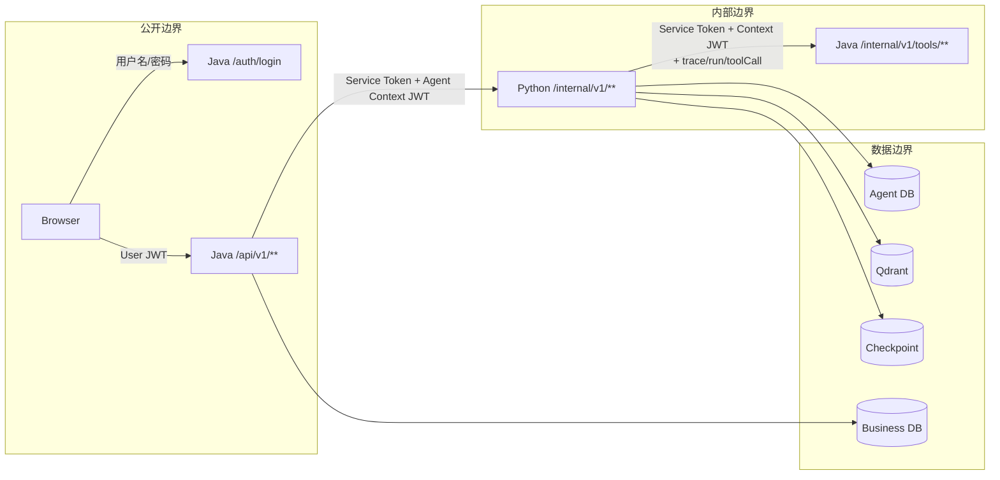
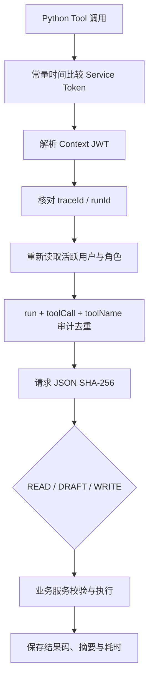
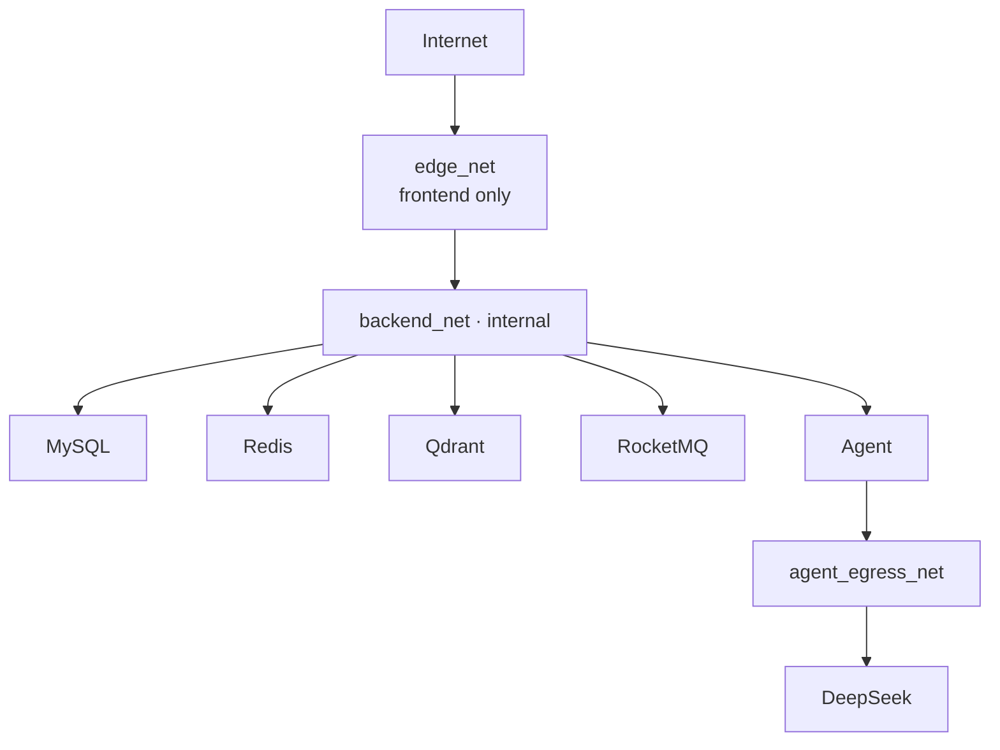
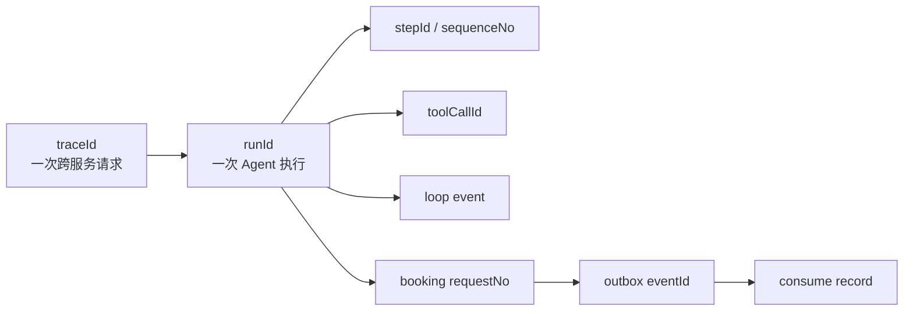
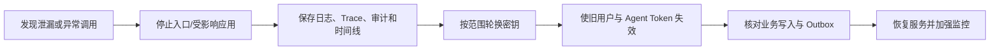

# 安全与运行观测

本文描述 WeMe 的身份链、信任边界、Tool 审计、敏感数据处理、Trace 和日常运行检查。

## 1. 信任边界



安全原则：

- 浏览器永远不持有内部服务令牌或 Agent Context JWT。
- Python 永远不从请求体接受用户身份作为授权依据。
- Tool API 即使在内部网络也必须完成双重认证和上下文一致性校验。
- 业务对象权限在 Controller 路由之后还会由 Service 再校验。

## 2. 用户认证

- 密码使用 BCrypt 保存。
- 登录只接受活跃账户。
- Java 签发 HMAC JWT，包含用户 ID、角色、发行者和过期时间。
- Spring Security 使用无状态 Session 策略。
- `/api/v1/auth/login` 与健康检查公开，其余请求默认需要认证。
- `/api/v1/admin/**` 需要 `ADMIN`。

前端把登录状态用于路由守卫，但前端守卫不是安全边界；后端对每个请求重新校验 JWT 与角色。

## 3. Agent Context

Java 在每次 Agent 调用前生成短期 Context JWT：

| Claim/头部 | 作用 |
| --- | --- |
| `sub` | 当前用户 ID |
| `roles` | Java 认证后的角色快照 |
| `aud` | 必须等于 `agent-service` |
| `exp` | 默认 600 秒 |
| `traceId` | 跨服务追踪 |
| `runId` | Agent 执行隔离 |
| `X-Service-Token` | 独立服务认证 |

Python 要求 Claim 与 `X-Trace-Id`、`X-Run-Id` 完全一致。Java Tool API 还会重新读取用户，确认账户仍为活跃状态、Token 角色没有过时。

## 4. Tool 防护



同一 Tool 标识再次调用：

- 请求 hash 相同且上次成功：重放保存的响应。
- 请求 hash 不同：`IDEMPOTENCY_KEY_REUSED`。
- 上次仍在处理或失败：返回依赖不可用，不重复执行未知效果。

## 5. 最小写权限

模型可直接规划的只有 READ Tool。DRAFT 与 WRITE 的进入条件由代码固定：

- DRAFT 必须在候选/目标会议通过确定性验证后执行。
- WRITE 必须从 LangGraph 的 HITL `ACCEPT` 分支执行。
- WRITE 使用稳定幂等键和 Tool Call ID。
- `REJECT` 不执行写 Tool。
- `EDIT` 清除旧候选、旧 token、旧业务结果并重新读取事实。

## 6. RBAC 与对象级权限

| 资源 | EMPLOYEE | ADMIN |
| --- | --- | --- |
| 会议室 | 查看活跃/可见资源 | 查看并管理全部资源 |
| 员工目录 | 查看活跃目录 | 创建、编辑、停用、重置密码 |
| 会议 | 查看参与或可见会议；管理自己有权管理的会议 | 仍经过业务对象校验 |
| 通知 | 只读写自己的通知状态 | 也不能代改其他用户通知 |
| 改期单 | 只看与自己相关的改期单 | 按服务规则扩大可见范围 |
| 制度文档 | 查看未删除文档 | 上传、编辑、删除 |
| Agent Run/Thread | 只看自己的 | 不自动获得其他用户历史 |

## 7. 敏感字段处理

### 不应持久化或回显

- 用户 Access Token。
- Agent Context JWT。
- `X-Service-Token`。
- DeepSeek API Key。
- HITL `confirmationToken` 的历史副本。
- 原始密码和重置后的密码。

Java Agent 网关会递归清除常见令牌字段；Run 历史读取默认省略 `confirmationToken`；Agent Tool Trace 只记录安全化参数。

### 允许持久化的安全摘要

- 请求 hash、payload hash。
- Tool 名、风险级别、稳定 ID。
- 业务对象 ID、数量、时间窗等经过裁剪的参数。
- 模型名、Prompt/Schema 版本和 Token 数量。

## 8. 网络隔离



基础 Compose 的 `backend_net` 设置为 internal，只有前端同时连接 edge/backend。Agent 额外连接 egress 网络访问模型服务。`compose.dev.yaml` 会把内部端口发布给宿主机，只应在可信开发环境使用。

## 9. Trace 关系



排查时优先保留以下非秘密标识：

- API `traceId`
- SSE 响应头 `X-Run-Id`
- 热门预约 `requestNo`
- 会议 `meetingId`
- Outbox `eventId`

不要用截图传递 Authorization Header 或完整 `.env`。

## 10. 健康与关键指标

### 服务健康

| 检查 | 成功条件 |
| --- | --- |
| Nginx `/health` | 静态入口可服务 |
| Java liveness | JVM 进程可响应 |
| Java readiness | DB、Redis、RocketMQ 全部可用 |
| Agent `/internal/v1/health` | Agent DB 与 Redis Checkpoint 可用 |
| Agent 模型状态 | DeepSeek 未配置显示 `DEGRADED`，不是伪装成 `UP` |

### 建议监控

- HTTP 401/403/409/503 比率。
- SSE Run 的成功、失败、等待输入、等待确认、等待业务结果数量。
- Agent 模型/工具调用次数、耗时、预算耗尽和重规划次数。
- RAG embedding/query/search 耗时、缓存命中与词法回退。
- Outbox 各状态数量、最老未发送时间、`DEAD` 数量。
- RocketMQ 消费堆积与 Broker 磁盘。
- MySQL 连接池、锁等待、唯一约束冲突。
- Redis 内存、AOF 状态与 Checkpoint 读写失败。
- Qdrant 集合点数、磁盘和查询错误。

## 11. 日常检查

```bash
docker compose ps
docker compose logs --tail=100 business-service agent-service
docker compose logs --tail=100 rocketmq-broker qdrant
```

开发覆盖下：

```bash
curl http://localhost:8080/actuator/health/readiness
curl http://localhost:8000/internal/v1/health
```

每次发布后至少确认：

- 登录与 `/auth/me`。
- 一个只读会议室请求。
- 一个 Fixture Agent 只读任务。
- 制度检索引用。
- Outbox 没有新增 `DEAD`。

## 12. 密钥管理

### 首次生成

```powershell
pwsh -File .\scripts\New-LocalEnv.ps1
```

### 本地轮换

```powershell
docker compose stop frontend business-service agent-service
pwsh -File .\scripts\Rotate-LocalSecrets.ps1
docker compose up -d
```

轮换脚本会检查应用已停止、更新 MySQL/Redis 实际凭据，再更新 `.env`。如果过程在“基础设施凭据已改、`.env` 尚未改”之间中断，应保留现场并按脚本输出恢复，不能重新运行随机轮换尝试碰撞旧值。

生产环境应使用外部 Secret Manager，并建立双人复核和审计。

## 13. 输入与内容安全

- Java 对所有公共 DTO 做长度、格式、枚举和范围验证。
- 上传文档限制为 5 MB，文件名必须是 basename，格式只允许 Markdown 与文本型 PDF。
- RAG 文档元数据禁止额外字段和换行注入。
- Model 输出必须通过 Pydantic Schema；非法输出触发有限修复或稳定失败。
- Tool Result 限制为 32 KiB，防止把过大业务数据注入模型上下文。
- 用户可见澄清文本拒绝内部错误码和未发生的“已创建/已取消”声明。

## 14. 外部模型数据边界

DeepSeek 模式会把完成当前 Agent 任务所需的提示发送到配置的外部 API。上线前应确认：

- 哪些用户输入、会议标题、参会人名称和制度片段会进入 Prompt。
- Provider 的保存、训练、地域和合规条款。
- API Key 权限与配额。
- 是否需要脱敏、代理、专线或禁用外部模型。

Fixture 不访问网络，但仅适合测试，不能替代真实模型能力。

## 15. 事件与审计保留

审计数据包括：

- `agent_tool_audit`
- `agent_step`、`agent_tool_call`、`agent_loop_event`
- `message_outbox`、`event_consume_record`
- 登录后的业务变更版本与时间

当前没有自动保留期清理任务。制定清理策略前应明确法律、隐私、故障取证和幂等重放所需时长。

## 16. 安全事件响应顺序



不要先删除日志或清空数据库。若怀疑内部 Tool 被滥用，使用 `runId + toolCallId + toolName` 审计记录判断实际执行和响应重放情况。

## 17. 当前边界

- 用户 JWT 使用 HMAC 共享密钥，不是外部 OIDC/SAML。
- Compose 入口默认 HTTP，无内置 TLS。
- `.env` 是明文文件。
- 单机 Compose 没有多副本高可用或集中日志系统。
- 健康端点不是完整监控替代品。
- 对外生产前还需要依赖漏洞扫描、镜像签名、SBOM 和第三方许可证审查。
