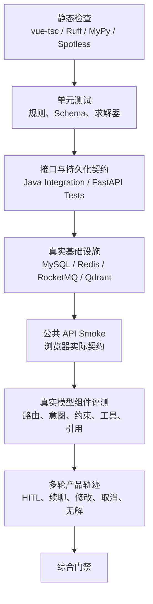
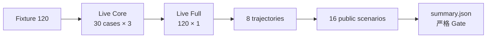
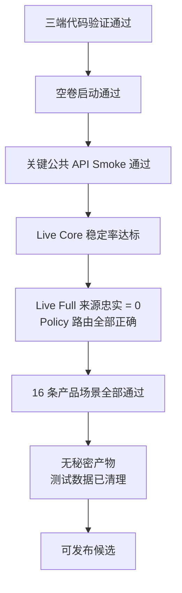

# 测试与评测

WeMe 的质量验证分为确定性代码测试、真实基础设施集成、公共 API 产品链路、真实模型组件质量和综合发布门禁。不同层回答不同问题，不能把模型评测替代并发/事务测试，也不能把 Fixture 结果解释为真实模型能力。

## 1. 测试分层



## 2. 本地代码验证

### 前端

```bash
cd frontend
npm ci
npm run build
```

`build` 依次运行：

- `vue-tsc --noEmit`
- `vite build`

### Java 业务服务

Windows：

```powershell
cd business-service
.\mvnw.cmd -B -ntp verify
```

Linux / WSL：

```bash
cd business-service
./mvnw -B -ntp verify
```

`verify` 包含 Java 测试和 Spotless 格式门禁。Dockerfile 构建阶段也执行同一命令。

### Python Agent 服务

```bash
cd agent-service
uv sync --frozen --dev
uv run ruff check app tests
uv run mypy app
uv run pytest
```

若只需要与容器生产依赖完全一致：

```bash
uv sync --frozen --no-dev --no-install-project
```

## 3. 测试覆盖面

### Java

| 测试域 | 代表性验证 |
| --- | --- |
| Auth | 登录、当前用户、无效账户 |
| Meeting | 创建、读取、更新、取消、权限、版本 |
| Concurrency | 房间槽和必需人员槽竞争、幂等重放 |
| Agent Gateway | SSE 代理、Tool 认证、结果回调 |
| Room / Employee | RBAC、管理版本、状态变化 |
| Outbox / MQ | 发布、消费去重、成功/冲突完成 |
| Replan | 会议室失效、替代方案、状态冲突 |
| Lifecycle | 会前准备、会后审核、行动项与提醒 |
| Knowledge | 文档公共读取、管理员写入与版本 |
| Health / Migration | Readiness 和空 Schema 迁移 |

### Python

| 测试域 | 代表性验证 |
| --- | --- |
| Workflow | 路由、需求、Policy、Scheduling、HITL、回调 |
| Schema / Metadata | Pydantic 协议、数据库元数据 |
| Solver | 可行候选、无解、硬约束、排序 |
| Tool Gate | 白名单、上下文参数、重复指纹、结果大小 |
| Provider | Fixture、DeepSeek 结构化输出与错误映射 |
| Checkpoint / Locks | Redis 恢复、同 Run 串行化 |
| RAG | 解析、分块、Embedding、管理、检索与回退 |
| Evaluation | 数据集、指标、真实模型报告 |

## 4. Compose 配置与构建门禁

```bash
docker compose config --quiet
docker compose build business-service agent-service frontend
```

构建成功意味着：

- Java `verify` 通过。
- Python lockfile 可严格同步。
- 前端类型检查和生产构建通过。

它不代表运行时依赖、RAG 模型路径或真实模型 API 可用。

## 5. Smoke 测试矩阵

先用开发覆盖启动完整栈：

```bash
docker compose -f compose.yaml -f compose.dev.yaml up -d --build
```

| 脚本 | 边界 | 主要验证 | 数据影响 |
| --- | --- | --- | --- |
| `smoke-day1.ps1` | 健康 + 公共 API | Nginx、Java、Agent、登录、房间 | 只读 |
| `smoke-day2.ps1` | 公共 API | 手工会议、幂等、冲突与权限 | 创建后清理 |
| `concurrency-day2.py` | 公共 API | 100 请求/32 worker 的真实竞争 | 创建后清理 |
| `smoke-day3.py` | Public + Internal | Tool 认证、热门预约、MQ 完成 | 创建后清理 |
| `smoke-day4.py` | Java SSE Gateway | Fixture Agent 流和安全上下文 | 受控 |
| `smoke-day5.py` | 完整 Agent | 规划、HITL、恢复、热门冲突重规划 | 创建后清理 |
| `smoke-day6.py` | 仅公共 API | Vue 实际数据/SSE 契约与 RBAC | 创建后清理 |
| `smoke-employee-notifications.py` | 仅公共 API | 员工管理、通知隔离 | 留下停用的固定 Smoke 员工 |
| `smoke-exception-replan.py` | 仅公共 API | 停用房间、改期单、替代方案、恢复 | 恢复房间并取消测试会议 |
| `smoke-pre-post-meeting.py` | 仅公共 API | 会前准备、Agent 草案、审核、行动项 | 使用固定演示会议并清理临时会议 |
| `smoke-rag-document-management.py` | 仅公共 API | 员工只读、管理员上传/编辑/删除 | 保留删除墓碑 |
| `smoke-rag-ingestion.py` | Agent 内部依赖 | 文档数、Qdrant payload、代表性检索 | 只读 |
| `Test-Day7EmptyVolume.ps1` | 独立 Compose | 全新卷启动与 Golden Path | 新建并保留隔离验证卷 |

常用执行：

```powershell
pwsh -File .\scripts\smoke-day1.ps1
pwsh -File .\scripts\smoke-day2.ps1
python .\scripts\smoke-day6.py
python .\scripts\smoke-exception-replan.py
python .\scripts\smoke-pre-post-meeting.py
python .\scripts\smoke-rag-document-management.py
```

Day 3–5 会读取 `.env` 或直接检查内部服务，运行前确认目标是本地演示栈。任何脚本失败都应先阅读脚本头部的数据影响说明，不要直接重复执行未知写入。

## 6. 并发测试

```bash
python scripts/concurrency-day2.py --base-url http://localhost --requests 100 --workers 32
```

它验证：

- 同一时段的竞争请求不会产生重复房间槽。
- 必需参会人忙碌槽同样受唯一约束。
- 冲突返回稳定 409，而不是 500。
- 幂等请求重放得到相同结果。

通过 API 返回成功数还不够；测试会读取创建结果并清理，Java 集成测试还会验证底层唯一约束。

## 7. RAG 验证

### 入库检查

`scripts/smoke-rag-ingestion.py` 直接使用 Agent Settings、SQLAlchemy 和 Qdrant Client，适合在已安装 Agent 依赖的环境执行：

```bash
cd agent-service
uv run python ../scripts/smoke-rag-ingestion.py
```

它检查固定启动语料数量、已索引数、分块数、Qdrant payload 和代表性问题。

### 管理 API

```bash
python scripts/smoke-rag-document-management.py --public-base http://localhost
```

它通过公共 API 验证上传、重建索引、版本冲突、员工只读和删除墓碑，不直连数据库。

## 8. Fixture 组件评测

从 `agent-service`：

```bash
uv run python -m app.evaluation --output ../artifacts/fixture-evaluation.json
```

Fixture 特点：

- 0 次外部网络调用。
- 输入和输出完全可复现。
- 适合验证评测代码、Schema、求解器、硬约束和引用格式。
- 不能衡量真实模型对口语、歧义、跨轮变化的鲁棒性。

## 9. 真实模型组件评测

在 Agent 容器内运行：

```bash
docker compose exec -T agent-service \
  python -m app.evaluation.live --suite core --repeats 3 --output /tmp/live-core.json

docker compose exec -T agent-service \
  python -m app.evaluation.live --suite full --repeats 1 --output /tmp/live-full.json
```

然后从容器复制报告。组件评测会真实调用 DeepSeek，但不会执行 Java 业务写入。

### 指标

| 指标 | 含义 |
| --- | --- |
| Route Accuracy | Supervisor 路由正确率 |
| Intent Accuracy | 最终意图正确率 |
| Constraint Field F1 | 时长、容量、设备、人员、目标会议等字段 F1 |
| Planned Tool Set Accuracy | 结构化计划选择的 Tool 集合正确率 |
| Source Fidelity Violations | 输出字段没有输入证据或违反来源忠实约束的次数 |
| Citation Validity | Citation 是否来自真实候选 |
| Native Tool Protocol | 真实模型是否遵守原生结构化 Tool 协议 |
| Latency P50/P95 | 单样本端到端组件耗时 |

## 10. 产品轨迹与对抗场景

### 真实模型轨迹

```bash
python scripts/live-model-trajectory.py \
  --public-base http://localhost \
  --output artifacts/live-eval/trajectory.json
```

覆盖创建、制度引用、修改、取消、接受/拒绝和数据清理。脚本不读取模型密钥、不保存 Token；提前停止时通过公共 API 取消自己创建的会议。

### 16 条公共 API 场景

```bash
python scripts/evaluate-product-scenarios.py \
  --public-base http://localhost \
  --output artifacts/product-scenario-evaluation.json
```

覆盖：

- 正式、口语、中英混合表达。
- 信息不足与时间歧义的多轮澄清。
- 参会人增删与“我的小组”服务端解析。
- 只查时间、只推荐房间。
- 有依据的制度回答与无依据拒答。
- 修改/取消目标识别。
- 无解后在同一 Run 放宽约束。

安全策略是拒绝所有 HITL 草案，因此不会故意改变受保护会议。

## 11. 综合评测

PowerShell：

```powershell
pwsh -File .\scripts\Run-AgentEvaluationV2.ps1
```

流程：



`-SkipRebuildAgent` 只适用于已经确认当前 Agent 容器与代码/配置完全一致的情况。

## 12. 仓库内已有评测证据

### 12.1 公共 API 场景快照

`artifacts/product-scenario-evaluation.json`：

- 生成时间：2026-08-15 01:33（Asia/Shanghai）。
- 16 条，16 通过，成功率 100%。
- P50 14,594.29 ms；P95 26,113.21 ms。
- 所有 HITL 草案均拒绝。
- 两个受保护会议前后快照一致。
- 产物标记没有持久化秘密。

### 12.2 40 条真实模型组件快照

`artifacts/live-eval/component-full-final-20260815.json`：

| 指标 | 结果 |
| --- | ---: |
| Route Accuracy | 100% |
| Intent Accuracy | 100% |
| Constraint Field F1 | 95.31% |
| Tool Selection Accuracy | 100% |
| Source Fidelity Violations | 0 |
| Citation Validity | 100% |
| Native Tool Protocol | 100% |
| P50 / P95 | 3,026.68 / 3,873.55 ms |

限制：真实调用 DeepSeek，但不执行 Java 业务写入；Policy 使用版本化内存种子语料。

### 12.3 8 条真实轨迹快照

`artifacts/live-eval/trajectory-final.json`：

- 8 条中 7 条通过，轨迹成功率 87.5%。
- 固定会议 ID 9001 在保留数据中不存在，因此该用例记录为准确负例。
- P50 9,164.86 ms；P95 11,602.02 ms。

### 12.4 时间更晚的综合门禁

`artifacts/agent-eval-v2/summary.json` 生成于 2026-08-15 22:30，状态为 **FAIL**。这是判断“是否通过综合发布门禁”时更重要的证据。

主要质量结果：

| 指标 | 结果 |
| --- | ---: |
| Fixture Component Task Success | 100% |
| Live Full Task Success | 93.33% |
| Live Core Task Success | 96.67% |
| Route Accuracy | 97.5% |
| Intent Accuracy | 95% |
| Constraint Field F1 | 100% |
| Planned Tool Set Accuracy | 97.5% |
| Citation Validity | 100% |
| Native Tool Protocol | 100% |
| Trajectory Success | 100% |
| Public API Scenario Success | 81.25% |

门禁失败原因：

- Live Full 报告不是 PASS。
- Live Full 出现 2 次来源忠实违规。
- 并非所有 Policy Case 都正确路由。
- 16 条公共 API 场景中有 3 条终态不符合预期：中英混合创建、显式 ID 修改、歧义目标修改。

这与较早的专项 PASS 不矛盾：它们记录了不同时间、模型调用和 Prompt/Schema 版本的随机性与演进状态。

## 13. 如何解释结果

可以陈述：

- 硬约束候选、Tool 协议、引用合法性和大多数真实模型任务已有系统性覆盖。
- 公共 API 场景和真实模型轨迹已有可复现脚本与安全清理策略。
- 最新综合产物暴露了路由、来源忠实和多轮终态的剩余问题。

不能陈述：

- “当前版本所有测试通过”。
- “16/16 的早期快照证明最新代码已生产就绪”。
- “Fixture 100% 等价于 DeepSeek 100%”。
- “组件评测通过证明事务、MQ 和 HITL 写入安全”。

## 14. 发布门禁建议



模型评测具有波动性。Core 使用重复运行衡量稳定率，Full 用冻结集覆盖广度；二者都应保存 Provider、模型、Prompt/Schema 版本、Token 和延迟。

## 15. 失败排查顺序

1. 先区分代码/依赖失败、基础设施失败、模型输出失败和产品 Gate 失败。
2. 保存 `caseId`、`runId`、`traceId`，不要保存令牌。
3. 查看 Run Trace 中的路由、需求 revision、Tool 计划、反馈码和剩余预算。
4. 对随机模型失败至少在同一配置下重复运行，再判断稳定性。
5. 检查报告中的 Provider、实际响应模型、Prompt 版本和 Schema 版本是否与目标版本一致。
6. 产品场景失败时核对终态、候选数、引用、工具集合和清理结果，不能只看最终文本。

## 16. 测试数据安全

- 只使用虚构演示账户和会议。
- 所有真实写入脚本在注释中说明清理行为。
- HITL 对抗评测默认拒绝草案。
- 不把 Access Token、confirmation token、API Key 或原始 SSE 写入产物。
- 运行会后审核、员工管理等脚本前确认固定演示数据允许被更新。
- 失败后先检查清理是否完成，再决定是否重跑。
