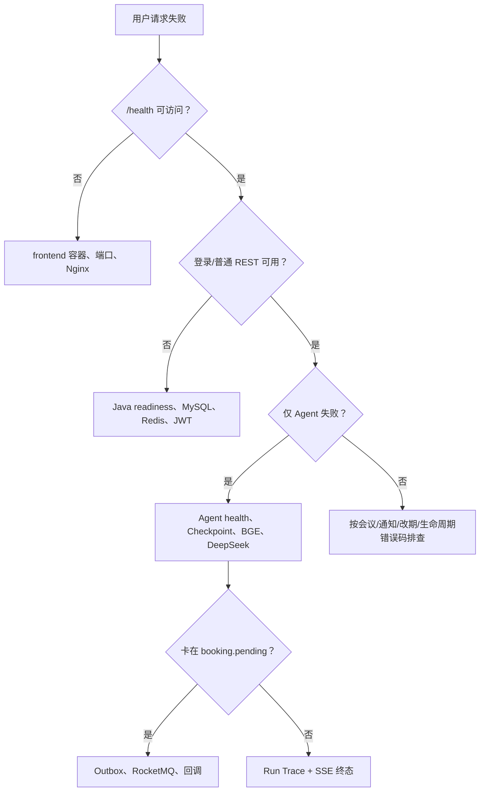
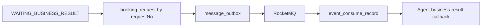

# 故障排查

本文按“入口 → 业务服务 → Agent → 数据/消息”的顺序排查。先保留 `traceId`、`runId`、`requestNo` 和时间范围，不要粘贴 JWT、服务令牌、DeepSeek Key 或 `.env` 全文。

## 1. 快速分诊



## 2. 第一组命令

```bash
docker compose ps -a
docker compose logs --tail=200 frontend
docker compose logs --tail=200 business-service
docker compose logs --tail=200 agent-service
```

开发覆盖下：

```bash
curl http://localhost/health
curl http://localhost:8080/actuator/health/readiness
curl http://localhost:8000/internal/v1/health
```

配置语法：

```bash
docker compose config --quiet
```

不要直接运行 `docker compose down --volumes` 作为“重试”。

## 3. 容器状态解释

| 服务 | 正常状态 |
| --- | --- |
| `mysql`、`redis`、`rocketmq-namesrv`、`rocketmq-broker`、`qdrant` | running + healthy |
| `business-service`、`agent-service`、`frontend` | running + healthy |
| `rocketmq-store-init`、`rocketmq-topic-init`、`rag-init` | exited (0) |

一次性任务 exited (0) 是成功；exited 非 0 才需要查看日志。

## 4. 前端无法访问

### 症状

- `http://localhost` 连接被拒绝。
- `/health` 不返回 `UP`。
- 页面可打开但刷新子路由 404。

### 检查

```bash
docker compose ps frontend
docker compose logs --tail=200 frontend
docker compose port frontend 80
```

### 常见原因

| 原因 | 处理 |
| --- | --- |
| `FRONTEND_PORT` 被占用 | 修改 `.env` 后重建 frontend |
| 前端构建失败 | 在 `frontend` 运行 `npm ci && npm run build` |
| business-service 不健康 | frontend 的启动依赖未满足，先修 Java |
| 使用了错误 URL | 基础 Compose 只暴露 `FRONTEND_PORT`，不是 Java/Agent 端口 |
| 自定义 Nginx 配置缺失 | 检查 `deploy/nginx/default.conf` 挂载 |

## 5. 登录失败或 401

### 区分错误

- `AUTH_REQUIRED`：缺少、过期或无效用户 JWT。
- `SERVICE_TOKEN_INVALID`：内部服务令牌不一致。
- `AGENT_CONTEXT_INVALID`：内部 JWT、audience、用户状态或 trace/run 不一致。

### 检查

1. 重新登录，不要手工复用旧 JWT。
2. 确认 `JWT_SECRET` 在 business-service 重建前后没有意外变化。
3. 内部失败时确认 Java 与 Python 使用同一 `AGENT_CONTEXT_JWT_SECRET`、`INTERNAL_SERVICE_TOKEN`。
4. 确认用户没有被管理员停用或改变角色。

轮换安全密钥后旧会话全部失效是正常行为。

## 6. Java readiness 为 DOWN

```bash
docker compose logs --tail=200 business-service mysql redis rocketmq-broker
```

Java readiness 组包含数据库、Redis、RocketMQ。常见原因：

| 组件 | 线索 | 处理 |
| --- | --- | --- |
| MySQL | 连接拒绝、认证失败、Flyway 失败 | 核对数据库用户/密码；查看 MySQL 与 Flyway 日志 |
| Redis | `NOAUTH`、连接超时 | 核对 `REDIS_PASSWORD` 与容器实际 requirepass |
| RocketMQ | NameServer/Broker 不可达 | 查看两个 MQ 容器和 topic-init |
| Schema | Flyway 校验失败 | 不要手工改历史迁移；恢复匹配的数据库或新增前向修复迁移 |

## 7. Agent 为 DEGRADED 或 DOWN

### DEGRADED

通常表示 DeepSeek 未配置：

```json
{
  "status": "DEGRADED",
  "deepseek": "NOT_CONFIGURED"
}
```

如果使用 `fixture`，这是可接受的测试状态。真实模型模式必须配置三个 `DEEPSEEK_*` 值并重建 Agent。

### DOWN / 启动循环

检查：

```bash
docker compose logs --tail=300 agent-service
docker compose logs --tail=300 rag-init
docker compose ps -a rag-init
```

常见原因：

- Agent MySQL 无法连接或 Alembic 失败。
- Redis DB 1 无法写 Checkpoint。
- BGE-M3 路径不存在、权限不足、模型文件不完整或维度不是 1024。
- CPU 内存不足，模型加载被 OOM Kill。
- `rag-init` 失败导致 Agent 启动依赖未满足。

## 8. BGE-M3 或 RAG 初始化失败

### 路径检查

确认 `.env` 的 `BGE_M3_HOST_PATH` 是宿主机绝对路径，并查看挂载：

```bash
docker compose config --quiet
docker compose run --rm --no-deps rag-init sh -c 'test -d /models/bge-m3 && find /models/bge-m3 -maxdepth 1 -type f | head'
```

不要用该命令打印模型目录之外的主机文件。

### Qdrant 维度冲突

错误包含 “vector dimension does not match” 时：

- 当前代码固定 BGE-M3 1024 维。
- 确认 collection 没有由其他模型创建。
- 为新模型使用新的 `QDRANT_COLLECTION`，完整重建，不要混写。

### PDF 入库失败

当前仅支持可提取文本的 PDF，不支持 OCR。检查：

- 文件不超过 5 MB。
- PDF 每页能提取文本，总文本不少于最低阈值。
- 元数据存在于 sidecar 或第一页 front matter。
- 文档时区为 `Asia/Shanghai`，状态为 `ACTIVE`。

## 9. 制度检索慢或无引用

### 查看 Agent 日志字段

- `embeddingMs`
- `vectorSearchMs`
- `totalMs`
- `cacheHit`
- `fallback`
- `resultCount`

### 解释

| 现象 | 可能原因 |
| --- | --- |
| 首次查询很慢，后续变快 | BGE 模型冷启动；Keepalive/查询缓存生效 |
| `fallback=true` | Embedding 超时或失败，使用 Qdrant payload 词法回退 |
| `resultCount=0` | 文档未索引、被删除、查询无相关证据 |
| Qdrant 整体异常 | 向量与词法回退都可能失败 |
| 有答案无引用 | 未命中可验证候选或模型输出被 Citation 校验移除 |

不要为了“看起来有依据”放宽 Citation 校验。

## 10. SSE 不流式或中途断开

### 浏览器侧

- 确认请求是 `POST /api/v1/agent/runs/stream`，不是直接请求 Agent 端口。
- 查看响应 `Content-Type: text/event-stream` 和 `X-Run-Id`。
- 保存 Run ID 后使用 `GET /api/v1/agent/runs/{runId}` 查询状态。

### 代理侧

Nginx 的 Agent location 应包含：

- `proxy_http_version 1.1`
- `proxy_buffering off`
- `proxy_cache off`
- `proxy_read_timeout 300s`
- `X-Accel-Buffering: no`

Java 使用异步 Dispatcher 透传 InputStream。若普通 API 正常但 SSE 很快断开，检查上游 Agent 日志和 Java “stream closed” 时间，而不是只改浏览器超时。

## 11. Run 卡在 WAITING_USER_INPUT

这是业务状态，不一定是故障。检查 `requirement.updated`：

- `revision`
- `ready`
- 每个 Requirement Item 的状态与提示

续写时必须发送最新 `expectedRevision`。如果返回 `AGENT_RUN_STATE_CONFLICT`，先重新读取 Run/Thread，不要盲目增加 revision。

## 12. Run 卡在 WAITING_CONFIRMATION

检查：

- 页面是否仍持有当前 SSE 的 `confirmationToken`。
- `expiresAt` 是否已过。
- 是否从历史页面恢复；历史接口故意不返回 token。
- 是否已有另一个页面接受/拒绝了同一草案。

草案已过期时，重新基于已有需求生成新 Run；不要从日志或数据库复制旧 token。

## 13. Run 卡在 WAITING_BUSINESS_RESULT



按顺序检查：

1. 公共 `GET /api/v1/booking-requests/{requestNo}`。
2. business-service 日志中的 `requestNo`、`runId`。
3. Outbox Publisher 是否在重试或进入 `DEAD`。
4. RocketMQ Broker 与消费者日志。
5. `AGENT_CALLBACK_ENABLED` 是否为 true。
6. Agent 是否仍有对应 Checkpoint。

不要重复调用确认接口。原确认幂等键会重放 PENDING，换新键可能造成未知重复请求尝试。

## 14. Outbox 堆积

### 可能状态

- `NEW/RETRY`：等待认领或退避。
- `SENDING`：30 秒租约内正在发送。
- `SENT`：已交给 Broker。
- `DEAD`：超过最大重试次数。

检查：

```bash
docker compose logs --tail=300 business-service rocketmq-namesrv rocketmq-broker
```

处理顺序：

1. 修复 NameServer/Broker 或网络。
2. 等待 `RETRY` 按退避自动恢复。
3. 对 `DEAD` 记录核对事件是否已消费、业务是否已完成和 request 状态。
4. 只有在设计了幂等补偿并保留审计后才重放。

不要直接把全部 `SENT/DEAD` 批量改成 `NEW`。

## 15. 预约 409 冲突

### `BOOKING_CONFLICT`

候选产生后资源被占用，或数据库唯一槽裁决失败。Agent 路径会基于结构化证据重规划；手工路径应刷新可用性。

### `IDEMPOTENCY_KEY_REUSED`

同一用户和操作复用了一个幂等键，但请求 hash 不同。修复客户端键生成，不要清空幂等表。

### `DRAFT_EXPIRED` / `DRAFT_ALREADY_USED`

重新生成草案或刷新 Run。不能延长数据库中过期时间继续确认。

### 版本冲突

`MEETING_STATE_CONFLICT`、`ROOM_STATE_CONFLICT`、`EMPLOYEE_STATE_CONFLICT` 等都要求重新 GET 最新实体，把最新 `version` 和用户的新意图一起提交。

## 16. 冲突重规划没有新候选

检查 Run Trace：

- `replanCount` 是否达到 2。
- `excludedCandidateIds` 是否已排除所有原候选。
- 冲突类型、房间 ID 和槽位是否存在。
- Agent 是否重新调用了人员忙闲和房间 Tool。
- `plan.unsat` 是否给出不可满足分析。

达到上限后进入 `WAITING_USER_INPUT` 是安全终态。用户必须调整时间、房间或约束，系统不会自动放宽。

## 17. 会议室停用但没有改期单

改期单只针对：

- 使用该会议室。
- 未来时间。
- 当前为 `CONFIRMED`。
- 同一 `(meeting, room, roomStatusVersion)` 尚未创建过改期单。

检查管理员请求是否带停用原因、会议是否满足以上条件、事务是否因为版本冲突回滚。

## 18. 会前提醒重复或缺失

提醒投递表有唯一约束，重复扫描不应重复发同一类型提醒。缺失时检查：

- 生命周期 Scheduler 是否运行。
- 会议状态和开始时间。
- 扫描时间窗与批次上限。
- 收件人是否为组织者/参与者。
- 是否已有 `meeting_reminder_delivery` 记录。

准备缺失提醒只发给组织者。

## 19. 会后草案失败

| 错误 | 检查 |
| --- | --- |
| Agent 不可用 | Java 到 Agent URL、服务令牌、Context JWT、DeepSeek |
| 输出无效 | Agent 日志中的 Schema 校验；不要直接保存原模型文本 |
| 负责人无效 | 行动项负责人必须是会议参与者或被规范为空 |
| 版本冲突 | 草案可能被其他审核者更新，刷新生命周期 |
| 状态冲突 | 会议必须处于允许会后处理的状态 |

`FAILED` 草案保留错误码用于诊断；不要手工改为 `PENDING_REVIEW`。

## 20. 数据库迁移失败

### Flyway

- 检查业务库迁移校验和与执行顺序。
- 历史迁移已经应用后不应修改。
- 新增前向修复迁移，不直接编辑生产 Schema 伪装成功。

### Alembic

- 检查 `alembic_version` 与代码 revision 链。
- `rag-init` 和 `agent-service` 都会执行 `alembic upgrade head`，迁移必须可重复检查但不会重复改变结果。

在任何“repair”前先备份并确认目标数据库。

## 21. 磁盘或内存不足

```bash
docker stats --no-stream
docker system df
docker compose logs --tail=100 mysql qdrant rocketmq-broker agent-service
```

优先检查：

- Agent/BGE 模型是否 OOM。
- Qdrant 和 RocketMQ Store 是否增长。
- MySQL 数据与 binlog/临时文件。
- Docker json-file 日志；项目已限制每文件 10 MB、3 个轮换文件。

不要用广泛删除命令清理 Docker。先确定具体 Compose Project、卷和可恢复性。

## 22. 最小回归

修复后按故障域运行最小回归：

| 故障域 | 最小回归 |
| --- | --- |
| 入口/登录 | `smoke-day1.ps1` |
| 会议/并发 | `smoke-day2.ps1` + `concurrency-day2.py` |
| MQ/热门预约 | `smoke-day3.py` |
| Agent/HITL/恢复 | `smoke-day5.py` |
| 前端公共契约 | `smoke-day6.py` |
| 员工/通知 | `smoke-employee-notifications.py` |
| 资源异常 | `smoke-exception-replan.py` |
| 生命周期 | `smoke-pre-post-meeting.py` |
| RAG | 两个 `smoke-rag-*` 脚本 |

## 23. 升级为事件处理

满足以下任一条件时停止反复重启，保留现场并按安全事件/数据恢复流程处理：

- 怀疑 `.env`、用户 JWT、Agent Context 或 DeepSeek Key 泄漏。
- 相同幂等键产生不同业务结果。
- 出现重复会议、重复房间槽或必需人员槽不一致。
- Outbox 显示 SENT 但 Broker Store 丢失且业务终态未知。
- 恢复后 MySQL、Redis Checkpoint 和 Agent Run 无法对应。
- 日志或历史接口出现内部令牌。
